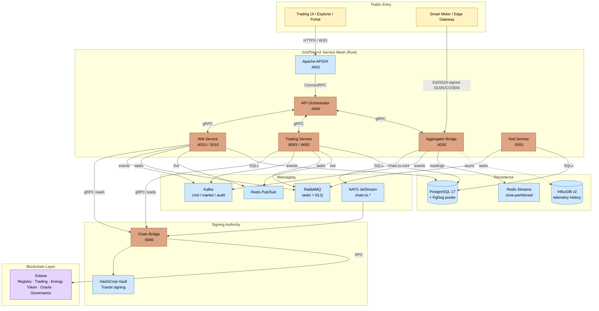
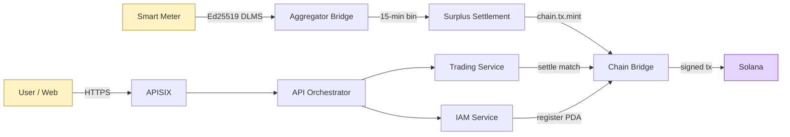

# GridTokenX Platform

[](https://gridtokenx.com)
[](https://solana.com)
[](LICENSE)

**GridTokenX** is a next-generation, blockchain-powered Peer-to-Peer (P2P) energy trading platform. It enables prosumers (energy producers) and consumers to trade energy directly, ensuring trustless on-chain settlement, high-performance telemetry ingestion, and decentralized grid stabilization.

The platform bridges **physical energy infrastructure** (smart meters, solar inverters, EV chargers) with **trustless financial markets** on the Solana blockchain, leveraging a high-performance Rust-based microservices mesh for scalability, data integrity, and low-latency matching.

---

## Architecture at a Glance

GridTokenX follows a **Modern Microservices Architecture** orchestrated by a high-performance Rust gateway and secured by Solana smart contracts. The system consists of **5 core Rust services**, **3 frontend applications**, **30+ Docker containers** for infrastructure, and **5 Anchor programs** on Solana.

> **Repo layout**: this is a **git superproject** — every `gridtokenx-*` service is a git submodule (see `.gitmodules`). There is **no root `Cargo.toml`**; each service is an independent Cargo workspace. Always clone with `--recursive`, and after switching branches run `git submodule update --init --recursive`.

### Platform Architecture



### Two Interconnected Platforms

GridTokenX is architected as **two distinct but interconnected platforms**:

| Aspect | **Exchange Platform** | **Infrastructure Platform** |
| :--- | :--- | :--- |
| **Primary Domain** | Financial / Trading | Physical / Data Integrity |
| **Blockchain Access** | ✅ Direct (IAM, Trading) | ❌ Indirect (signs only) |
| **Data Direction** | Receives validated data | Produces validated data |
| **Scaling Factor** | Trading volume / User count | Device count / Telemetry volume |
| **Key Services** | API Services, IAM, Trading | Edge Gateway, Aggregator Bridge |

### Edge-to-Blockchain Data Flow



---

## Technology Stack

### Backend Core

-   **Language**: Rust (2021 Edition)
-   **Web Framework**: Axum (REST), Tonic/ConnectRPC (gRPC over HTTP/2)
-   **Async Runtime**: Tokio (multi-threaded)
-   **Database ORM**: SQLx with compile-time query verification
-   **Error Handling**: `anyhow::Result` for application logic

### Blockchain

-   **Platform**: Solana (localnet for dev, devnet/testnet for staging)
-   **Smart Contracts**: Anchor Framework (1.0.0)
-   **Token Standard**: SPL Token-2022
-   **Programs**: Registry, Trading, Energy Token, Oracle, Governance

### Messaging (Hybrid Architecture)

| Technology | Role | Primary Use Case | Performance |
| :--- | :--- | :--- | :--- |
| **Kafka** (3 clusters) | Event Sourcing Log | Orders, trades, audit trails — strict ordering, 168h retention | High Throughput |
| **RabbitMQ** | Task Queues | Email notifications, settlement retries, DLQ, guaranteed delivery | High Reliability |
| **Redis 7** | Real-Time Engine | WebSocket fan-out, session cache, sub-millisecond access | Ultra-Low Latency |

### Persistence

| Component | Version | Purpose |
|-----------|---------|---------|
| **PostgreSQL 17** | Primary + Replica | User data, orders, trades, **Transactional Outbox** |
| **Redis 7** | Primary + Replica | Cache, session, Pub/Sub, zone-partitioned meter Streams |

### Infrastructure & Observability

-   **Docker Runtime**: **OrbStack** (2s startup, faster networking, battery optimized)
-   **API Gateway**: Apache APISIX (User-facing, port 4001)
-   **Secrets Management**: HashiCorp Vault (port 8200)
-   **Observability**: Prometheus, Grafana (port 3001), Loki, Tempo, OpenTelemetry, SigNoz

### Frontend

-   **Trading UI**: Next.js (React, port 11001)
-   **Explorer**: Platform-specific blockchain explorer
-   **Portal**: Administrative dashboard

---

## Protocols & Standards

GridTokenX speaks a deliberately layered protocol stack: standard meter/IoT protocols at the physical edge, a Rust RPC mesh in the middle, and Solana on-chain at the settlement boundary. Every protocol below is in use in the codebase.

### Service Mesh — Transport & RPC

| Protocol | Transport | Where used |
| :--- | :--- | :--- |
| **HTTP/1.1 + HTTPS (TLS 1.2/1.3)** | TCP | REST APIs (Axum), APISIX user-facing gateway (`:4001`), health/metrics endpoints |
| **HTTP/2** | TCP/TLS | gRPC + ConnectRPC transport across the service mesh |
| **gRPC** | HTTP/2 (Tonic) | Synchronous service-to-service reads (IAM/Trading → Chain Bridge), 40+ Trading RPCs |
| **ConnectRPC** | HTTP/2 + HTTP+JSON | Browser-friendly gRPC variant — IAM `:5010`, Chain Bridge `:5040`, API orchestrator ingress |
| **Protocol Buffers (protobuf)** | — | Wire schema for all gRPC/ConnectRPC services (`prost` + `tonic` codegen) |
| **WebSocket / WSS** | HTTP/1.1 upgrade | Real-time market/data fan-out from API orchestrator (backed by Redis Pub/Sub) |
| **JSON-RPC 2.0** | HTTPS | Solana RPC — **only** Chain Bridge speaks it directly |

### Messaging & Streaming

| Protocol | Broker | Role |
| :--- | :--- | :--- |
| **Kafka wire protocol** | Kafka (3 clusters) | Event sourcing — orders, trades, audit, `gridtokenx.aggregator.grid_status` |
| **NATS + JetStream** | NATS | Async on-chain tx submission (`chain.tx.submit`, `chain.tx.cancel`, `chain.tx.mint`) |
| **AMQP 0-9-1** | RabbitMQ (`:9030`) | Durable task queues + DLQ — email pipeline, settlement retries |
| **RESP (Redis Serialization)** | Redis 7 | Pub/Sub fan-out, session cache, **zone-partitioned meter Streams** |

### IoT / Edge / Telemetry

| Protocol | Standard | Notes |
| :--- | :--- | :--- |
| **DLMS/COSEM** | IEC 62056 | **The** meter-side protocol — signed canonical OBIS readings into the Aggregator Bridge |
| **`dlms-enc` envelope** | AES-256-GCM | Encrypted DLMS frame (counter + nonce + ciphertext); secure mode rejects plaintext downgrade |
| **Ed25519 signed payloads** | RFC 8032 | Per-device cryptographic identity on every telemetry frame |
| **Modbus / SunSpec** | — | Inverter/DER-side, translated to the canonical schema at the Edge Gateway |
| **MQTT** | — | Edge Gateway local transport (RPi / `rppal` hardware aggregation) |

### Demand Response (VPP flex dispatch)

| Protocol | Implementation | Role |
| :--- | :--- | :--- |
| **OpenADR 3 / OpenLEADR** | `openleadr-rs` v0.2.3 | Preferred VTN↔VEN dispatch — flex events, VEN registration, execution reports |
| **IEEE 2030.5 (SEP2)** | adapter | Alternate demand-response standard alongside OpenADR |
| **OAuth 2.0 (client credentials)** | — | VTN client auth (`OPENLEADR_CLIENT_ID`/`SECRET`); frontend auth via Supabase |

### Blockchain

| Protocol | Standard | Notes |
| :--- | :--- | :--- |
| **Solana JSON-RPC** | — | All transactions routed through Chain Bridge — no service calls RPC directly |
| **SPL Token-2022** | Solana Program Library | Token standard for GRID / GRX / REC assets |
| **Anchor** | Anchor 1.0.0 | IDL + program framework for the 5 on-chain programs |

### Security, Identity & Crypto

| Protocol / Scheme | Purpose |
| :--- | :--- |
| **mTLS (X.509, SPIFFE SVID)** | Service-to-service trust boundary — Chain Bridge isolated by mTLS + RBAC |
| **JWT** | Scoped bearer auth issued by IAM |
| **API keys** | Service + device auth (Aggregator Bridge ingest, IAM-verified) |
| **AES-256-GCM** | Wallet-key custody + `dlms-enc` telemetry envelope |
| **argon2id / bcrypt** | Password hashing (IAM) |
| **Ed25519** | Wallet keypairs + edge device signatures |
| **Vault Transit** | Distributed transaction signing (Chain Bridge), no local keypair files in prod |

### Time, Mail & Observability

| Protocol | Purpose |
| :--- | :--- |
| **SNTP/NTP** | Trusted wall-clock — `gridtokenx_telemetry::time::now()` (Cloudflare/Google SNTP), replaces `Utc::now()` |
| **SMTP** | Outbound email (Noti Service register → verify → welcome) |
| **OpenTelemetry / OTLP** | Distributed traces → Tempo / SigNoz |
| **Prometheus exposition** | Metrics scrape (HTTP `/metrics`; Aggregator Bridge scrape is mTLS) |

---

## Core Services

### 1. API Services (`gridtokenx-api`) — Lead Orchestrator
-   **Port**: 4000 (HTTP)
-   **Role**: Central nervous system. Aggregates responses from microservices, manages real-time WebSocket broadcasting via Redis Pub/Sub, executes background persistence workers for telemetry ingestion (20k+ readings/sec).
-   **Tech**: Rust (Axum), ConnectRPC

### 2. IAM Service (`gridtokenx-iam-service`) — Identity Guardian
-   **Ports**: 4010 (REST) / 5010 (gRPC via ConnectRPC)
-   **Role**: User registration, KYC workflows, secure wallet custody. Generates/encrypts Ed25519 keypairs. Manages Registry Program on-chain. Issues scoped JWTs.
-   **Security**: AES-256-GCM encryption, argon2id password hashing, JWT auth
-   **Blockchain**: Registry + Governance programs

### 3. Trading Service (`gridtokenx-trading-service`) — Matching Engine
-   **Ports**: 8092 (gRPC-primary) / 8093 (REST metrics + settlement)
-   **Role**: In-memory order book management, Continuous Double Auction (CDA) matching, on-chain settlement. Handles conditional orders (stop-loss, take-profit), recurring DCA orders, VPP aggregation, ERC certificate management.
-   **Complexity**: 587-line startup file, 1883-line gRPC implementation (40+ RPCs)
-   **Blockchain**: Trading + Energy Token programs

### 4. Aggregator Bridge (`gridtokenx-aggregator-bridge`) — Cryptographic Trust Layer
-   **Port**: 4030 (Unified gRPC/HTTP)
-   **Role**: Validates Ed25519 signatures from Edge Gateways, performs zone-based partitioning, aggregates 15-minute settlement windows. Bridges physical energy data to digital markets.
-   **Blockchain**: Oracle Program

### 5. Chain Bridge (`gridtokenx-chain-bridge`) — Decentralized Signing Authority
-   **Port**: 5040 (gRPC via ConnectRPC)
-   **Role**: Decentralized signing authority and Solana blockchain interface. All services route blockchain transactions through Chain Bridge for distributed key management.

### 6. Edge Gateway (`gridtokenx-edge-gateway`) — Edge Aggregation
-   **Role**: Local aggregation, buffering, protocol translation, Ed25519 signing. Hardware-specific (RPi, rppal, MQTT).
-   **Communication**: Sends validated telemetry directly to the Aggregator Bridge IoT gateway (Ed25519-signed payloads)

---

## Features

A domain-grouped inventory of platform capabilities.

### Identity & Access (IAM Service)
-   User registration + KYC workflows
-   Secure wallet custody — Ed25519 keypair generation, AES-256-GCM encryption (never plaintext)
-   argon2id password hashing, scoped JWT auth, API keys
-   On-chain Registry PDA lifecycle (idempotent register → verify → claim)
-   Governance program control

### Trading (Trading Service)
-   In-memory order book with Continuous Double Auction (CDA) matching
-   Conditional orders — stop-loss, take-profit
-   Recurring DCA (dollar-cost-averaging) orders
-   VPP (Virtual Power Plant) aggregation
-   ERC / REC certificate management
-   On-chain settlement routed through Chain Bridge
-   40+ gRPC RPCs

### Telemetry & Edge (Aggregator Bridge + Edge Gateway)
-   Ed25519-signed DLMS/COSEM telemetry ingest from smart meters
-   Per-device cryptographic identity verification
-   Zone-partitioned Redis Streams for operational dissemination
-   15-minute settlement-window aggregation
-   Surplus mint over NATS (`chain.tx.mint`) → Solana
-   Independent InfluxDB v2 realtime history (async, fire-and-forget)
-   High-throughput ingest (20k+ readings/sec)

### Blockchain (Chain Bridge + Anchor)
-   5 Anchor programs — Registry, Trading, Energy Token, Oracle, Governance
-   SPL Token-2022 standard
-   Sole Solana RPC gateway — Vault Transit signing, isolated by mTLS + RBAC
-   NATS JetStream async tx submission; gRPC synchronous reads
-   Shared `gridtokenx-blockchain-core` types

### Notifications (Noti Service)
-   Email pipeline — register → verify → welcome
-   Independent DB schema; RabbitMQ task queues + DLQ for guaranteed delivery

### Demand Response (Aggregator Bridge — VPP flex dispatch)
Autonomous, fleet-driven demand response with no external SCADA feed — the meter fleet is itself the frequency sensor.

-   **Fleet-as-sensor frequency monitoring** — each meter reading carries instantaneous grid frequency; a rolling-window `FrequencyMonitor` folds samples into a mean (implausible <40Hz / >70Hz dropped)
-   **Grid-status publishing** — periodic task turns the mean into `GridStatusEvent`s on Kafka (`gridtokenx.aggregator.grid_status`), the dispatch engine's trigger
-   **VTN dispatch (OpenADR 3 / OpenLEADR)** — dispatch engine emits flex events on a VTN; `openleadr` adapter (openleadr-rs v0.2.3) preferred over the IEEE 2030.5 adapter; requires ≥1 completed aggregation bin
-   **VEN listener + execution** — polling listener consumes `DISPATCH_SETPOINT` events from a utility VTN and executes them (positive setpoint → FLEX_UP, negative → FLEX_DOWN); multi-interval events executed per-window, deduped by id + modificationDateTime, retried on failure
-   **VEN self-registration** — listener registers a VEN object on the VTN at startup (best-effort)
-   **Execution reports** — VEN posts dispatch execution reports back to the VTN, closing the loop
-   **IEEE 2030.5 (SEP2)** — alternate dispatch standard adapter alongside OpenADR
-   E2E coverage: `tests/e2e/85_openadr/` proves telemetry → frequency monitor → grid-status → Kafka → dispatch → VTN event → VEN execute → report (gated `E2E_RUN_OPENADR=1`)

### Frontends
-   Trading UI (Next.js, `:11001`)
-   Blockchain Explorer (`:11002`)
-   Smart Meter Simulator + map (`:12011`)
-   Admin Portal (separate repo)

### Platform & Observability
-   APISIX user-facing gateway (`:4001`) + API orchestrator (`:4000`)
-   Hybrid messaging — Kafka (event sourcing, 3 clusters), RabbitMQ (task queues), Redis 7 (real-time)
-   PostgreSQL 17 (+ PgDog pooler), Transactional Outbox pattern
-   HashiCorp Vault secrets management + rotation
-   Prometheus, Grafana, Loki, Tempo, OpenTelemetry, SigNoz observability
-   Surfpool mainnet simulation; matching + ingest-saturation benchmarks

---

## Quick Start

### Prerequisites
-   **OrbStack**: Optimized Docker runtime for macOS (not Docker Desktop)
-   **Rust Toolchain**: `rustup`, `cargo`
-   **Solana CLI & Anchor**: For blockchain interaction
-   **Nushell**: For `grx` helper script
-   **just**: Task runner

### 1. Initialize the Platform
```bash
# Clone and setup
git clone --recursive https://github.com/gridtokenx/platform.git
cd platform

# Copy environment configuration
cp .env.example .env

# Generate dev mTLS certs for Chain Bridge (CA + server + per-service SPIFFE client certs)
just gen-certs

# Start the unified infrastructure (PostgreSQL, Redis, Kafka, APISIX, NATS, Vault)
./scripts/app.sh start --docker-only

# Initialize the blockchain state and deploy Anchor programs
./scripts/app.sh init
```

### 2. Database Setup
```bash
# Run PostgreSQL migrations
just migrate
```

### 3. Launch Services
```bash
# Recommended: Native Apps Mode (best dev experience)
./scripts/app.sh start --native-apps

# Monitor background services
tail -f logs/*.log
```

### 4. Performance Tuning (Optional)
For production-grade high-throughput setups, configure Firedancer, Hugepages, and CPU pinning. On macOS Apple Silicon, `solana-test-validator` requires raised file limits — `app.sh` sets `ulimit -n 65536` automatically.

---

## Development Commands

### Platform Management (`scripts/app.sh`)
```bash
./scripts/app.sh start              # Start all infrastructure + services
./scripts/app.sh start --docker-only  # Start only Docker infrastructure
./scripts/app.sh start --native-apps  # Docker + native app services (background)
./scripts/app.sh stop               # Gracefully stop the platform
./scripts/app.sh init               # Initialize Solana + deploy programs
./scripts/app.sh register           # Register admin user
./scripts/app.sh seed               # Seed database with test users
./scripts/app.sh status             # Check running services
./scripts/app.sh doctor             # Check dependencies + health
```

### Task Automation (`just`)
```bash
just check-all          # cargo check all microservices
just build-all          # Build all microservice binaries
just test               # Run all microservice tests
just test-all           # Run all tests + integration tests (Solana validator)
just test-edge          # Run Edge Protocol integration test
just test-registration  # Run User Registration & Onboarding E2E test
just migrate            # Run sqlx migrations (IAM Service)
just migrate-new name:X # Create new IAM migration
just migrate-revert     # Revert last IAM migration
just migrate-info       # Show migration status
just db-up              # Start PostgreSQL container
just db-down            # Stop PostgreSQL container
just orb-up             # Start all OrbStack services
just orb-down           # Stop all OrbStack services
just fmt                # Format all code (cargo fmt)
just clippy             # Run clippy on all services (-- -D warnings)
just clean-all          # Clean all build artifacts
just benchmark          # Run trading engine benchmarks
just simnet             # Start Solana Mainnet Simulation (Surfpool)
just simnet-ci          # Start Solana Simnet in CI mode
just simnet-down        # Stop Solana Simnet
just orb-rebuild        # Rebuild all Docker services (no cache)
```

### Nushell Helper (`grx.nu`)
```bash
grx check     # cargo check
grx build     # cargo build
grx test      # cargo test
grx migrate   # sqlx migrate run
grx db-up     # Start PostgreSQL
grx db-down   # Stop PostgreSQL
grx orb-up    # Start all Docker services
grx orb-down  # Stop all Docker services
grx prepare   # sqlx prepare (offline query preparation)
```

---

## Service Registry

| Component | HTTP Port | gRPC Port | Role |
| :--- | :--- | :--- | :--- |
| **APISIX Gateway** | `4001` | — | Unified Gateway Routing |
| **Direct Gateway** | `4000` | — | Platform HTTP API & Health |
| **IAM Service** | `4010` | `5010` | Identity, Auth & KYC |
| **Trading Service** | `8093` | `8092` | Matching & Settlement |
| **Aggregator Bridge** | — | `4030` | Telemetry Validation |
| **Chain Bridge** | — | `5040` | Solana Signing Authority |
| **Noti Service** | — | `5050` | Notifications Dispatcher |
| **Simulator API** | `12010` | — | IoT Simulation Backend |
| **Trading UI** | `11001` | — | Exchange Web App |
| **Explorer UI** | `11002` | — | Block Explorer UI |
| **Simulator UI** | `12011` | — | Smart Meter Simulator Map |
| **PostgreSQL** | `7001` | — | Relational store (primary) |
| **[PgDog](https://docs.pgdog.dev)** | `7003` | — | Sole Postgres pooler (in-network `pgdog:6432`; all services route here) |
| **Redis** | `7010` | — | Cache, Session, Pub/Sub, meter Streams |
| **RabbitMQ** | `9030` (AMQP) / `9031` (mgmt) | — | Task Queues |
| **Kafka** | `29001` | — | Event Bus / Broker |
| **Grafana** | `6002` | — | Metrics Dashboard |
| **Prometheus** | `6001` | — | Metrics Scraper |
| **Loki** | `6003` | — | Log Aggregator |

---

## On-Chain Program IDs (Localnet)

| Program | ID |
| :--- | :--- |
| **Registry** | `5xdQsDuGa1AaLVnddGhevvf2bngCvSob4dAepETS7oaJ` |
| **Trading** | `DA9TdkcToi5r7oS7X5CddoMBiGNF3sAGqwPQph1CfLwd` |
| **Energy Token** | `EzXnJoHSjS6VR7eBwHTkHHAJGqVfRsEvyksqz7uJCBpe` |
| **Oracle** | `D5MCbSHxhxZTRFyUMdTHcQvjzwjx5Lb8jg9PQ2LTja8S` |
| **Governance** | `BRQEyx7DHX1Ljx1eNTHUve52aHHwkWckBXGeL9FZPEgZ` |

---

## Workspace Structure

Each `gridtokenx-*` entry below is a **git submodule** with its own Cargo workspace — there is no root `Cargo.toml`.

```
gridtokenx-coresystem/                # superproject (git submodules)
├── gridtokenx-iam-service/          # Identity, Auth, KYC, Registry (Rust)
├── gridtokenx-trading-service/      # Order Matching, Settlement (Rust)
├── gridtokenx-aggregator-bridge/    # Edge Validation, IoT Ingestion (Rust)
├── gridtokenx-chain-bridge/         # Decentralized Signing Authority (Rust)
├── gridtokenx-noti-service/         # Notifications Dispatcher (Rust)
├── gridtokenx-anchor/               # Solana Anchor Programs
│   ├── programs/                    # Registry, Trading, Energy Token, Oracle, Governance
│   ├── tests/                       # Program integration tests
│   └── shared/                      # Shared types between programs
├── gridtokenx-blockchain-core/      # Shared blockchain utilities
├── gridtokenx-smartmeter-simulator/ # IoT Device Simulator (Python/FastAPI)
├── gridtokenx-trading/              # Trading UI (Next.js)
│   └── wasm/                        # Rust→WASM client crate (WebAssembly utilities)
├── gridtokenx-explorer/             # Blockchain Explorer
├── apisix_conf/                     # APISIX Gateway Configuration
├── docker-compose.yml               # Main Docker Compose
├── Justfile                         # Task Runner (Nushell)
├── grx.nu                           # Nushell Helper
├── academic/                        # Whitepaper / thesis (Typst)
├── docs/                            # Platform Documentation
├── scripts/
│   └── app.sh                       # Unified Platform Manager
└── tests/
    └── load-test/                   # Load Testing Tool
```

> The API orchestrator (`gridtokenx-api`, `:4000`), Edge Gateway (`gridtokenx-edge-gateway`), and Admin Portal (`gridtokenx-portal`) are referenced throughout the architecture but are **not submodules of this superproject** — they live in separate repos.

### Per-Service Cargo Workspaces

Each Rust service builds independently. Trading Service and Edge Gateway are kept out of any shared workspace due to target conflicts.

| Service | Description | Notes |
|-------|-------------|-----------|
| `gridtokenx-iam-service` | Identity & Access Management | Modular monolith, 6 sub-crates |
| `gridtokenx-trading-service` | Trading Engine & Matching | Separate workspace (BPF target) |
| `gridtokenx-aggregator-bridge` | Edge Validation & IoT | — |
| `gridtokenx-chain-bridge` | Decentralized Signing | Binds `0.0.0.0`; isolated by mTLS + RBAC |
| `gridtokenx-noti-service` | Notifications Dispatcher | — |
| `gridtokenx-blockchain-core` | Shared Blockchain Utilities | — |
| `gridtokenx-trading/wasm` | WebAssembly | Rust→WASM client crate (inside Trading frontend) |
| `gridtokenx-anchor/programs/*` | Anchor Programs | BPF |
| `gridtokenx-smartmeter-simulator` | IoT Simulation | Python/FastAPI |

---

## Security Model

-   **Wallet Custody**: Private keys encrypted with AES-256-GCM using master secret from environment. Never stored in plaintext.
-   **Authentication**: JWT tokens (scoped), API keys, bcrypt/argon2 password hashing
-   **Edge Validation**: Ed25519 signature verification at edge and oracle layers
-   **Distributed Signing**: Blockchain signing keys distributed per-service (not centralized)
-   **Edge Device Auth**: Aggregator Bridge verifies Ed25519-signed payloads from IoT devices (per-device key identity)
-   **Secrets Management**: HashiCorp Vault for key management and secret rotation
-   **Database Security**: SQLx with compile-time query checking, parameterized queries

---

## Key Documentation

Detailed specifications are located in the `/docs` directory:

-   [National Control Plane Design](docs/product-specs/National.md)
-   [gTHB Issuer Service Spec](docs/product-specs/gTHB_ISSUER_SERVICE.md)
-   [System Architecture](ARCHITECTURE.md)
-   [Documentation Map](docs/DESIGN.md)
-   [Benchmark Best-Practices](docs/benchmark-best-practices.md)
-   [Glossary](docs/glossary.md)

---

## License

Proprietary Software. © 2026 GridTokenX. All Rights Reserved.
