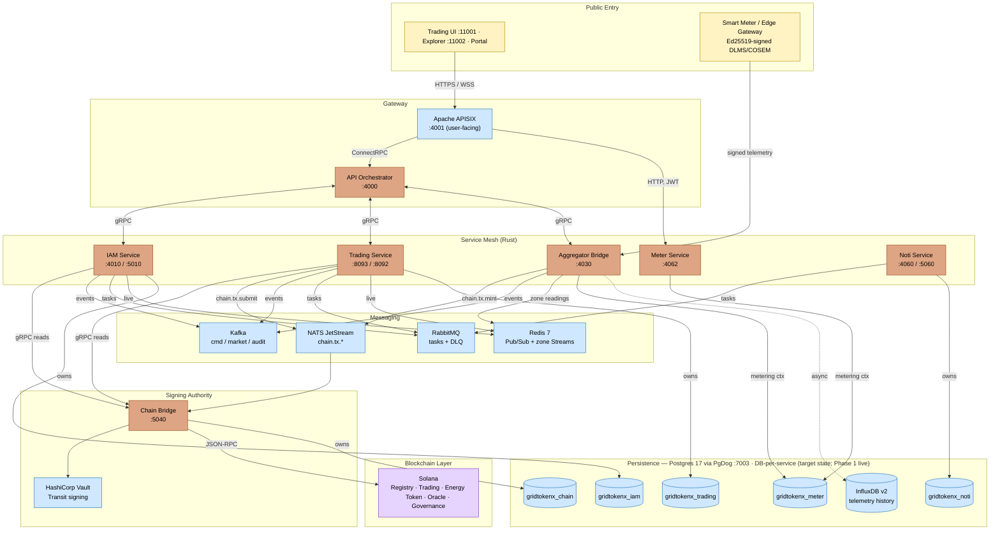
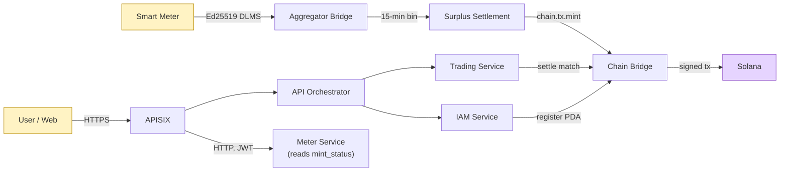

# GridTokenX Platform

[](https://gridtokenx.com)
[](https://solana.com)


**GridTokenX** is a blockchain-powered Peer-to-Peer (P2P) energy trading platform. Prosumers and consumers trade energy directly, with trustless on-chain settlement, high-throughput telemetry ingestion, and decentralized grid stabilization.

The platform bridges **physical energy infrastructure** (smart meters, solar inverters, EV chargers) with **trustless financial markets** on Solana, built on a Rust microservices mesh: **6 core Rust services**, **3 frontend applications**, **30+ Docker containers**, and **5 Anchor programs** on-chain.

> **Repo layout**: this is a **git superproject** — every `gridtokenx-*` service is a git submodule (see `.gitmodules`). There is **no root `Cargo.toml`**; each service is an independent Cargo workspace. Always clone with `--recursive`, and after switching branches run `git submodule update --init --recursive`.

---

## Contents

- [Quick Start](#quick-start)
- [Architecture](#architecture)
- [Core Services](#core-services)
- [Technology Stack](#technology-stack)
- [Protocols & Standards](#protocols--standards)
- [Service Registry](#service-registry)
- [On-Chain Program IDs](#on-chain-program-ids-localnet)
- [Workspace Structure](#workspace-structure)
- [Development Commands](#development-commands)
- [Security Model](#security-model)
- [Key Documentation](#key-documentation)

---

## Quick Start

### Prerequisites

| Tool | Why |
| :--- | :--- |
| **OrbStack** | Docker runtime for macOS (not Docker Desktop) |
| **Rust toolchain** | `rustup`, `cargo` |
| **Solana CLI + Anchor** | Blockchain programs |
| **just** | Task runner |
| **Nushell** | Required by `just` recipes and `grx.nu` |

### 1. Initialize

```bash
# Clone and setup
git clone --recursive https://github.com/gridtokenx/platform.git
cd platform

# Copy environment configuration
cp .env.example .env

# Generate dev mTLS certs for Chain Bridge (CA + server + per-service SPIFFE client certs)
just gen-certs

# Start the unified infrastructure (PostgreSQL, Redis, Kafka, APISIX, NATS, Vault)
./scripts/app.sh start --docker-only

# Initialize the blockchain state and deploy Anchor programs
./scripts/app.sh init
```

### 2. Migrate databases

```bash
just migrate        # IAM Service migrations
just noti-migrate   # Notification Service has its OWN migrations (separate DB)
```

### 3. Launch services

```bash
# Recommended: Native Apps Mode (best dev experience)
./scripts/app.sh start --native-apps

# Monitor background services
tail -f logs/*.log
```

### 4. Verify

```bash
./scripts/app.sh status   # Process status
./scripts/app.sh doctor   # Dependency + health check
```

> **macOS Apple Silicon**: `solana-test-validator` needs raised file limits under load — `app.sh` sets `ulimit -n 65536` automatically. Running the validator manually requires tuning limits first.

---

## Architecture

GridTokenX is layered so the **trust boundary is explicit at every hop**. Traffic enters through one of two doors: user/web traffic hits **APISIX** (`:4001`), which fans out over ConnectRPC to the **API Orchestrator** (`:4000`) and the Rust service mesh; edge telemetry enters directly at the **Aggregator Bridge** (`:4030`) as Ed25519-signed DLMS/COSEM frames — no shared door between the two.

Three flows run through the mesh:

- **User request** — APISIX → API Orchestrator → gRPC to IAM / Trading / Aggregator Bridge (Meter Service is read-mostly, JWT-authed directly off APISIX).
- **Edge telemetry** — signed meter frames → Aggregator Bridge → zone-partitioned Redis Streams (operational) + async InfluxDB (history) → 15-min settlement bins.
- **Blockchain settlement** — no service touches Solana directly. Writes publish to **NATS JetStream** (`chain.tx.submit` from Trading, `chain.tx.mint` from the Aggregator Bridge); the **Chain Bridge** (`:5040`) is the sole signer (Vault Transit) and sole Solana RPC client. Synchronous reads (balances, accounts) are gRPC straight to Chain Bridge.

Each service targets its own Postgres database (**DB-per-service**, pooled through PgDog `:7003` — see [migration status](#persistence) below), emits domain events to Kafka, and routes durable tasks through RabbitMQ. Chain Bridge is isolated by **mTLS + RBAC**, not by network position — it binds `0.0.0.0`.

### Platform Diagram



### Edge-to-Blockchain Data Flow



---

## Core Services

### 1. API Orchestrator (`gridtokenx-api`) — Lead Orchestrator
- **Port**: 4000 (HTTP) · **Tech**: Rust (Axum), ConnectRPC
- Central nervous system. Aggregates responses from microservices, manages real-time WebSocket broadcasting via Redis Pub/Sub, runs background persistence workers for telemetry ingestion (20k+ readings/sec).

### 2. IAM Service (`gridtokenx-iam-service`) — Identity Guardian
- **Ports**: 4010 (REST) / 5010 (gRPC via ConnectRPC) · **On-chain**: Registry + Governance programs
- User registration + KYC workflows; secure wallet custody (generates Ed25519 keypairs, encrypts with AES-256-GCM — never plaintext); argon2id password hashing; scoped JWTs + API keys; idempotent on-chain Registry PDA lifecycle (register → verify → claim).
- Modular monolith of 6 sub-crates ("sync core, async edges").

### 3. Trading Service (`gridtokenx-trading-service`) — Matching Engine
- **Ports**: 8092 (gRPC-primary) / 8093 (REST metrics + settlement) · **On-chain**: Trading + Energy Token programs
- In-memory order book with Continuous Double Auction (CDA) matching; conditional orders (stop-loss, take-profit); recurring DCA orders; VPP aggregation; ERC/REC certificate management; 40+ gRPC RPCs.
- Settlement routed through Chain Bridge — never direct Solana RPC.
- **Not** the same repo as `gridtokenx-trading` (the Next.js Trading UI).

### 4. Aggregator Bridge (`gridtokenx-aggregator-bridge`) — Cryptographic Trust Layer
- **Port**: 4030 (unified gRPC/HTTP) · **On-chain**: Oracle program (mints via `chain.tx.mint`)
- Validates Ed25519 signatures from Edge Gateways (per-device cryptographic identity); zone-based partitioning into Redis Streams; 15-minute settlement-window aggregation; surplus mint over NATS; independent InfluxDB v2 realtime history (async fire-and-forget); 20k+ readings/sec ingest.
- Also hosts the **demand-response (VPP) stack** — see [Demand Response](#demand-response-vpp-flex-dispatch).

### 5. Chain Bridge (`gridtokenx-chain-bridge`) — Signing Authority
- **Port**: 5040 (gRPC via ConnectRPC)
- The **only** service that touches Solana RPC. Signs transactions via Vault Transit (dev mode supports keypair files). NATS JetStream for async tx submission; gRPC for synchronous reads. Binds `0.0.0.0` — the trust boundary is mTLS + RBAC, not the bind address.

### 6. Meter Service (`gridtokenx-meter-service`) — Smart Meter Dashboard Reader
- **Port**: 4062 → container `8080` (HTTP, JWT-authed via APISIX)
- Chain-light, read-mostly Axum service backing the Trading UI's Smart Meter dashboard. Reads shared `meters`/`meter_readings` (joined to `users` for wallet); registers meters to a user; serves readings/stats + an SSE stream of mint-status transitions (`pending`/`minted`/`denied`) detected by a background poller.
- Does **no** blockchain work and has **no** reading-ingest path — telemetry only enters via the Aggregator Bridge.

### 7. Edge Gateway (`gridtokenx-edge-gateway`) — Edge Aggregation
- Local aggregation, buffering, protocol translation, Ed25519 signing. Hardware-specific (RPi, rppal, MQTT).
- Sends validated telemetry directly to the Aggregator Bridge IoT gateway — no separate edge proxy.

### Notification Service (`gridtokenx-noti-service`)
- **Ports**: 4060 (HTTP) / 5060 (gRPC) · Email pipeline (register → verify → welcome) over RabbitMQ task queues + DLQ for guaranteed delivery. Own physical database (`gridtokenx_noti`) with its own migrations (`just noti-migrate`).

### Demand Response (VPP flex dispatch)

Autonomous, fleet-driven demand response inside the Aggregator Bridge — no external SCADA feed; the meter fleet is itself the frequency sensor.

- **Fleet-as-sensor frequency monitoring** — each reading carries instantaneous grid frequency; a rolling-window `FrequencyMonitor` folds samples into a mean (implausible <40Hz / >70Hz dropped).
- **Grid-status publishing** — periodic task emits `GridStatusEvent`s on Kafka (`gridtokenx.aggregator.grid_status`), the dispatch engine's trigger.
- **VTN dispatch (OpenADR 3 / OpenLEADR)** — dispatch engine emits flex events on a VTN; `openleadr-rs` v0.2.4 adapter preferred over IEEE 2030.5; requires ≥1 completed aggregation bin.
- **VEN listener + execution** — polls `DISPATCH_SETPOINT` events from a utility VTN and executes them (positive setpoint → FLEX_UP, negative → FLEX_DOWN); multi-interval events executed per-window, deduped by id + modificationDateTime, retried on failure; VEN self-registers on the VTN at startup and posts execution reports back, closing the loop.
- E2E coverage: `tests/e2e/85_openadr/` proves telemetry → frequency monitor → grid-status → Kafka → dispatch → VTN event → VEN execute → report (gated `E2E_RUN_OPENADR=1`).

### Frontends

- **Trading UI** — Next.js, `:11001` (submodule `gridtokenx-trading`; hosts the Rust→WASM client crate at `wasm/`)
- **Blockchain Explorer** — Next.js, `:11002`
- **Smart Meter Simulator** — API `:12010`, map UI `:12011` (Python/FastAPI)
- **Admin Portal** — separate repo

---

## Technology Stack

### Backend Core

- **Language**: Rust (2021 Edition) · **Async runtime**: Tokio (multi-threaded)
- **Web**: Axum (REST), Tonic/ConnectRPC (gRPC over HTTP/2)
- **Database**: SQLx with compile-time query verification
- **Errors**: `anyhow::Result` for application logic, `thiserror` at API boundaries

### Blockchain

- **Platform**: Solana (localnet for dev, devnet/testnet for staging)
- **Smart contracts**: Anchor Framework (1.0.0) · **Token standard**: SPL Token-2022
- **Programs**: Registry, Trading, Energy Token, Oracle, Governance

### Messaging (Hybrid Architecture)

| Technology | Role | Primary Use Case | Strength |
| :--- | :--- | :--- | :--- |
| **Kafka** (3 clusters) | Event Sourcing Log | Orders, trades, audit trails — strict ordering, 168h retention | High Throughput |
| **RabbitMQ** | Task Queues | Email notifications, settlement retries, DLQ, guaranteed delivery | High Reliability |
| **Redis 7** | Real-Time Engine | WebSocket fan-out, session cache, zone-partitioned meter Streams | Ultra-Low Latency |
| **NATS JetStream** | Chain TX Bus | Async on-chain submission (`chain.tx.submit` / `.cancel` / `.mint`) | Durable Delivery |

### Persistence

| Component | Deployment | Purpose |
|-----------|-----------|---------|
| **PostgreSQL 17** | Primary + Replica, pooled via **PgDog** `:7003` | User data, orders, trades, **Transactional Outbox** |
| **Redis 7** | Primary + Replica | Cache, session, Pub/Sub, meter Streams |
| **InfluxDB v2** | Dedicated to Aggregator Bridge | Realtime telemetry history (async, fire-and-forget) |

> **Database-per-service migration (partially live).** The platform is moving off the shared-database pattern toward physical **database-per-service** — each service owns its data, no cross-service SQL; cross-domain data flows via API reads + NATS event-carried state transfer. Status:
> - `gridtokenx_noti` — **already isolated** (the reference model).
> - **Phase 1** (Trading → `gridtokenx_trading`) — **LIVE + e2e-validated**.
> - **Phase 2** (Metering → `gridtokenx_meter`, shared by the metering bounded context: aggregator + meter-service) — authored but **rolled back**: meter-service still JOINs `users`, so metering runs on the shared `gridtokenx` DB until those reads move to `meter_owner_read_model`.
> - **Phase 3** (Chain Bridge → `gridtokenx_chain` + IAM trim) — authored, not cut over.
>
> Each phase is gated behind an env cutover (`*_DATABASE_URL`) and reversible. See [Database-per-Service Migration](docs/design-docs/db-per-service-migration.md).

### Infrastructure & Observability

- **Docker runtime**: **OrbStack** (macOS; not Docker Desktop)
- **Gateway**: Apache APISIX (`:4001`) + API Orchestrator (`:4000`)
- **Secrets**: HashiCorp Vault (`:8200`) — key management + rotation
- **Observability**: Prometheus, Grafana (`:6002`), Loki, Tempo, OpenTelemetry, SigNoz
- **Benchmarks**: Surfpool mainnet simulation; matching + ingest-saturation suites

---

## Protocols & Standards

A deliberately layered protocol stack: standard meter/IoT protocols at the physical edge, a Rust RPC mesh in the middle, Solana at the settlement boundary. Every protocol below is in use in the codebase.

### Service Mesh — Transport & RPC

| Protocol | Transport | Where used |
| :--- | :--- | :--- |
| **HTTP/1.1 + HTTPS (TLS 1.2/1.3)** | TCP | REST APIs (Axum), APISIX gateway (`:4001`), health/metrics |
| **HTTP/2** | TCP/TLS | gRPC + ConnectRPC transport across the mesh |
| **gRPC** | HTTP/2 (Tonic) | Sync service-to-service reads (IAM/Trading → Chain Bridge), 40+ Trading RPCs |
| **ConnectRPC** | HTTP/2 + HTTP+JSON | Browser-friendly gRPC — IAM `:5010`, Chain Bridge `:5040`, orchestrator ingress |
| **Protocol Buffers** | — | Wire schema for all gRPC/ConnectRPC services (`prost` + `tonic` codegen) |
| **WebSocket / WSS** | HTTP/1.1 upgrade | Real-time market fan-out from the orchestrator (backed by Redis Pub/Sub) |
| **JSON-RPC 2.0** | HTTPS | Solana RPC — **only** Chain Bridge speaks it |

### Messaging & Streaming

| Protocol | Broker | Role |
| :--- | :--- | :--- |
| **Kafka wire protocol** | Kafka (3 clusters) | Event sourcing — orders, trades, audit, `gridtokenx.aggregator.grid_status` |
| **NATS + JetStream** | NATS | Async on-chain tx submission (`chain.tx.submit`, `chain.tx.cancel`, `chain.tx.mint`) |
| **AMQP 0-9-1** | RabbitMQ (`:9030`) | Durable task queues + DLQ — email pipeline, settlement retries |
| **RESP** | Redis 7 | Pub/Sub fan-out, session cache, zone-partitioned meter Streams |

### IoT / Edge / Telemetry

| Protocol | Standard | Notes |
| :--- | :--- | :--- |
| **DLMS/COSEM** | IEC 62056 | **The** meter-side protocol — signed canonical OBIS readings into the Aggregator Bridge |
| **`dlms-enc` envelope** | AES-256-GCM | Encrypted DLMS frame (counter + nonce + ciphertext); secure mode rejects plaintext downgrade |
| **Ed25519 signed payloads** | RFC 8032 | Per-device cryptographic identity on every telemetry frame |
| **Modbus / SunSpec** | — | Inverter/DER-side, translated to the canonical schema at the Edge Gateway |
| **MQTT** | — | Edge Gateway local transport (RPi / `rppal` hardware aggregation) |

### Demand Response

| Protocol | Implementation | Role |
| :--- | :--- | :--- |
| **OpenADR 3 / OpenLEADR** | `openleadr-rs` v0.2.4 | Preferred VTN↔VEN dispatch — flex events, VEN registration, execution reports |
| **IEEE 2030.5 (SEP2)** | adapter | Alternate demand-response standard alongside OpenADR |
| **OAuth 2.0 (client credentials)** | — | VTN client auth (`OPENLEADR_CLIENT_ID`/`SECRET`); frontend auth via Supabase |

### Blockchain

| Protocol | Standard | Notes |
| :--- | :--- | :--- |
| **Solana JSON-RPC** | — | All transactions routed through Chain Bridge |
| **SPL Token-2022** | Solana Program Library | Token standard for GRID / GRX / REC assets |
| **Anchor** | Anchor 1.0.0 | IDL + program framework for the 5 on-chain programs |

### Security, Identity & Crypto

| Protocol / Scheme | Purpose |
| :--- | :--- |
| **mTLS (X.509, SPIFFE SVID)** | Service-to-service trust boundary — Chain Bridge isolated by mTLS + RBAC |
| **JWT** | Scoped bearer auth issued by IAM |
| **API keys** | Service + device auth (Aggregator Bridge ingest, IAM-verified) |
| **AES-256-GCM** | Wallet-key custody + `dlms-enc` telemetry envelope |
| **argon2id / bcrypt** | Password hashing (IAM) |
| **Ed25519** | Wallet keypairs + edge device signatures |
| **Vault Transit** | Distributed transaction signing (Chain Bridge) — no local keypair files in prod |

### Time, Mail & Observability

| Protocol | Purpose |
| :--- | :--- |
| **SNTP/NTP** | Trusted wall-clock — `gridtokenx_telemetry::time::now()` (Cloudflare/Google SNTP), replaces `Utc::now()` |
| **SMTP** | Outbound email (Noti Service register → verify → welcome) |
| **OpenTelemetry / OTLP** | Distributed traces → Tempo / SigNoz |
| **Prometheus exposition** | Metrics scrape (HTTP `/metrics`; Aggregator Bridge scrape is mTLS) |

---

## Service Registry

| Component | HTTP Port | gRPC Port | Role |
| :--- | :--- | :--- | :--- |
| **APISIX Gateway** | `4001` | — | Unified Gateway Routing |
| **API Orchestrator** | `4000` | — | Platform HTTP API & Health |
| **IAM Service** | `4010` | `5010` | Identity, Auth & KYC |
| **Trading Service** | `8093` | `8092` | Matching & Settlement |
| **Aggregator Bridge** | — | `4030` | Telemetry Validation |
| **Chain Bridge** | — | `5040` | Solana Signing Authority |
| **Noti Service** | `4060` | `5060` | Notifications Dispatcher |
| **Meter Service** | `4062` | — | Smart Meter Dashboard Read API |
| **Simulator API** | `12010` | — | IoT Simulation Backend |
| **Trading UI** | `11001` | — | Exchange Web App |
| **Explorer UI** | `11002` | — | Block Explorer UI |
| **Simulator UI** | `12011` | — | Smart Meter Simulator Map |
| **PostgreSQL** | `7001` | — | Relational store (primary) |
| **[PgDog](https://docs.pgdog.dev)** | `7003` | — | Sole Postgres pooler (in-network `pgdog:6432`; all services route here) |
| **Redis** | `7010` | — | Cache, Session, Pub/Sub, meter Streams |
| **RabbitMQ** | `9030` (AMQP) / `9031` (mgmt) | — | Task Queues |
| **Kafka** | `29001` | — | Event Bus / Broker |
| **Grafana** | `6002` | — | Metrics Dashboard |
| **Prometheus** | `6001` | — | Metrics Scraper |
| **Loki** | `6003` | — | Log Aggregator |

Port numbering scheme: **4000s** = gateways, **5000s** = gRPC mesh, **7000s** = persistence, **9000s** = messaging.

---

## On-Chain Program IDs (Localnet)

| Program | ID |
| :--- | :--- |
| **Registry** | `5xdQsDuGa1AaLVnddGhevvf2bngCvSob4dAepETS7oaJ` |
| **Trading** | `DA9TdkcToi5r7oS7X5CddoMBiGNF3sAGqwPQph1CfLwd` |
| **Energy Token** | `EzXnJoHSjS6VR7eBwHTkHHAJGqVfRsEvyksqz7uJCBpe` |
| **Oracle** | `D5MCbSHxhxZTRFyUMdTHcQvjzwjx5Lb8jg9PQ2LTja8S` |
| **Governance** | `BRQEyx7DHX1Ljx1eNTHUve52aHHwkWckBXGeL9FZPEgZ` |

---

## Workspace Structure

Each `gridtokenx-*` entry below is a **git submodule** with its own Cargo workspace — there is no root `Cargo.toml`.

```
gridtokenx-coresystem/                # superproject (git submodules)
├── gridtokenx-iam-service/          # Identity, Auth, KYC, Registry (Rust)
├── gridtokenx-trading-service/      # Order Matching, Settlement (Rust)
├── gridtokenx-aggregator-bridge/    # Edge Validation, IoT Ingestion (Rust)
├── gridtokenx-chain-bridge/         # Signing Authority, Solana RPC (Rust)
├── gridtokenx-noti-service/         # Notifications Dispatcher (Rust)
├── gridtokenx-meter-service/        # Smart Meter Dashboard Read API (Rust)
├── gridtokenx-anchor/               # Solana Anchor Programs
│   ├── programs/                    # Registry, Trading, Energy Token, Oracle, Governance
│   ├── tests/                       # Program integration tests
│   └── shared/                      # Shared types between programs
├── gridtokenx-blockchain-core/      # Shared blockchain utilities
├── gridtokenx-smartmeter-simulator/ # IoT Device Simulator (Python/FastAPI)
├── gridtokenx-trading/              # Trading UI (Next.js)
│   └── wasm/                        # Rust→WASM client crate (WebAssembly utilities)
├── gridtokenx-explorer/             # Blockchain Explorer (Next.js)
├── apisix_conf/                     # APISIX Gateway Configuration
├── docker-compose.yml               # Main Docker Compose
├── Justfile                         # Task Runner (Nushell)
├── grx.nu                           # Nushell Helper
├── academic/                        # Whitepaper / thesis (Typst)
├── docs/                            # Platform Documentation
├── scripts/
│   └── app.sh                       # Unified Platform Manager
└── tests/
    └── load-test/                   # Load Testing Tool
```

> The API Orchestrator (`gridtokenx-api`, `:4000`), Edge Gateway (`gridtokenx-edge-gateway`), and Admin Portal (`gridtokenx-portal`) are referenced throughout the architecture but are **not submodules of this superproject** — they live in separate repos.

### Per-Service Cargo Workspaces

Each Rust service builds independently — always `cd` into a service before running `cargo`.

| Service | Description | Notes |
|-------|-------------|-----------|
| `gridtokenx-iam-service` | Identity & Access Management | Modular monolith, 6 sub-crates |
| `gridtokenx-trading-service` | Trading Engine & Matching | Separate workspace (BPF target conflict) |
| `gridtokenx-aggregator-bridge` | Edge Validation & IoT | — |
| `gridtokenx-chain-bridge` | Signing Authority | Binds `0.0.0.0`; isolated by mTLS + RBAC |
| `gridtokenx-noti-service` | Notifications Dispatcher | Own DB + own migrations |
| `gridtokenx-meter-service` | Smart Meter Dashboard Read API | Read-mostly, no blockchain, no reading-ingest |
| `gridtokenx-blockchain-core` | Shared Blockchain Utilities | — |
| `gridtokenx-trading/wasm` | WebAssembly | Rust→WASM client crate (inside Trading frontend) |
| `gridtokenx-anchor/programs/*` | Anchor Programs | BPF |
| `gridtokenx-smartmeter-simulator` | IoT Simulation | Python/FastAPI |

---

## Development Commands

### Platform Management (`scripts/app.sh`)

```bash
./scripts/app.sh start                # Start all infrastructure + services
./scripts/app.sh start --docker-only  # Start only Docker infrastructure
./scripts/app.sh start --native-apps  # Docker + native app services (background)
./scripts/app.sh stop                 # Gracefully stop the platform
./scripts/app.sh init                 # Initialize Solana + deploy programs
./scripts/app.sh register             # Register admin user
./scripts/app.sh seed                 # Seed database with test users
./scripts/app.sh status               # Check running services
./scripts/app.sh doctor               # Check dependencies + health
```

### Task Automation (`just`)

```bash
# Build & check
just check-all          # cargo check all microservices
just build-all          # Build all microservice binaries
just fmt                # Format all code (cargo fmt)
just clippy             # Run clippy on all services (-- -D warnings)
just clean-all          # Clean all build artifacts

# Test
just test               # Run all microservice tests
just test-all           # All tests + integration tests (Solana validator)
just e2e                # Full cross-service E2E flow (tests/e2e/run.sh)
just test-edge          # Edge/DLMS protocol against the Aggregator Bridge
just test-registration  # User registration & onboarding E2E
just openadr-e2e        # OpenADR VTN↔VEN demand-response flow
just benchmark          # Trading engine matching benchmarks (Criterion)

# Database
just db-up / db-down    # Start/stop PostgreSQL container
just migrate            # Run sqlx migrations (IAM Service)
just migrate-new name:X # Create new IAM migration
just noti-migrate       # Noti Service migrations (separate DB!)

# Docker / infra
just orb-up / orb-down  # Start/stop all OrbStack services
just orb-rebuild        # Rebuild all Docker services (no cache)
just check-drift        # Report containers stale vs their source
just gen-certs          # Generate dev mTLS certs (Chain Bridge)
just verify-conns       # Probe Postgres/Redis/Chain-Bridge/NATS/IAM/Kafka reachability

# Blockchain
just solana-up / solana-down  # Local solana-test-validator
just simnet             # Mainnet simulation (Surfpool) + Studio + hot-reload
just simnet-ci          # Simnet CI mode (no UI, fast startup)
just simnet-down        # Stop Surfpool

# Docs
just lint-docs          # Doc-lint gate: broken links + stale path:line citations (CI-enforced)
```

### Nushell Helper (`grx.nu`)

```bash
grx check | build | test      # cargo check / build / test
grx migrate | prepare         # sqlx migrate run / sqlx prepare (offline)
grx db-up | db-down           # PostgreSQL container
grx orb-up | orb-down         # All Docker services
```

---

## Security Model

- **Wallet custody** — private keys encrypted with AES-256-GCM using a master secret from environment; never stored in plaintext.
- **Authentication** — scoped JWT tokens, API keys, argon2id/bcrypt password hashing.
- **Edge validation** — Ed25519 signature verification at both edge and oracle layers; per-device key identity on every telemetry frame.
- **Signing isolation** — all blockchain signing concentrated in Chain Bridge behind mTLS (X.509 / SPIFFE SVID) + RBAC; Vault Transit in prod, no local keypair files.
- **Secrets management** — HashiCorp Vault for key management and secret rotation.
- **Database security** — SQLx compile-time-checked, parameterized queries.

---

## Key Documentation

- [System Architecture](ARCHITECTURE.md) — top-level system map; §8 indexes every per-component `ARCHITECTURE.md`
- [Glossary](docs/glossary.md) — domain terms (GRID, GRX, REC, VPP, CDA, PDA, …)
- [Database-per-Service Migration](docs/design-docs/db-per-service-migration.md)
- [National Control Plane Design](docs/product-specs/National.md)
- [gTHB Issuer Service Spec](docs/product-specs/gTHB_ISSUER_SERVICE.md)
- [Documentation Map](docs/DESIGN.md)
- [Benchmark Best-Practices](docs/benchmark-best-practices.md)

---

## License

Proprietary Software. © 2026 GridTokenX. All Rights Reserved.
