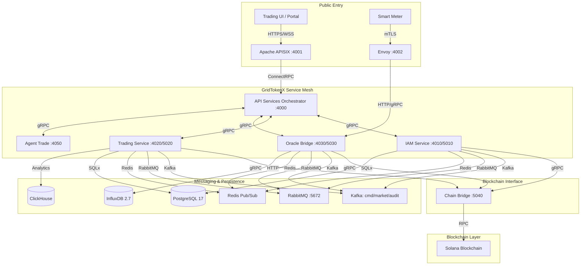

# GridTokenX Platform

[](https://gridtokenx.com)
[](https://solana.com)
[](LICENSE)

**GridTokenX** is a next-generation, blockchain-powered Peer-to-Peer (P2P) energy trading platform. It enables prosumers (energy producers) and consumers to trade energy directly, ensuring trustless on-chain settlement, high-performance telemetry ingestion, and decentralized grid stabilization.

The platform bridges **physical energy infrastructure** (smart meters, solar inverters, EV chargers) with **trustless financial markets** on the Solana blockchain, leveraging a high-performance Rust-based microservices mesh for scalability, data integrity, and low-latency matching.

---

## Architecture at a Glance

GridTokenX follows a **Modern Microservices Architecture** orchestrated by a high-performance Rust gateway and secured by Solana smart contracts. The system consists of **6 core Rust services**, **3 frontend applications**, **30+ Docker containers** for infrastructure, and **5 Anchor programs** on Solana.

### Platform Architecture



### Two Interconnected Platforms

GridTokenX is architected as **two distinct but interconnected platforms**:

| Aspect | **Exchange Platform** | **Infrastructure Platform** |
| :--- | :--- | :--- |
| **Primary Domain** | Financial / Trading | Physical / Data Integrity |
| **Blockchain Access** | ✅ Direct (IAM, Trading) | ❌ Indirect (signs only) |
| **Data Direction** | Receives validated data | Produces validated data |
| **Scaling Factor** | Trading volume / User count | Device count / Telemetry volume |
| **Key Services** | API Services, IAM, Trading | Edge Gateway, Oracle Bridge |

### Edge-to-Blockchain Data Flow

```
Edge Meter → Edge Gateway → Envoy (Edge Gateway) ─┐
                                              IAM Service ─┐
User/Web → APISIX (User Gateway) ───────────────┼→ Trading Service─┼→ Solana Blockchain
                                              Oracle Service─┘
                                              Agent Trade ───┘
                                              Chain Bridge ──┘
```

---

## Technology Stack

### Backend Core

-   **Language**: Rust (2021 Edition)
-   **Web Framework**: Axum (REST), Tonic/ConnectRPC (gRPC over HTTP/2)
-   **Async Runtime**: Tokio (multi-threaded)
-   **Database ORM**: SQLx with compile-time query verification
-   **Error Handling**: `anyhow::Result` for application logic

### Blockchain

-   **Platform**: Solana (localnet for dev, devnet/testnet for staging)
-   **Smart Contracts**: Anchor Framework (1.0.0)
-   **Token Standard**: SPL Token-2022
-   **Programs**: Registry, Trading, Energy Token, Oracle, Governance

### Messaging (Hybrid Architecture)

| Technology | Role | Primary Use Case | Performance |
| :--- | :--- | :--- | :--- |
| **Kafka** (3 clusters) | Event Sourcing Log | Orders, trades, audit trails — strict ordering, 168h retention | High Throughput |
| **RabbitMQ** | Task Queues | Email notifications, settlement retries, DLQ, guaranteed delivery | High Reliability |
| **Redis 7** | Real-Time Engine | WebSocket fan-out, session cache, sub-millisecond access | Ultra-Low Latency |

### Persistence

| Component | Version | Purpose |
|-----------|---------|---------|
| **PostgreSQL 17** | Primary + Replica | User data, orders, trades (streaming replication) |
| **InfluxDB 2.7** | 1 | Time-series meter readings |
| **Redis 7** | Primary + Replica | Cache, session, Pub/Sub |
| **ClickHouse** | 1 | CQRS read-side analytics |

### Infrastructure & Observability

-   **Docker Runtime**: **OrbStack** (2s startup, faster networking, battery optimized)
-   **API Gateway**: Apache APISIX (User-facing, port 4001)
-   **Edge Gateway**: Envoy (IoT/mTLS, port 4002)
-   **Secrets Management**: HashiCorp Vault (port 8200)
-   **Observability**: Prometheus, Grafana (port 3001), Loki, Tempo, OpenTelemetry, SigNoz

### Frontend

-   **Trading UI**: Next.js (React, port 3000)
-   **Explorer**: Platform-specific blockchain explorer
-   **Portal**: Administrative dashboard

---

## Core Services

### 1. API Services (`gridtokenx-api`) — Lead Orchestrator
-   **Port**: 4000 (HTTP)
-   **Role**: Central nervous system. Aggregates responses from microservices, manages real-time WebSocket broadcasting via Redis Pub/Sub, executes background persistence workers for telemetry ingestion (20k+ readings/sec).
-   **Tech**: Rust (Axum), ConnectRPC

### 2. IAM Service (`gridtokenx-iam-service`) — Identity Guardian
-   **Ports**: 8080 (REST) / 8090 (gRPC via ConnectRPC)
-   **Role**: User registration, KYC workflows, secure wallet custody. Generates/encrypts Ed25519 keypairs. Manages Registry Program on-chain. Issues scoped JWTs.
-   **Security**: AES-256-GCM encryption, argon2id password hashing, JWT auth
-   **Blockchain**: Registry + Governance programs

### 3. Trading Service (`gridtokenx-trading-service`) — Matching Engine
-   **Ports**: 8092 (gRPC-primary) / 8093 (REST metrics + settlement)
-   **Role**: In-memory order book management, Continuous Double Auction (CDA) matching, on-chain settlement. Handles conditional orders (stop-loss, take-profit), recurring DCA orders, VPP aggregation, ERC certificate management.
-   **Complexity**: 587-line startup file, 1883-line gRPC implementation (40+ RPCs)
-   **Blockchain**: Trading + Energy Token programs

### 4. Oracle Bridge (`gridtokenx-oracle-bridge`) — Cryptographic Trust Layer
-   **Ports**: 4010 (HTTP) / 50051 (gRPC)
-   **Role**: Validates Ed25519 signatures from Edge Gateways, performs zone-based partitioning, aggregates 15-minute settlement windows. Bridges physical energy data to digital markets.
-   **Blockchain**: Oracle Program

### 5. Chain Bridge (`gridtokenx-chain-bridge`) — Decentralized Signing Authority
-   **Port**: 8095 (gRPC via ConnectRPC)
-   **Role**: Decentralized signing authority and Solana blockchain interface. All services route blockchain transactions through Chain Bridge for distributed key management.

### 6. Agent Trade (`gridtokenx-agent-trade`) — Algorithmic Trading Agent
-   **Port**: 4050 (HTTP)
-   **Role**: Algorithmic trading agent with an actor-based architecture (MarketData, Execution, Strategy, Risk). Supports Binance WebSocket integration, order book management, and automated grid trading strategies.
-   **Tech**: Rust (Tokio), Binance API, Kafka, SQLite

### 6. Edge Gateway (`gridtokenx-edge-gateway`) — Edge Aggregation
-   **Role**: Local aggregation, buffering, protocol translation, Ed25519 signing. Hardware-specific (RPi, rppal, MQTT).
-   **Communication**: Sends validated telemetry to Oracle Bridge via Envoy (mTLS)

---

## Quick Start

### Prerequisites
-   **OrbStack**: Optimized Docker runtime for macOS ([Setup Guide](docs/ORBSTACK_MIGRATION.md))
-   **Rust Toolchain**: `rustup`, `cargo`
-   **Solana CLI & Anchor**: For blockchain interaction
-   **Nushell**: For `grx` helper script
-   **just**: Task runner

### 1. Initialize the Platform
```bash
# Clone and setup
git clone --recursive https://github.com/gridtokenx/platform.git
cd platform

# Copy environment configuration
cp .env.example .env

# Start the unified infrastructure (PostgreSQL, Redis, Kafka, APISIX, Envoy, InfluxDB, Vault)
./scripts/app.sh start --docker-only

# Initialize the blockchain state and deploy Anchor programs
./scripts/app.sh init
```

### 2. Database Setup
```bash
# Run PostgreSQL migrations
just migrate
```

### 3. Launch Services
```bash
# Recommended: Native Apps Mode (best dev experience)
./scripts/app.sh start --native-apps

# Monitor background services
tail -f logs/*.log
```

### 4. Seed Test Data
```bash
# Register admin user
./scripts/app.sh register

# Seed database with test users
./scripts/app.sh seed
```

---

## Development Commands

### Platform Management (`scripts/app.sh`)
```bash
./scripts/app.sh start              # Start all infrastructure + services
./scripts/app.sh start --docker-only  # Start only Docker infrastructure
./scripts/app.sh start --native-apps  # Docker + native app services (background)
./scripts/app.sh stop               # Gracefully stop the platform
./scripts/app.sh init               # Initialize Solana + deploy programs
./scripts/app.sh register           # Register admin user
./scripts/app.sh seed               # Seed database with test users
./scripts/app.sh status             # Check running services
./scripts/app.sh doctor             # Check dependencies + health
```

### Task Automation (`just`)
```bash
just check-all          # cargo check all microservices
just build-all          # Build all microservice binaries
just test               # Run all microservice tests
just test-all           # Run all tests + integration tests (Solana validator)
just test-edge          # Run Edge Protocol integration test
just migrate            # Run sqlx migrations (IAM Service)
just migrate-new name:X # Create new IAM migration
just migrate-revert     # Revert last IAM migration
just migrate-info       # Show migration status
just db-up              # Start PostgreSQL container
just db-down            # Stop PostgreSQL container
just orb-up             # Start all OrbStack services
just orb-down           # Stop all OrbStack services
just fmt                # Format all code (cargo fmt)
just clippy             # Run clippy on all services (-- -D warnings)
just clean-all          # Clean all build artifacts
just benchmark          # Run trading engine benchmarks
just simnet             # Start Solana Mainnet Simulation (Surfpool)
just simnet-ci          # Start Solana Simnet in CI mode
just simnet-down        # Stop Solana Simnet
just orb-rebuild        # Rebuild all Docker services (no cache)
just observability-up   # Start Tempo + SigNoz
just observability-down # Stop observability
```

### Nushell Helper (`grx.nu`)
```bash
grx check     # cargo check
grx build     # cargo build
grx test      # cargo test
grx migrate   # sqlx migrate run
grx db-up     # Start PostgreSQL
grx db-down   # Stop PostgreSQL
grx orb-up    # Start all Docker services
grx orb-down  # Stop all Docker services
grx prepare   # sqlx prepare (offline query preparation)
```

---

## Service Registry

| Component | HTTP Port | gRPC Port | Role |
| :--- | :--- | :--- | :--- |
| **APISIX (User)** | `4001` | — | User Gateway (Web/Mobile) |
| **Envoy (Edge)** | `4002` | — | Edge Gateway (IoT/mTLS) |
| **API Services** | `4000` | — | Lead Orchestrator |
| **IAM Service** | `8080` | `8090` | Identity & Registry |
| **Trading Service** | `8093` | `8092` | Matching & Settlement |
| **Oracle Bridge** | `4010` | `50051` | IoT Data Ingestion |
| **Agent Trade** | `4050` | — | Algorithmic Trading |
| **Chain Bridge** | — | `8095` | Decentralized Signing |
| **PostgreSQL** | `5434` (primary) / `5433` (replica) | — | Primary DB |
| **Redis** | `6379` (primary) / `6380` (replica) | — | Cache, Session, Pub/Sub |
| **RabbitMQ Mgmt** | `15672` | — | Task Queues |
| **Grafana** | `3001` | — | Observability (admin/admin) |
| **InfluxDB** | `8086` | — | Time-Series Meter Readings |
| **ClickHouse** | `8123` | — | CQRS Analytics |
| **Vault** | `8200` | — | Secrets Management |
| **Kafka** | `9092` (cmd) / `9094` (market) / `9096` (audit) | — | Event Sourcing |

---

## On-Chain Program IDs (Localnet)

| Program | ID |
| :--- | :--- |
| **Registry** | `FmvDiFUWPrwXsqo7z7XnVniKbZDcz32U5HSDVwPug89c` |
| **Trading** | `69dGpKu9a8EZiZ7orgfTH6CoGj9DeQHHkHBF2exSr8na` |
| **Energy Token** | `n52aKuZwUeZAocpWqRZAJR4xFhQqAvaRE7Xepy2JxLxKop` |
| **Oracle** | `JDUVXMkeGi4oxLp8njBaGScAFaVBBg7iGoiqcY1LxKop` |
| **Governance** | `DamT9e1VqbA5nSyFZHExKwQu6qs4L5FW6dirWCK8YLd4` |

---

## Workspace Structure

```
gridtokenx-coresystem/
├── gridtokenx-iam-service/          # Identity, Auth, KYC, Registry (Rust)
├── gridtokenx-trading-service/      # Order Matching, Settlement (Rust)
├── gridtokenx-oracle-bridge/        # Edge Validation, IoT Ingestion (Rust)
├── gridtokenx-chain-bridge/         # Decentralized Signing Authority (Rust)
├── gridtokenx-edge-gateway/         # Edge Aggregation (Rust, RPi-specific)
├── gridtokenx-agent-trade/          # Algorithmic Trading Agent (Rust)
├── gridtokenx-anchor/               # Solana Anchor Programs
│   ├── programs/                    # Registry, Trading, Energy Token, Oracle, Governance
│   ├── tests/                       # Program integration tests
│   └── shared/                      # Shared types between programs
├── gridtokenx-blockchain.core/      # Shared blockchain utilities
├── gridtokenx-wasm/                 # WebAssembly utilities
├── gridtokenx-smartmeter-simulator/ # IoT Device Simulator (Python/FastAPI)
├── gridtokenx-api/                  # Lead Orchestrator (Rust)
├── gridtokenx-trading/              # Trading UI (Next.js)
├── gridtokenx-explorer/             # Blockchain Explorer
├── gridtokenx-portal/               # Admin Dashboard
├── apisix_conf/                     # APISIX Gateway Configuration
├── envoy_conf/                      # Envoy Gateway Configuration
├── docker-compose.yml               # Main Docker Compose
├── docker-compose.db.yml            # Database-specific Compose
├── Cargo.toml                       # Rust Workspace (resolver = "2")
├── Justfile                         # Task Runner
├── grx.nu                           # Nushell Helper
├── docs/                            # Platform Documentation
│   ├── PLATFORM_DESIGN.md           # Full Platform Specification (v2.2)
│   ├── architecture/
│   │   ├── specs/system-architecture.md
│   │   └── services/                # Service-specific deep dives
│   ├── academic/                    # Thesis & Research
│   └── ORBSTACK_MIGRATION.md        # OrbStack Setup Guide
├── scripts/
│   └── app.sh                       # Unified Platform Manager
└── tests/
    └── load-test/                   # Load Testing Tool
```

### Cargo Workspace Members

| Crate | Description | Excluded? |
|-------|-------------|-----------|
| `gridtokenx-iam-service` | Identity & Access Management | No |
| `gridtokenx-trading-service` | Trading Engine & Matching | Yes (BPF target) |
| `gridtokenx-oracle-bridge` | Edge Validation & IoT | No |
| `gridtokenx-chain-bridge` | Decentralized Signing | No |
| `gridtokenx-edge-gateway` | Edge Aggregation | Yes (hardware deps) |
| `gridtokenx-blockchain.core` | Shared Blockchain Utilities | No |
| `gridtokenx-wasm` | WebAssembly | No |
| `gridtokenx-agent-trade` | Algorithmic Trading | No |
| `gridtokenx-anchor/programs/*` | Anchor Programs | No |
| `gridtokenx-smartmeter-simulator` | IoT Simulation | No |

---

## Security Model

-   **Wallet Custody**: Private keys encrypted with AES-256-GCM using master secret from environment. Never stored in plaintext.
-   **Authentication**: JWT tokens (scoped), API keys, bcrypt/argon2 password hashing
-   **Edge Validation**: Ed25519 signature verification at edge and oracle layers
-   **Distributed Signing**: Blockchain signing keys distributed per-service (not centralized)
-   **mTLS**: Envoy gateway enforces mutual TLS for IoT device connections
-   **Secrets Management**: HashiCorp Vault for key management and secret rotation
-   **Database Security**: SQLx with compile-time query checking, parameterized queries

---

## Key Documentation

Detailed specifications are located in the `/docs` directory:

-   [Platform Design (Full Specification)](docs/PLATFORM_DESIGN.md)
-   [System Architecture & Diagrams](docs/architecture/specs/system-architecture.md)
-   [Codebase Architecture](docs/architecture/CODEBASE_ARCHITECTURE.md)
-   [API Services Architecture](docs/architecture/services/API_SERVICES_ARCHITECTURE.md)
-   [IAM & Security Model](docs/architecture/services/IAM_SERVICE_ARCHITECTURE.md)
-   [Trading Service Deep Dive](docs/architecture/services/TRADING_SERVICE_ARCHITECTURE.md)
-   [Oracle Bridge & IoT Pipeline](docs/architecture/services/ORACLE_BRIDGE_ARCHITECTURE.md)
-   [Oracle Bridge Grid Protocol](docs/architecture/services/ORACLE_BRIDGE_GRID_PROTOCOL.md)
-   [Academic Documentation (Thesis & Research)](docs/academic/README.md)
-   [Messaging Architecture (Hybrid)](docs/architecture/messaging/HYBRID_MESSAGING_ARCHITECTURE.md)
-   [OrbStack Migration Guide](docs/ORBSTACK_MIGRATION.md)

---

## License

Proprietary Software. © 2026 GridTokenX. All Rights Reserved.
