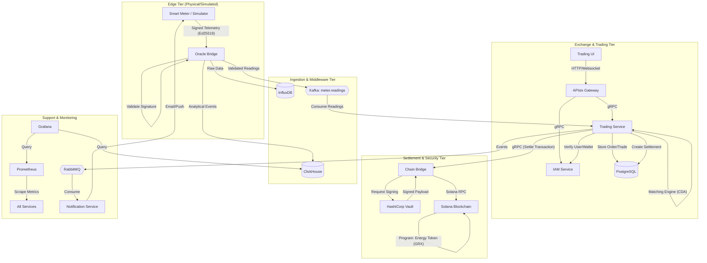

# GridTokenX — Combined Documentation

> Auto-generated concatenation of all files under `docs/`. Edit source files, not this.

## Table of Contents

1. [AGENT_STATE_20260602.md](#agent-state-20260602-md)
2. [BLOCKCHAIN_CORE_ACADEMIC.md](#blockchain-core-academic-md)
3. [CHAIN_BRIDGE_ACADEMIC.md](#chain-bridge-academic-md)
4. [DATA_FLOW.md](#data-flow-md)
5. [IAM_SERVICE_ACADEMIC.md](#iam-service-academic-md)
6. [LAYERED_SYSTEM_ARCHITECTURE.md](#layered-system-architecture-md)
7. [MINTING_E2E_FLOW.md](#minting-e2e-flow-md)
8. [NOTI_SERVICE_ACADEMIC.md](#noti-service-academic-md)
9. [National.md](#national-md)
10. [ORACLE_BRIDGE_ACADEMIC.md](#oracle-bridge-academic-md)
11. [Overview.md](#overview-md)
12. [SMARTMETER_SIMULATOR_ACADEMIC.md](#smartmeter-simulator-academic-md)
13. [TRADING_SERVICE_ACADEMIC.md](#trading-service-academic-md)
14. [VALIDATOR_EQUATIONS.md](#validator-equations-md)
15. [VALIDATOR_EQUATIONS_TH.md](#validator-equations-th-md)
16. [adr/0001-solana-over-evm.md](#adr-0001-solana-over-evm-md)
17. [adr/0002-modular-monolith-services.md](#adr-0002-modular-monolith-services-md)
18. [adr/0003-hybrid-messaging.md](#adr-0003-hybrid-messaging-md)
19. [adr/0004-port-numbering-scheme.md](#adr-0004-port-numbering-scheme-md)
20. [adr/0005-direct-edge-signing-and-telemetry-ingestion.md](#adr-0005-direct-edge-signing-and-telemetry-ingestion-md)
21. [gTHB_ISSUER_SERVICE.md](#gthb-issuer-service-md)
22. [glossary.md](#glossary-md)

---


<a id="agent-state-20260602-md"></a>

# 📄 AGENT_STATE_20260602.md

# AI Agent State - 2026-06-02

## Topic: Coordination Layer & AI Forecasting

### Status
Coordination Layer optimized for high-throughput VPP ops. AI forecasting + batched blockchain settlement ready.

### Achievements
- **Tx Batching**: `BlockchainGateway` expand. Multi-instruction Solana tx for generation mints.
- **VPP Engine**: Port optimization logic. Multi-objective dispatch (SOC, Price, Carbon).
- **Forecasting**: Load prediction service use Thai SLP baseline.
- **Noti Integration**: Kafka consumers for `VppDispatched`. Tera templates ready.
- **Protocol**: gRPC `BatchSettleGenerationMint` + `target_kw` support.

### Knowledge Base
- **Cycle**: 15-min windows.
- **Weights**: SOC 30%, Price 40%, Carbon 30%.
- **Scale**: Target 800M users.

### Next Steps
- Atomic swap batching for Matching Engine.
- Kafka partition strategy refactor for scale.


---


<a id="blockchain-core-academic-md"></a>

# 📄 BLOCKCHAIN_CORE_ACADEMIC.md

# GridTokenX Blockchain Core: Architecture and Design Formalisms

**Abstract**
The `gridtokenx-blockchain-core` library constitutes the foundational middleware and shared cryptographic primitives for the GridTokenX microservices ecosystem. It establishes a unified security model for cross-service authentication, authorization, and blockchain interaction. This document outlines the architecture, security mechanisms, and system abstractions implemented within the core library.

---

## 1. Introduction

In decentralized financial infrastructures, the interaction between off-chain microservices and on-chain smart contracts presents a critical operational surface. `gridtokenx-blockchain-core` addresses this by centralizing critical access controls, messaging schemas, and identity verification into a strictly typed shared library. By adopting an architecture rooted in SPIFFE (Secure Production Identity Framework for Everyone) and Role-Based Access Control (RBAC), the core library ensures that transactions are authenticated and contextually authorized before reaching the signing authority (`chain-bridge`).

## 2. Architectural Abstractions

The core library is partitioned into several interoperable modules, each addressing a specific domain of the system architecture.

### 2.1 Identity and Authorization (`auth.rs`)

The identity model leverages X.509 SVIDs (SPIFFE Verifiable Identity Documents) injected during mutual TLS (mTLS) handshakes. The `auth::SpiffeIdentity` struct acts as the canonical representation of a caller's identity.

A deterministic mapping translates a SPIFFE URI into a domain-specific `ServiceRole`:
`spiffe://gridtokenx.th/prod/trading-service/api` → `TradingApi`

This mapping reduces the reliance on application-layer HTTP headers, grounding the identity in the transport layer's cryptographic proofs.

### 2.2 Policy Enforcement Engine (`policy.rs`)

The `PolicyEngine` implements a Reference Monitor pattern to prevent unauthorized program invocation. It defines an instruction-level validation function against the SPIFFE Identity and the Solana Transaction.

Let `P` be the set of all Solana Program IDs and `A(I)` be the subset of programs authorized for identity `I`. The validation requires that for all instructions in the transaction, the program ID must belong to the authorized set or the System Program. For instance, the `TradingMatcher` identity is explicitly permitted to invoke the Trading, Registry, and Energy Token programs, but denied access to the Oracle program. This compartmentalization bounds the operational scope of each microservice.

### 2.3 RPC and Messaging Middleware (`rpc/`)

The `rpc` module defines the structural boundaries for both synchronous and asynchronous inter-process communication:
1. **gRPC Definitions:** Trait bounds (e.g., `BlockchainService`, `TransactionHandler`) ensure that consuming services implement a standardized interface for interacting with the ledger.
2. **NATS JetStream Schemas:** Defines deterministically serialized message formats (e.g., `TxSubmitMessage`, `TxResultMessage`) required for the asynchronous transaction ingestion paths. This provides binary compatibility across the message bus.

## 3. Security Model

The security posture of the GridTokenX ecosystem relies on primitives defined in `blockchain-core`.

### 3.1 Role-Based Access Control (RBAC)

The `ServiceRole` enum enforces access constraints natively within the Axum routing layer via the `FromRequestParts` trait. The `require()` and `require_any()` functions ensure that specific RPC endpoints are accessible only by the provided roles.

### 3.2 Program-Level Isolation

By evaluating transaction payloads prior to signing, the core library mitigates the risk of unauthorized code execution on the Solana Virtual Machine (SVM). The evaluation of instructions against the hardcoded `SolanaProgramsConfig` enforces strict least-privilege adherence.

## 4. Empirical Validation

The robustness of the core library is validated through extensive testing:
- **Identity Resolution:** Assertions mapping SPIFFE URIs to expected `ServiceRole` enumerations.
- **Policy Enforcement:** Tests demonstrating that a valid identity attempting to construct an unauthorized transaction payload results in a deterministic rejection.
- **RBAC Assertions:** Matrix testing of role-based permissions against simulated API endpoints.

## 5. Conclusion

The `gridtokenx-blockchain-core` library provides the indispensable security and communication scaffolding for the GridTokenX platform. Through its implementation of SPIFFE-based identity mapping, RBAC enforcement, and instruction-level transaction validation, it establishes a resilient and well-defined interface between off-chain services and the Solana blockchain.


---


<a id="chain-bridge-academic-md"></a>

# 📄 CHAIN_BRIDGE_ACADEMIC.md

# GridTokenX Chain Bridge: Decentralized Signing Authority Architecture

**Abstract**
The `gridtokenx-chain-bridge` microservice acts as the exclusive gateway and decentralized signing authority between GridTokenX off-chain services and the Solana blockchain. By implementing a strict Reference Monitor pattern, it decouples transaction construction from cryptographic signing. This document details the architectural topology, authorization invariants, and integration with SPIFFE-based workload identity and HashiCorp Vault Transit.

---

## 1. Introduction

In modern decentralized architectures, managing private key material across distributed microservices introduces operational risks. The GridTokenX Chain Bridge resolves this by centralizing the interaction with the Solana blockchain into a single mediated perimeter. Backend services do not hold private keys; instead, all signing is delegated to a hardened signing oracle. This design ensures that every transaction is authenticated, authorized, and structurally validated before submission.

## 2. Theoretical Foundations

### 2.1 The Reference Monitor Pattern

The Chain Bridge implements a mediated Reference Monitor pattern characterized by:
1. **Tamper-proof Environment:** The mediation mechanism operates within a hardened network perimeter, with entry points secured via mutual TLS (mTLS).
2. **Always-invoked Path:** Every transaction path (synchronous gRPC and asynchronous NATS JetStream) converges at an atomic `sign_and_submit()` pipeline.
3. **Focused Verification Area:** The core authorization logic (RBAC mapping and Policy Engine validation) and the signing delegation are concentrated in an auditable surface area.

### 2.2 Root of Trust (RoT) Partitioning

The system operates under a Delegated Trust Model, partitioning authority to minimize systemic risks:
* **Identity RoT (SPIFFE):** Workload identity is rooted in the platform's SPIRE control plane. The bridge relies on the verification of X.509 SVIDs during the TLS handshake.
* **Key RoT (Vault Transit):** Cryptographic keys are not instantiated in the application's address space. The bridge delegates signing to HashiCorp Vault.
* **Blockchain RoT (Solana):** Finality and state transitions are rooted in the Solana validator cluster.

## 3. Formal System Invariants

The Chain Bridge maintains the following properties during operation:

### 3.1 Authorization Integrity
A signature for a transaction is generated only if the mediation function (involving identity verification, RBAC, and policy constraints) succeeds.

### 3.2 Transaction Processing
Valid transactions submitted by an authorized identity reach the blockchain layer within the blockhash validity window (approximately 60s), facilitated by an asynchronous pull-based consumer with retry disciplines.

### 3.3 Identity Non-Repudiation
Identities are derived directly from the verified transport layer ($L_4$) Subject Alternative Name (SAN) URI, mitigating application-layer ($L_7$) spoofing vectors.

## 4. Architectural Topology

The bridge ingests transactions via two distinct topological paths, converging at a unified processing pipeline.

### 4.1 Dual Ingestion Paths
1. **Synchronous RPC (gRPC / ConnectRPC):** Utilized for real-time transaction submission and state queries by services such as the Trading Service and Oracle Bridge.
2. **Asynchronous Messaging (NATS JetStream):** Utilized for batch settlement and retry queues, implementing a concurrent pull consumer to maximize throughput.

### 4.2 The Atomic `sign_and_submit` Pipeline
All transactions must clear the core pipeline:
1. **Deserialization:** Payload decoded into a Solana `Transaction`.
2. **Policy Engine Evaluation:** Ensures program IDs invoked align with the caller's allowed list.
3. **Blockhash Cache Injection:** Ameliorates RPC latency by injecting a cached latest blockhash if needed.
4. **Delegated Signing:** Vault Transit signs the raw message data.
5. **Signature Attachment:** The resulting Ed25519 signature is affixed to the transaction.
6. **Network Submission:** Broadcast to the Solana validator network.

## 5. Defense in Depth Mechanisms

The implementation provides an overlapping defense mechanism:
1. **Network Layer:** Strict mTLS via `WebPkiClientVerifier`.
2. **Identity Layer:** SPIFFE URIs cryptographically extracted via `PeerCertLayer`.
3. **RBAC Layer:** Per-RPC endpoint method assertions mapping SPIFFE identities to `ServiceRole` categories.
4. **Policy Layer:** Instruction-level Program ID allowlisting.
5. **Key Authority:** Remote signing via Vault Transit; zero local key instantiation.
6. **Idempotency:** A concurrent `DashMap` cache actively rejects double-submissions.
7. **Staleness Protection:** A 55-second TTL validation rejects expired payloads prior to signing.
8. **Retry Discipline:** Bound retries (max 3 attempts) restrict transient RPC amplification.

## 6. Conclusion

The `gridtokenx-chain-bridge` establishes a robust, zero-trust boundary between distributed microservices and the Solana Virtual Machine. By enforcing strict reference monitoring and delegating cryptographic operations to key management systems, the architecture ensures authorization integrity and high operational reliability.


---


<a id="data-flow-md"></a>

# 📄 DATA_FLOW.md

# GridTokenX Data Flow Documentation

This document describes the architectural data flow of the GridTokenX core system, mapping the journey of energy telemetry from physical smart meters to on-chain financial settlement.

## 1. System Overview

GridTokenX is a four-tier cyber-physical system designed to bridge the physical electricity grid with a decentralized ledger (Solana).



---

## 2. Core Data Paths

### A. Telemetry & Ingestion Path (IoT)
The system's primary input is time-series energy telemetry generated by Smart Meters.

1.  **Generation & Signing:** Physical or simulated smart meters generate energy frames (active power, voltage, etc.). Each frame is signed using the meter's private **Ed25519** key.
2.  **Edge Ingestion:** The `Oracle Bridge` receives these frames via gRPC (high-throughput) or REST.
3.  **Off-Chain Verification:** The Oracle Bridge performs cryptographic verification of the meter's signature before processing. Invalid data is dropped at the boundary to protect down-stream services.
4.  **Dissemination:** Validated readings are:
    *   Committed to **Kafka** (`meter.readings`) for real-time processing.
    *   Stored in **InfluxDB** for time-series visualization.
    *   Aggregated in **ClickHouse** for long-term grid analytics.

### B. Trading & Matching Path
This path handles user-driven energy transactions and automatic matching.

1.  **Order Entry:** Users place Buy/Sell orders via the `Trading UI`. These are routed through **APIsix** to the `Trading Service`.
2.  **Identity Verification:** The `Trading Service` verifies the user's identity and wallet status via the `IAM Service`.
3.  **Matching Engine:** The service runs a **Continuous Double Auction (CDA)** engine. When a seller's surplus matches a buyer's deficit, a trade is executed.
4.  **Settlement Generation:** A trade results in a `Settlement` record stored in **PostgreSQL** with a `Pending` status.

### C. On-Chain Settlement Path (The "Atomic" Step)
The finality of all transactions occurs on the Solana blockchain.

1.  **Settlement Trigger:** The `SettlementWorker` identifies `Pending` settlements in the database.
2.  **Transaction Building:** The `Trading Service` constructs the necessary Solana instructions (e.g., `mint_to_wallet` or `atomic_swap`).
3.  **Secure Signing:** Instructions are sent to the `Chain Bridge`. The bridge requests a cryptographic signature from **HashiCorp Vault**, which holds the system's authority keys in a secure HSM-like environment.
4.  **Submission:** The signed transaction is submitted to the **Solana Cluster** via RPC.
5.  **Confirmation:** The `Chain Bridge` monitors for finality. Once confirmed, the settlement status in PostgreSQL is updated to `Completed`.

---

## 3. Technology Stack Summary

| Component | Technology | Role |
| :--- | :--- | :--- |
| **Edge Gateway** | Envoy / Oracle Bridge (Rust) | mTLS Termination & IoT Ingestion |
| **Message Bus** | Apache Kafka | Event Sourcing & Reading Streams |
| **API Gateway** | Apache APISIX | User Auth & Routing |
| **Core Services** | Rust (Axum, Tokio) | Trading Logic, IAM, Notifications |
| **Primary DB** | PostgreSQL 17 | Relational State & Metadata |
| **Time-Series DB** | InfluxDB / ClickHouse | Telemetry & Analytics |
| **Blockchain** | Solana (Anchor Framework) | Settlement & Registry |
| **Security** | HashiCorp Vault | Key Management & Signing |
| **Monitoring** | Prometheus / Grafana | System Health & Observability |


---


<a id="iam-service-academic-md"></a>

# 📄 IAM_SERVICE_ACADEMIC.md

# GridTokenX IAM Service: Identity and Access Management Architecture

**Abstract**
The `gridtokenx-iam-service` functions as the central identity, security, and authentication authority for the GridTokenX Platform. Implemented as a modular monolith, it enforces strict architectural boundaries to decouple domain logic from infrastructure constraints. This document details its layered architecture, unified identity model, communication protocols, and concurrency safeguards utilized to securely provision and validate access across the platform.

---

## 1. Introduction

Identity and Access Management (IAM) requires resilient, high-throughput verification without compromising domain complexity. The GridTokenX IAM Service establishes a definitive boundary for user lifecycles, Role-Based Access Control (RBAC), and session management. It acts as the authoritative bridge between off-chain user states (managed via traditional web paradigms) and on-chain cryptographic identities (managed via the Solana Registry program).

## 2. Architectural Design: Modular Monolith

The service adheres to the **"Sync Core, Async Edges"** architectural principle, structuring the Rust workspace into distinct crates to enforce a downward dependency flow. 

### 2.1 Crate Topology
- **`iam-core`**: The foundational primitive layer containing zero-dependency domain models, common error types, and trait definitions.
- **`iam-protocol`**: The contract layer defining domain-agnostic Protobuf schemas and generated ConnectRPC implementations.
- **`iam-persistence`**: The infrastructure layer handling state mutations via SQLx (PostgreSQL), Redis, and Kafka/RabbitMQ.
- **`iam-logic`**: The domain core orchestrating business rules (e.g., `AuthService`). It is decoupled from implementation details via Trait-Based Dependency Injection.
- **`iam-api`**: The asynchronous edge adapter defining high-concurrency Axum REST endpoints and ConnectRPC handlers.
- **`bin/iam-service`**: The executable entry point responsible for configuration loading and the orchestration of Dependency Injection.

### 2.2 Trait-Based Dependency Injection
The `iam-logic` layer interacts with external services exclusively through traits defined in `iam-core`. This enables comprehensive unit testing (via `mockall`) and permits the substitution of infrastructure components without altering business rules. To resolve complex lifetime constraints across crate boundaries, the service utilizes manual `BoxFuture` return types for specific interfaces (e.g., `BlockchainTrait`).

## 3. Unified Identity Model and Cryptography

The system provisions dual identities upon user registration:
1.  **Off-Chain Identity:** Persistent relational data stored in PostgreSQL. Passwords are secured using Argon2id hashing algorithms.
2.  **On-Chain Identity:** A Program Derived Address (PDA) deterministically derived and registered on the Solana blockchain via the platform's Registry program. 

This model links traditional authentication flows with decentralized cryptographic authorities.

## 4. Protocol and Communication Topologies

The IAM service is the authoritative verification node for inter-service communications, operating on dual protocols.

### 4.1 Inter-Service Verification (ConnectRPC)
Internal microservices rely on the IAM service to validate incoming requests facilitated via high-throughput gRPC over HTTP/2 (`ConnectRPC`).
*   `VerifyToken`: Validates JWT cryptographic signatures, expiry, and queries the Redis session cache.
*   `Authorize`: Evaluates RBAC constraints for downstream services.

### 4.2 Client-Facing Access (REST)
External consumers interact with the IAM service through a standard JSON REST API routed via the system's API Gateway. This pathway handles user registration, login, and profile management.

## 5. Concurrency and System Safety

To maintain high throughput, the service implements rigorous concurrency safeguards.

### 5.1 Tokio Worker Starvation Prevention
The service segregates I/O-bound operations from CPU-bound operations. Cryptographic tasks—such as Argon2id password hashing and JWT signature generation—are offloaded from the primary asynchronous executor using `tokio::task::spawn_blocking`. This ensures consistent low-latency request handling under load.

### 5.2 Idempotency and Fault Tolerance
State-mutating persistence operations (`iam-persistence`) are designed to be idempotent. This ensures that the system can safely retry operations during partial network failures without compromising the integrity of the off-chain Postgres store or the on-chain Solana state.

## 6. Conclusion

The `gridtokenx-iam-service` exemplifies a disciplined approach to identity management in hybrid Web2/Web3 environments. Its modular monolithic architecture ensures clean domain separation, and its unified identity model successfully bridges the gap between traditional web authentication and cryptographic blockchain identity.


---


<a id="layered-system-architecture-md"></a>

# 📄 LAYERED_SYSTEM_ARCHITECTURE.md

# Layered System Architecture: A Cyber-Physical System Design for Decentralized P2P Energy Markets

## Abstract
This document details the layered cyber-physical architecture of the GridTokenX platform. To address the computational limits of distributed ledgers and the latency constraints of high-frequency internet of things (IoT) telemetry, we present a four-layered system model. By decoupling edge protocol translation, off-chain cryptographic signature verification, event-sourced matching, and on-chain atomic settlement, the architecture achieves low-latency, trustless, and grid-aware energy transactions.

---

## 1. Architectural System Model

The GridTokenX system model is formalized as a four-tier architecture designed to bridge the physical electricity grid with a decentralized ledger. The structure minimizes on-chain storage and execution overhead while preserving non-repudiation and security invariants. For a detailed mapping of data movement across services, see the [Data Flow Documentation](DATA_FLOW.md).

```
+---------------------------------------------------------------------------------+
|                             I. SMARTMETER SIMULATOR                             |
|  [Smart Meter Node] ---> Compute Ed25519 Signature: Sig = sign(SK_edge, Payload)  |
+------------------------------------+--------------------------------------------+
                                     │
                                     ▼ (Secure TLS Tunnel)
+------------------------------------+--------------------------------------------+
|                       II. INGESTION & MIDDLEWARE LAYER                         |
|  [Oracle Bridge] ───► Verify: verify(PK_edge, Payload, Sig)                    |
|         │                                                                       |
|         ▼ (Partitioned by Meter ID)                                             |
|  [Apache Kafka Event Log] ───► Event-Sourced Storage                            |
+------------------------------------+--------------------------------------------+
                                     │
                                     ▼ (Kafka Event Stream Ingestion)
+------------------------------------+--------------------------------------------+
|                       III. EXCHANGE PLATFORM LAYER                             |
|  [Continuous Double Auction Engine]                                             |
|         │                                                                       |
|         ▼ (Generate Match Payload with Match Engine Signature)                 |
|  [Atomic Settlement Gateway]                                                    |
+------------------------------------+--------------------------------------------+
                                     │
                                     ▼ (Anchor RPC Call)
+------------------------------------+--------------------------------------------+
|                          IV. DISTRIBUTED LEDGER LAYER                           |
|  [Solana Virtual Machine Program Space]                                         |
|    ├── Registry Program (Wallet-to-Node Mapping)                                |
|    ├── Settlement Program (Multi-Signature Validation & Escrow Clearing)         |
|    └── Energy Asset Ledger (SPL Token Minting & Transfer)                       |
+---------------------------------------------------------------------------------+
```

---

## 2. Layer Analysis

### A. SmartMeter Simulator Layer
The SmartMeter Simulator layer simulates physical smart meters to generate telemetry and interface with the electrical network structure.
1. **Telemetry Generation:** Each simulated smart meter node directly generates measurements (active/reactive power, voltage, current, frequency) or imports them via historical load profile playback, packaging them into standardized JSON frames or raw binary payloads.
2. **Cryptographic Attestation:** To establish data integrity at the source, the smart meter signs each telemetry frame using an asymmetric **Ed25519** signature scheme. Depending on the ingestion path, the signing target is either:
   * **Text Path:** A structured colon-separated string: `"{meter_id}:{surplus_energy}:{timestamp_seconds}"`.
   * **Binary Path:** A binary encoded DLMS/COSEM frame representation.
   The private key ($SK_{edge}$) is stored inside the meter's configuration to prevent unauthorized manipulation.

### B. Ingestion & Middleware Layer
To prevent malicious nodes from exhausting blockchain resources through Sybil attacks or malformed payloads, the ingestion layer enforces off-chain input filtering.
1. **Ingestion Transport Interfaces:** The Oracle Bridge exposes dual-path reception protocols:
   * **gRPC / ConnectRPC Interface:** High-throughput RPC endpoint that accepts structured `TelemetryRequest` protobuf payloads. In binary mode, raw DLMS/COSEM frames are transmitted directly as a byte stream to eliminate JSON serialization latency.
   * **HTTP REST Interface:** Standard web API endpoint that accepts JSON structured payloads (e.g., `POST /api/v1/telemetry/submit-reading`) for compatibility with legacy systems or REST-only clients.
2. **Oracle Bridge Signature Verification:** The Oracle Bridge serves as a stateless validator. Upon receiving a payload from either transport path, it performs a cryptographic lookup against an in-memory cache of registered public keys ($PK_{edge}$). It verifies the signature:
   $$\text{verify}(PK_{edge}, \text{Payload}, \text{Sig}) == \text{True}$$
   Invalid or unregistered inputs are dropped immediately at the boundary.
3. **Message Partitioning & Event Sourcing:** Authenticated telemetry frames are forwarded to a partitioned **Apache Kafka** topic. To guarantee monotonic time ordering per physical node, payloads are partitioned using the unique `meter_id` as the message key.

### C. Exchange Platform Layer
The Exchange Platform contains the high-frequency matching components and the business logic gateways.
1. **API Routing Proxy:** A gRPC-enabled gateway manages authorization, rate limiting, and request serialization using **ConnectRPC** over HTTP/2.
2. **Matching Engine (Continuous Double Auction):** The matching service consumes the telemetry stream and tracks the energy states of active nodes. Buy and sell orders are matched in real-time based on price-time priority. When a match occurs, the matching engine generates a cryptographic match proof, signing it with the matching engine's key ($SK_{match}$).

### D. Distributed Ledger Layer
The ultimate source of state and financial settlement is executed on the **Solana** blockchain using smart contracts built with the **Anchor** framework.
1. **On-Chain Meter Registry:** To prevent wallet-spoofing, the registry program maintains a state mapping:
   $$\text{RegistryAccount} \rightarrow \{ \text{OwnerWallet}, \text{MeterID}, \text{FeederNodeID} \}$$
   This binds a cryptographic identity to a physical location on the grid topology.
2. **Atomic Settlement Program:** Settles matched trades on-chain. It accepts the match payload, verifies the signature of the matching engine, and executes an atomic transfer:
   * It transfers stablecoins (e.g., USDC) from the buyer's on-chain escrow to the seller.
   * It mints and transfers **SPL Energy Tokens** to the buyer, representing cryptographic, non-repudiable utility certificates of green energy delivery.

---

## 3. End-to-End Transaction Lifecycle

1. **Telemetry Generation & Signing:** 
   * **Structured Text Format:**
     $$\text{Data}_{\text{text}} = \text{MeterID} \mathbin{\Vert} \text{SurplusEnergy}_{\text{kWh}} \mathbin{\Vert} \text{Timestamp}_{\text{seconds}}$$
   * **Binary DLMS Format:**
     $$\text{Data}_{\text{bin}} = \text{DLMS\_Payload}$$
   * **Signature Computation:**
     $$\text{Sig} = \text{Sign}(SK_{\text{edge}}, \text{Data})$$
2. **Off-Chain Verification:** Oracle Bridge verifies $\text{Sig}$ using $PK_{\text{edge}}$, and commits the validated state to the Kafka ingestion log.
3. **Auction Matching:** The matching engine matches the seller's surplus with the buyer's deficit and outputs a match result signed by the engine:
   $$\text{Match} = \{ \text{Buyer}, \text{Seller}, \text{Volume}_{\text{kWh}}, \text{Price}_{\text{USDC}} \}$$
4. **On-Chain Settlement:** The settlement smart contract verifies the matching engine's signature, transfers USDC, and mints the SPL Energy token to the buyer.
5. **Auditing & State Logging:** The settlement program emits an on-chain transaction log, facilitating trustless audits by distribution system operators (DSOs).


---


<a id="minting-e2e-flow-md"></a>

# 📄 MINTING_E2E_FLOW.md

# GridTokenX Minting E2E Flow

This document maps the end-to-end flow from smart meter telemetry ingestion to on-chain GRX token minting, as implemented in the current codebase.

## 🏗️ Architecture Flow

1. **Telemetry Ingestion**: `gridtokenx-smartmeter-simulator` (Python) → `gridtokenx-oracle-bridge` (Rust).
   - Telemetry payload is signed with an Ed25519 key representing the meter.
   - Sent via gRPC (port 50051) to the Oracle Bridge.

2. **Validation & Dissemination**: `gridtokenx-oracle-bridge` receives the payload.
   - Verifies the Ed25519 signature against the device's public key.
   - Pushes the validated reading to the **Kafka Market Cluster** (topic: `meter.readings`).

3. **Oracle Consumption**: `gridtokenx-trading-service` listens to the Kafka `meter.readings` topic.
   - Resolves the `device_id` to a `user_id` (buyer/seller).
   - Calculates the `surplus_kwh` or generated amount based on feed-in tariffs.

4. **Settlement Creation**: The `SettlementService` inside `gridtokenx-trading-service` creates a `Pending` settlement record in PostgreSQL.

5. **Blockchain Execution Preparation**: The `SettlementService` batches pending settlements.
   - Uses the `blockchain-core-compat` library to build a `mint_to_wallet` instruction or `execute_atomic_settlement` instruction depending on the flow type.
   - Serializes the transaction payload.

6. **Transaction Bridging**: `gridtokenx-trading-service` publishes the serialized transaction to **NATS JetStream** (subject: `chain.tx.submit`).

7. **Finality**: `gridtokenx-chain-bridge` acts as the Vault-backed signer.
   - Pulls the message from NATS.
   - Enforces SPIFFE-based identity mapping and program RBAC.
   - Requests a signature from HashiCorp Vault.
   - Submits the signed transaction to the Solana network (Localnet/Devnet).
   - The Solana `energy-token` smart contract mints GRX to the user's Associated Token Account (ATA).

## ✅ Verification Checklist

### 1. Telemetry & Ingestion
- [ ] **Simulator Signing**: Verify `smartmeter-simulator` uses `Ed25519` for the `device_id`.
- [ ] **Gateway Handlers**: Confirm `gridtokenx-oracle-bridge` receives the gRPC request successfully.
- [ ] **Signature Verification**: Check logs for signature verification success in `oracle-bridge`.

### 2. Message Bus
- [ ] **Kafka Dissemination**: Verify `meter.readings` topic in `kafka-market` receives the payload.

### 3. Settlement Engine
- [ ] **DB Persistence**: Query `settlements` table in `gridtokenx-postgres` for `status = 'Pending'` entries after telemetry ingestion.
- [ ] **Incentive Calculation**: Verify the calculation logic correctly scales to 9 decimals (lamports).

### 4. Blockchain Execution
- [ ] **Instruction Building**: Verify `build_mint_to_wallet_instruction` in `blockchain-core-compat` uses the correct Anchor discriminator.
- [ ] **NATS Submission**: Verify `chain.tx.submit` message is published with the serialized transaction.
- [ ] **Bridge Signing**: Confirm `gridtokenx-chain-bridge` logs `✅ Success` for transaction submission.

### 5. On-Chain State
- [ ] **Token Balance**: Use Solana CLI (`spl-token balance`) to verify the prosumer's balance increased.
- [ ] **Supply Sync**: Confirm total supply syncs correctly on the blockchain.


---


<a id="noti-service-academic-md"></a>

# 📄 NOTI_SERVICE_ACADEMIC.md

# GridTokenX Notification Service: Omni-Channel Dispatch Architecture

**Abstract**
The `gridtokenx-noti-service` serves as the centralized, stateful notification dispatcher for the GridTokenX platform. Designed to handle high-throughput outbound communications, it supports omni-channel delivery (Email, WebSockets) while providing idempotency and robust fault tolerance through exponential backoff retry disciplines. This document outlines the system's modular monolithic architecture, its adherence to "Sync Core, Async Edges" principles, and the mechanisms by which it reliably converts asynchronous platform events into user communications.

---

## 1. Introduction

In distributed energy platforms, timely delivery of transactional alerts (e.g., trade matching, account onboarding) is critical for system usability. The GridTokenX Notification Service acts as a resilient message sink and omni-channel dispatcher. By decoupling the core orchestration logic from infrastructure specificities using a hexagonal ports-and-adapters architecture, the service achieves high testability and deterministic performance under concurrent load.

## 2. Architectural Design

The service is constructed as a **Modular Monolith** employing a 6-crate Rust workspace. The design rigorously enforces an acyclic dependency flow, ensuring that network adapters cannot leak implementation details into the domain core.

### 2.1 Crate Topology
- **`noti-core`**: The foundational primitive layer containing zero-I/O domain models, error enumerations, and core Dependency Injection (DI) traits.
- **`noti-protocol`**: The contract layer encompassing ConnectRPC (gRPC) definitions generated from Protobuf schemas.
- **`noti-persistence`**: The concrete infrastructure layer implementing SQLx (PostgreSQL), Redis (caching and locks), RabbitMQ (dispatch/retry queues), Kafka (event consumption), and SMTP/WebSocket providers.
- **`noti-logic`**: The pure domain core containing the `NotificationOrchestrator`, determining queuing, provider selection, and retry disciplines exclusively via `noti-core` traits.
- **`noti-api`**: The high-concurrency adapter layer providing Axum REST endpoints, ConnectRPC handlers, and the real-time WebSocket connection registry.
- **`bin/noti-server`**: The application entry point responsible for environment configuration and orchestrating DI wiring.

### 2.2 Sync Core, Async Edges
The architecture segregates I/O bounds. The orchestrator makes synchronous branching decisions regarding idempotency state and retry backoffs, delegating the actual asynchronous I/O execution to the trait implementations in the persistence layer.

## 3. Message Delivery Mechanics

The Notification Service acts as a Kafka consumer, processing domain events from `iam.user.events` and `iam.audit.events` into formatted outbound communications.

### 3.1 Idempotency and Deduplication
Upon receiving an event, the orchestrator performs a distributed lock check via Redis. This prevents concurrent redeliveries of the same Kafka event from resulting in duplicate dispatches, ensuring exact-once processing semantics at the orchestration boundary.

### 3.2 RabbitMQ Dead-Letter Exchange (DLX) Retry Strategy
To provide resilient delivery against downstream provider outages, the system employs a RabbitMQ retry topology:
1. Failed dispatches are routed to a `noti.retry` queue.
2. The retry queue utilizes an `x-dead-letter-exchange` pointing back to the main dispatch routing key.
3. The orchestrator applies an exponential backoff algorithm attaching the delay as an expiration header (TTL) before requeuing.

### 3.3 Dynamic Template Rendering
Message bodies are dynamically generated using the `Tera` templating engine, providing HTML auto-escaping. The system supports multi-part MIME email composition, generating plaintext fallbacks to ensure broad client compatibility.

## 4. Concurrency and Dual Server Topology

The service concurrently operates dual network listeners sharing a unified Axum router:
- **HTTP/REST (TCP):** Exposes endpoints for polling notification history and WebSocket session negotiation.
- **gRPC/ConnectRPC (TCP/HTTP2 + UDP/QUIC):** Utilizing `quinn` and `h3`, it exposes remote procedure calls over HTTP/3 for internal service communication.

Database queries are bifurcated utilizing a **Dual PostgreSQL Pool** strategy. High-priority connection pools handle state mutations (writes), while constrained low-priority pools serve client reads, preventing reporting queries from starving the dispatch pipeline.

## 5. Conclusion

The `gridtokenx-noti-service` represents a robust notification architecture designed for grid-scale environments. By combining acyclic hexagonal architecture, strict idempotency guarantees, and an advanced RabbitMQ DLX retry mechanism, it provides an omni-channel dispatch system capable of high concurrency and reliable message delivery.


---


<a id="national-md"></a>

# 📄 National.md

# GridTokenX System Architecture

This document describes the actual system architecture and deployment topology of the GridTokenX platform as implemented in the current codebase.

## High-Level Topology

The system is designed around a microservices architecture communicating via REST, gRPC, and asynchronous message brokers. All components are containerized and orchestrated via Docker Compose for local development and testing.

```text
[ EXTERNAL CLIENTS / DEVICES ]
          | (HTTPS / mTLS)
          v
+--------------------------------------------------------+
| EDGE & API GATEWAYS                                    |
| - APISIX (User Proxy / Web Clients)                    |
| - Envoy  (IoT Edge Proxy / mTLS)                       |
+--------------------------------------------------------+
          |
          v
+--------------------------------------------------------+
| CORE MICROSERVICES (Rust)                              |
| - IAM Service (Identity, Auth, JWT)                    |
| - Trading Service (Matching, Settlement, Order Book)   |
| - Oracle Bridge (IoT Telemetry Ingestion)              |
| - Notification Service (Email, Alerts)                 |
+--------------------------------------------------------+
          |
          v
+--------------------------------------------------------+
| BLOCKCHAIN INTERFACE (Rust)                            |
| - Chain Bridge (Vault-backed Signing & Submission)     |
+--------------------------------------------------------+
          | (RPC)
          v
[ SOLANA LOCALNET / DEVNET ]
```

## Core Components

### 1. API & Edge Gateways
- **Apache APISIX (`apisix`)**: Handles public internet traffic for web clients (e.g., `trading-ui`). Routes requests to appropriate microservices.
- **Envoy (`envoy`)**: Edge gateway primarily designed for IoT device ingestion, terminating mTLS connections from smart meters.

### 2. Microservices
- **IAM Service (`gridtokenx-iam-service`)**: Manages user identities, API keys, JWT authentication, and off-chain wallet authority mapping.
- **Trading Service (`gridtokenx-trading-service`)**: The core engine containing the order matcher, settlement logic, and trading API. Connects to Redis for caching/streaming and Postgres for state persistence.
- **Oracle Bridge (`gridtokenx-oracle-bridge`)**: Receives telemetry data (e.g., from `gridtokenx-smartmeter-simulator`), validates device signatures, and pushes events into the internal message bus for settlement.
- **Notification Service (`gridtokenx-noti-service`)**: Handles async delivery of emails and platform alerts.

### 3. Messaging & Streaming
The platform uses a segmented approach to message routing to isolate different traffic profiles:
- **Kafka Cluster (Command)**: Durable, strictly ordered queue for critical commands.
- **Kafka Cluster (Market)**: High-throughput, ephemeral stream for market data and telemetry.
- **Kafka Cluster (Audit)**: Long-retention queue for regulatory and system audit events.
- **RabbitMQ**: Handles asynchronous task queuing and RPC-style service-to-service communication.
- **Redis Streams**: Used for fast, transient event dissemination (e.g., between Oracle Bridge and Trading Service).

### 4. Persistence Tier
- **PostgreSQL**: Primary transactional store for all services. Implemented with primary and read-replica (including cascading replica) nodes. Connection pooling is managed by PgBouncer.
- **Redis**: Caching layer for IAM and Trading services, and transient event streams.
- **ClickHouse**: OLAP database used for high-volume analytics and trade history.
- **InfluxDB**: Time-series database for raw smart meter telemetry persistence.
- **MinIO**: S3-compatible object storage for cold data and large payloads.

### 5. Blockchain Integration
- **Chain Bridge (`gridtokenx-chain-bridge`)**: The exclusive gateway to the Solana network. No microservice holds private keys. Instead, they send transaction requests via gRPC or NATS to the Chain Bridge, which delegates signing to a HashiCorp Vault Transit engine before submitting the transaction to Solana. Enforces SPIFFE-based identity mapping and program-level RBAC.
- **Vault (`vault`)**: HashiCorp Vault instance providing the Transit Secrets Engine for Ed25519 transaction signing.

### 6. Observability
- **Prometheus & Grafana**: System metrics collection and visualization.
- **Node Exporter & cAdvisor**: Host and container-level resource metrics.

## Logical Flow Example (Telemetry Ingestion)

1. `smartmeter-simulator` generates energy generation data and signs it.
2. Payload is sent via gRPC to the `oracle-bridge`.
3. `oracle-bridge` verifies the Ed25519 signature and publishes the validated reading to a Kafka topic (market tier).
4. `trading-service` consumes the reading, calculates the required `surplus_kwh`, and stages a `Pending` settlement in Postgres.
5. A background worker in `trading-service` issues a transaction request to `chain-bridge`.
6. `chain-bridge` verifies the service's identity, requests a signature from Vault, and submits the `execute_generation_mint` instruction to the Solana network.


---


<a id="oracle-bridge-academic-md"></a>

# 📄 ORACLE_BRIDGE_ACADEMIC.md

# GridTokenX Oracle Bridge: VPP Convergence and Cryptographic Ingestion Layer

**Abstract**
The `gridtokenx-oracle-bridge` functions as the Convergence Layer for the GridTokenX Virtual Power Plant (VPP) ecosystem. By acting as the high-throughput, cryptographically secure ingestion entry point, it bridges edge devices (smart meters, EVs, BESS) to both the real-time VPP optimization platform and the blockchain settlement layer. This document delineates the architectural paradigms and dual-path processing model that secure off-chain energy telemetry for on-chain state transitions.

---

## 1. Introduction

In decentralized energy networks, the integration of distributed energy resources (DERs) into a unified market requires guarantees regarding the provenance and integrity of off-chain telemetry. The Oracle Bridge resolves this by decoupling raw hardware ingestion from the cryptographic attestation pipeline, enforcing strict signature verification and enabling batched processing.

## 2. Dual-Path Processing Architecture

To satisfy both the low-latency requirements of operational forecasting and the cryptographic rigor required for financial settlement, the Oracle Bridge implements a **Dual-Path processing topology**.

### 2.1 Path A: Real-Time Operational Ingestion
Operational data paths demand low latency to facilitate predictive forecasting and optimizations.
- **Ingestion & Normalization:** The service ingests raw, cryptographically signed telemetry via gRPC and REST endpoints, normalizing disparate hardware payloads into standardized schemas.
- **Streaming Pipeline:** Validated data streams are routed into highly concurrent message brokers (Apache Kafka and Redis Streams) powered by an optimized Rust/Tokio asynchronous runtime.

### 2.2 Path B: Settlement and Attestation
For financial settlement and on-chain syncing, data must be mathematically verifiable without exposing raw granular consumption metrics.
- **Batched Attestation:** The Oracle Bridge batches verified telemetry for downstream processing.
- **Aggregation Frameworks:** Utilizing Zero-Knowledge proofs (e.g., Plonky2), the system facilitates the verification of aggregated energy consumption or generation. This allows downstream systems like HyperEVM to verify asset behavior while maintaining compliance.

## 3. Cryptographic Security Model

The security of the Oracle Bridge relies on strict cryptographic enforcement at the edge-to-cloud boundary.

### 3.1 Edge Signature Verification
Every inbound telemetry packet must carry a cryptographic signature generated at the hardware edge. 
- **Algorithm:** The system mandates the use of the **Ed25519** elliptic curve signature scheme.
- **Encoding:** Signatures and public keys are transmitted and verified utilizing Base58 encoding.
- **Production Invariant:** When the `ENVIRONMENT=production` flag is active, the system strictly drops any payload failing signature verification, mitigating injection and spoofing vectors.

### 3.2 State-backed Key Validation
Device public keys are persistently registered and cached within a centralized Redis state store. The bridge validates incoming payloads against this cached Root of Trust, establishing a non-repudiable link between the physical asset and the data stream.

## 4. Systems Engineering and Performance

To accommodate grid-scale deployments, the service is engineered with a focus on concurrent throughput:
- **Asynchronous I/O:** Built on the Rust `tokio` multi-threaded runtime, ensuring non-blocking processing of simultaneous device connections.
- **Observability:** Integration of tracing telemetry and metrics guarantees monitoring of ingestion latencies and cryptographic verification overheads.

## 5. Conclusion

The GridTokenX Oracle Bridge forms the critical data convergence nexus of the VPP architecture. By bifurcating the processing load into a low-latency operational stream and a highly verifiable settlement stream, it establishes a high-throughput, secure data pipeline. Its adherence to Ed25519 signature enforcement ensures that the underlying blockchain networks operate on reliable truths concerning grid-edge physical assets.


---


<a id="overview-md"></a>

# 📄 Overview.md

# GridTokenX Documentation Overview

This file outlines the documentation structure for the GridTokenX core system.

## Project Structure

The project is structured as a collection of microservices and shared libraries, primarily written in Rust, Python, and TypeScript.

```
gridtokenx-coresystem/
├── README.md                      # Main entry point and project description
├── SECURITY.md                    # Security policies
├── CONTRIBUTING.md                # Contribution guidelines
├── CLAUDE.md                      # General LLM coding conventions
├── docker-compose.yml             # Local development infrastructure definition
├── docs/                          # Project-wide documentation
│   ├── Overview.md                # This file
│   ├── MINTING_E2E_FLOW.md        # End-to-end flow for token minting
│   ├── National.md                # System architecture and deployment tiers
│   └── ...                        # Other academic and architectural docs
├── gridtokenx-iam-service/        # Identity and Access Management service (Rust)
├── gridtokenx-trading-service/    # Core trading and settlement engine (Rust)
├── gridtokenx-noti-service/       # Notification delivery service (Rust)
├── gridtokenx-oracle-bridge/      # IoT gateway and telemetry ingestion (Rust)
├── gridtokenx-blockchain-core/    # Shared Solana/Anchor blockchain library (Rust)
├── gridtokenx-chain-bridge/       # Vault-backed Solana transaction bridge (Rust)
├── gridtokenx-smartmeter-simulator/ # Telemetry generation and testing (Python)
├── gridtokenx-trading/            # Web frontend for the trading platform (Next.js)
├── gridtokenx-explorer/           # Blockchain explorer interface (Next.js)
└── gridtokenx-anchor/             # Solana Anchor smart contracts
```

## Documentation Strategy

Documentation is decentralized where possible. Service-specific documentation lives within the respective service directories (e.g., `gridtokenx-chain-bridge/README.md`, `gridtokenx-iam-service/ARCHITECTURE.md`).

Cross-cutting concerns and high-level architectural overviews are located in the `docs/` folder.

- **Service Level**: Use `README.md` and `ARCHITECTURE.md` within the service folder to explain the service's responsibilities, internal architecture, and how to run it.
- **System Level**: Use `docs/` for end-to-end flows (`MINTING_E2E_FLOW.md`) and deployment architecture (`National.md`).
- **Blockchain Level**: Use `gridtokenx-anchor/docs/` or `gridtokenx-blockchain-core/` for detailed smart contract specifications.


---


<a id="smartmeter-simulator-academic-md"></a>

# 📄 SMARTMETER_SIMULATOR_ACADEMIC.md

# GridTokenX Smart Meter Simulator: High-Fidelity AMI and VPP Digital Twin Architecture

**Abstract**
The `gridtokenx-smartmeter-simulator` functions as the foundational digital twin and testing environment for the GridTokenX Virtual Power Plant (VPP) ecosystem. It provides high-fidelity simulation of Advanced Metering Infrastructure (AMI), real-time power flow orchestration, and AI-driven load forecasting. This document outlines the simulator's architectural paradigms, including its implementation of the DLMS/COSEM protocol, its dual-path cryptographic telemetry routing, and its Rust-accelerated grid physics engine.

---

## 1. Introduction

Validating the ingestion, orchestration, and settlement layers of decentralized energy trading platforms requires a reliable and highly scalable source of physical grid data. The GridTokenX Smart Meter Simulator acts as a comprehensive digital twin, capable of modeling thousands of disparate grid endpoints, injecting physical grid constraints, and emulating cyber-physical behaviors.

## 2. Telemetry Architecture and Cryptographic Models

To accurately replicate the behavior of the GridTokenX Oracle Bridge and external edge gateways, the simulator adheres to industry-standard protocols and cryptographic signing.

### 2.1 Dual-Path Telemetry Routing
The simulator accurately models the bifurcated data ingestion architecture required by the platform:
- **Path A (Real-Time Operational):** High-frequency telemetry streams from residential meters. Each discrete reading is cryptographically signed (`{meter_id}:{kwh}:{timestamp}`) via Ed25519 and dispatched to the Oracle Bridge for forecasting.
- **Path B (Settlement Attestations):** Aggregated 15-minute window attestations generated by commercial, feeder, and substation meters. These attestations are signed (`{meter_id}:{total_kwh}:{start_time}:{end_time}`) to provide verifiable proofs for downstream settlement.

### 2.2 DLMS/COSEM (IEC 62056) Implementation
The simulator encapsulates telemetry data using the DLMS/COSEM industrial standard, utilizing standard OBIS codes (e.g., `1.1.1.8.0.255` for Active Energy Import) and supporting both JSON and binary encoding modes. The binary frames are structured with authentic headers, ensuring seamless integration testing with production ingestion gateways.

## 3. Grid Physics and Simulation Engine

The core simulation loop bridges discrete meter telemetry with contiguous physical grid state estimations.

### 3.1 Rust-Accelerated Performance (PyO3)
To overcome the Global Interpreter Lock (GIL) limitations of Python when simulating thousands of concurrent meters, the core telemetry generation and VPP dispatch algorithms are written in Rust and integrated via the `PyO3` Foreign Function Interface (FFI). This hybrid approach yields significant empirical speedups for bulk meter state generation.

### 3.2 Power Flow and VPP Orchestration
The simulator integrates `pandapower` for real-time State Estimation and non-linear power flow analysis. The orchestration layer implements:
- **Optimal Power Flow (OPF):** Cost-optimized generation dispatch using linear programming bounds (`scipy.optimize.linprog`) to mitigate grid congestion.
- **Automated Frequency Restoration Reserve (aFRR):** Simulates droop control mechanisms governing distributed Battery Energy Storage Systems (BESS).

## 4. AI and Load Forecasting Models

The simulator incorporates AI engines designed to satisfy forecasting mandates of regional authorities (e.g., the Provincial Electricity Authority - PEA).
- **Algorithm:** Utilizes `LightGBM` for high-performance gradient boosting tree models.
- **Metrics:** Enforces a 24-hour predictive horizon and executes dual-target predictions (`Load_Tao` and `Capacity_115kV_Remaining`) to preemptively trigger VPP load-shifting actions.

## 5. Transport Layer and Spatial Modeling

To simulate complex network topologies, the system relies on a composite fan-out transport architecture.
- **Composite Transport:** Abstract `TransportLayer` implementations support simultaneous telemetry dispatch over gRPC (Protobuf), HTTP/REST, Kafka, MQTT v5, and InfluxDB (Line Protocol).
- **Spatial Grid Modeling:** Leverages PostGIS to manage geographic meter placements and map topological models of distribution networks.

## 6. Conclusion

The `gridtokenx-smartmeter-simulator` represents a state-of-the-art cyber-physical testing environment. By synthesizing Rust-accelerated execution, rigorous cryptographic signature standards, industrial DLMS/COSEM protocols, and Pandapower-driven physics models, it provides a high-fidelity digital twin that ensures the security and scalability of the broader GridTokenX ecosystem.


---


<a id="trading-service-academic-md"></a>

# 📄 TRADING_SERVICE_ACADEMIC.md

# GridTokenX Trading Service: Core Market and Settlement Architecture

**Abstract**
The `gridtokenx-trading-service` forms the economic and operational nexus of the GridTokenX Virtual Power Plant (VPP) ecosystem. It orchestrates peer-to-peer (P2P) energy trading and manages the cryptographic settlement of physical energy flows. This document details the underlying architectural patterns, the formulations governing the matching engine, and the asynchronous settlement lifecycles connecting off-chain market clearing with on-chain execution.

---

## 1. Introduction

In modern localized energy markets, the transition from centralized utility clearing to decentralized P2P trading introduces substantial complexity concerning grid stability and settlement verifiability. The GridTokenX Trading Service resolves these challenges by decoupling high-frequency order matching from asynchronous blockchain settlement. The architecture enforces a strictly layered modular monolith, ensuring that the core economic logic remains testable, concurrent, and isolated from infrastructure permutations.

## 2. Architectural Abstractions

The service is constructed as a **Modular Monolith** Rust workspace, adhering to a "Sync Core, Async Edges" paradigm.

### 2.1 Crate Topography
- **`trading-core`**: Defines the shared primitives, zero-dependency data structures (`FastOrder`, `Settlement`), and interface traits.
- **`trading-engine`**: Houses the **Synchronous Continuous Double Auction (CDA) Matching Engine**. It contains no I/O operations, ensuring deterministic execution.
- **`trading-logic`**: Contains domain workers orchestrating market data ingestion, matching coordination, and settlement lifecycle management.
- **`trading-persistence`**: The infrastructure adapter managing SQLx (PostgreSQL), Redis caching, and Kafka/RabbitMQ pub-sub.
- **`trading-api`**: Exposes ConnectRPC (gRPC) and Axum REST endpoints for client access.
- **`trading-infra`**: Manages configuration, tracing telemetry, and dependency injection wiring.

## 3. The Pure Matching Engine

At the core of the service is the `MatchingEngine`, executing a Continuous Double Auction mechanism modified for physical grid constraints.

### 3.1 Order Book Segmentation and Range Queries
The engine segments active sell orders utilizing a `BTreeMap` indexed by `(Price, CreatedAt, OrderId)` to enforce strict Price-Time priority. To optimize spatial grid constraints, order books are segmented by Zone. Range queries efficiently isolate eligible candidates.

### 3.2 Topology-Aware Landed Cost Formulation
Physical energy trading cannot disregard the electrical distance between participants. The engine integrates a `TopologySnapshot` to validate physical transmission capacities.

The engine evaluates candidates based on their **Landed Cost**, which dynamically incorporates system losses and wheeling (transmission) charges. Let $P_{sell}$ be the base sell price, $W$ the wheeling charge between zones, $L_{extra}$ the extra loss factor, and $M$ an external dynamic multiplier.

The monetary cost of that physical loss $C_{loss}$ is:
$$C_{loss} = P_{sell} \times L_{extra}$$
The Landed Cost $P_{landed}$ evaluated against the buyer's limit price is:
$$P_{landed} = (P_{sell} + W + C_{loss}) \times M$$

To incentivize localized grid balancing, the system applies an **Intra-Zone Discount** when the buyer and seller reside in the same physical zone. Only sellers whose $P_{landed}$ satisfies $P_{landed} \le P_{buy\_limit}$ are considered for matching.

## 4. Settlement and On-Chain Synchronization

The `SettlementService` orchestrates the financial finality of the physical energy matched by the engine.

### 4.1 Asynchronous Settlement Lifecycle
Matched trades yield `Settlement` records inserted into the data store in a `Pending` state. The service transitions these records:
1.  **Preparation**: Status transitions to `Processing`.
2.  **On-Chain Execution**: Delegated to the blockchain gateways via asynchronous message bus.
3.  **Finalization**: Upon successful on-chain validation, the record transitions to `Completed`, appending the transaction signature and emitting a `SettlementProcessed` Kafka event for downstream auditing.

### 4.2 Dynamic Feed-in-Tariffs
For excess energy not matched via P2P (or ingested directly from the Oracle Bridge), the platform acts as the buyer of last resort. The base Feed-in-Tariff can be dynamically altered by governance logic. If the system detects an incentive multiplier for a specific zone, the settlement price is dynamically adjusted.

### 4.3 Renewable Energy Certificate (ERC) Issuance
If a settlement indicates verified surplus generation without a corresponding P2P trade, the service triggers the issuance of a tokenized Renewable Energy Certificate (ERC) attributed to the seller's cryptographic identity.

## 5. Conclusion

The `gridtokenx-trading-service` successfully bridges complex physical grid constraints with high-frequency financial matching. By isolating the CDA algorithm within a pure, deterministic engine utilizing Landed Cost heuristics, and decoupling financial finality via asynchronous settlement pipelines, the architecture provides scalable and secure energy trading across the GridTokenX ecosystem.


---


<a id="validator-equations-md"></a>

# 📄 VALIDATOR_EQUATIONS.md

# Validator Node Equations and Economic Logic (Code Verified)

This document summarizes the mathematical formulas and logic governing Validator and Oracle nodes as **implemented in the GridTokenX Anchor programs**.

## 1. Staking & Registration (`registry` program)
Hard-coded thresholds for validator participation.

| Requirement | Value (Code) | Logic |
| :--- | :--- | :--- |
| **Minimum Validator Stake** | 10,000 GRX | `10_000_000_000_000` lamports |
| **Airdrop Amount** | 20 GRX | `20_000_000_000` lamports |

*Source: `gridtokenx-anchor/programs/registry/src/lib.rs`*

## 2. Oracle Metrics & Validation (`oracle` program)
On-chain logic for telemetry integrity and node performance.

### Quality Score (Success Rate)
Scaled by 100 for integer math representation.
$$\text{Quality Score} = \frac{\text{Total Valid Readings} \times 100}{\text{Total Readings}}$$

### Weighted Moving Average (WMA) for Stability
Smooths fluctuations in reporting intervals using an 80/20 split.
$$WMA = \frac{(\text{Old Average} \times 4) + \text{New Interval}}{5}$$
*Code Implementation:* `(old * 4 + new) / 5`

### Anomaly Detection (Ratio Check)
Prevents fraudulent generation reporting relative to consumption.
$$\text{Energy Produced} \times 100 \le \text{Max Ratio} \times \text{Energy Consumed}$$

*Source: `gridtokenx-anchor/programs/oracle/src/lib.rs`*

## 3. Governance & DAO Voting (`governance` program)
Logic governing the execution of protocol parameter changes.

### Voting Weight
Unlike standard PoS, weight is derived from physical energy contribution (lifetime generation).
$$\text{Weight} = \max\left(100, \frac{\text{Total Generation (kWh)}}{1,000}\right)$$

### Quorum and Approval
- **Quorum:** `Total Votes >= poa_config.min_quorum_votes`
- **Approval:** Simple majority (`Votes_For > Votes_Against`)

*Source: `gridtokenx-anchor/programs/governance/src/handlers/dao.rs`*

## 4. Market & Settlement Logic (`trading` program)
Formulas applied during atomic trade matching.

### Market Fee
$$\text{Fee} = \frac{\text{Match Value} \times \text{Market Fee BPS}}{10,000}$$

### Net Seller Proceeds
$$\text{Net Amount} = \text{Match Value} - \text{Fee} - \text{Wheeling Charge} - \text{Loss Cost}$$
*Note: Wheeling and Loss charges are calculated off-chain by the solver and passed as instruction parameters.*

*Source: `gridtokenx-anchor/programs/trading/src/instructions/settle_offchain.rs`*

## 5. Energy Tokenization (`energy-token` program)
- **REC Validator Co-signature:** Required for `mint_tokens_direct` if validators are registered.
- **Supply Sync:** `total_supply` is updated in batches via `sync_total_supply` to reduce write-lock contention.

*Source: `gridtokenx-anchor/programs/energy-token/src/lib.rs`*

## 6. Token Issuance & Minting Logic
The conversion of physical energy generation into digital assets.

### Minting Equation
$$T_{mint} = E_{gen} (\text{kWh}) \times P_{FiT} \times M_{zone}$$
- **$P_{FiT}$ (Feed-in-Tariff):** Base rate (Default: 0.10 GRX/kWh).
- **$M_{zone}$ (Incentive Multiplier):** Community-governed multiplier for specific zones (Default: 1.0).

### On-Chain Scaling
Tokens are minted with 9 decimal places of precision.
$$\text{Amount (lamports)} = \lfloor T_{mint} \times 10^9 \rfloor$$

---

# Formal Specification of On-Chain Economic Constraints and Consensus Logic

**Abstract**  
This technical report formalizes the operational parameters and cryptographic constraints of the GridTokenX protocol as implemented in the Sealevel-based smart contract suite. We define the admission control mechanisms, the recursive filtering of telemetry data, and the transition from a traditional Proof-of-Stake (PoS) governance model to a prosumer-centric meritocratic framework. The implementation prioritizes high-precision integer arithmetic to maintain deterministic execution across the distributed validator set.

### 1. Validator Admission and Economic Collateralization
The protocol enforces a statically defined admission threshold ($S_{\tau}$) within the `registry` program to mitigate Sybil attacks and ensure validators have sufficient "skin in the game." This lower bound is defined in the protocol's base units (lamports) to ensure absolute precision:
$$S_{\tau} = 10,000 \text{ GRX} = 10^{13} \text{ lamports}$$
Failure to meet this threshold results in a `MinStakeNotMet` exception, preventing the node from assuming an active state in the `ValidatorStatus` enum.

### 2. Recursive Filtering of Telemetry Streams (WMA)
To mitigate temporal jitter and sensor noise in smart meter telemetry, the `oracle` program implements an Exponentially Weighted Moving Average (EWMA), represented as a recursive low-pass filter. The implementation utilizes integer scaling to achieve an 80/20 smoothing ratio:
$$WMA_{t} = \left\lfloor \frac{(WMA_{t-1} \times 4) + \Delta_{interval}}{5} \right\rfloor$$
This configuration provides structural stability to the reporting interval metrics, ensuring that transient communication delays do not trigger false-positive liveness failures.

### 3. Byzantine Anomaly Detection via Cross-Multiplication
Given the non-deterministic nature of floating-point arithmetic in the Solana Virtual Machine (SVM), the `oracle` program utilizes integer cross-multiplication for production-to-consumption ratio validation. To verify that a prosumer’s generation ($G$) does not exceed an authorized ratio ($R_{max}$) relative to consumption ($C$), the protocol enforces:
$$G \cdot 100 \le R_{max} \cdot C$$
This approach eliminates division-by-zero vulnerabilities and preserves precision across the total 64-bit dynamic range of the telemetry values.

### 4. Meritocratic Governance: Contribution-Based Voting Weight
GridTokenX deviates from traditional PoS by weighting governance influence based on a node's cumulative physical contribution to the grid. The voting weight ($W$) is a function of lifetime energy generation ($\sum E$), ensuring that established prosumers hold greater influence than speculative capital holders:
$$W = \max\left(100, \left\lfloor \frac{\sum E (\text{kWh})}{1,000} \right\rfloor\right)$$
This meritocratic floor ($\min W = 100$) ensures that new participants retain a baseline level of governance participation while scaling exponentially with historical reliability.

### 5. Multi-Component Settlement and Atomic Payouts
The `trading` program executes an atomic settlement instruction that resolves a matched order pair by distributing a match value ($V_{match}$) across four distinct stakeholders. The net proceeds for the seller ($P_{net}$) are defined by the deduction of protocol fees, infrastructure charges, and physical loss factors:

**5.1 Protocol Service Fee ($F$):**
$$F = \left\lfloor \frac{V_{match} \times \text{Fee}_{BPS}}{10,000} \right\rfloor$$

**5.2 Settlement Equation:**
$$P_{net} = V_{match} - F - C_{wheeling} - C_{loss}$$
Where $C_{wheeling}$ and $C_{loss}$ are dynamically injected parameters representing zone-aware infrastructure costs and physical resistive losses, respectively. This ensures that the physical realities of the power grid are reflected in the financial finality of the transaction.

### 6. Formal Model of Energy Tokenization and Issuance
The protocol transforms physical energy generation ($\Delta E$) into digital assets ($T_{mint}$) through a multi-stage validation and incentive pipeline. This process ensures that digital issuance is physically collateralized by verified telemetry.

**6.1 Incentive Distribution Function:**
The issuance is governed by a globally defined Feed-in-Tariff ($P_{FiT}$) and a dynamic, zone-specific incentive multiplier ($M_z$) retrieved from the on-chain `ZoneConfig`:
$$T_{mint} = \Delta E (\text{kWh}) \times P_{FiT} \times M_z$$
This model allows the DAO to programmatically incentivize generation in specific geographic shards without modifying the core minting program.

**6.2 Precision and Fixed-Point Representation:**
To maintain compatibility with the SPL Token standard and prevent rounding errors in high-frequency minting, the system scales the calculated issuance to 9 decimal places:
$$T_{lamports} = \lfloor T_{mint} \times 10^9 \rfloor$$

**6.3 Provenance and Co-signature Constraints:**
If the set of REC validators is non-empty ($N_{rec} > 0$), the `mint_tokens_direct` instruction enforces a cryptographic co-signature constraint:
$$\text{isValid}(\sigma_{rec}) \land \text{PubKey}(\sigma_{rec}) \in \{V_{rec,1} \dots V_{rec,5}\}$$
This ensures that every minted token is backed by a Renewable Energy Certificate (REC) verified by an authorized physical auditor.

**6.4 Deferred Supply Synchronization:**
To optimize for the Sealevel parallel execution engine, the `energy-token` program implements a deferred supply synchronization model. The `total_supply` state is decoupled from individual mint/burn operations to prevent write-lock contention:
$$S_{cached} \leftarrow S_{canonical} \text{ iff } \text{call}(\text{sync\_total\_supply})$$
This allows for massive horizontal scaling of minting operations across independent prosumer accounts.


---


<a id="validator-equations-th-md"></a>

# 📄 VALIDATOR_EQUATIONS_TH.md

# สมการโหนดผู้ตรวจสอบและความชอบธรรมทางเศรษฐกิจ (ยืนยันตามรหัสโปรแกรม)

เอกสารนี้สรุปสูตรทางคณิตศาสตร์และตรรกะที่ควบคุมโหนดผู้ตรวจสอบ (Validator) และโหนดพยากรณ์ (Oracle) ตามที่ **นำไปใช้งานจริงในโปรแกรม Anchor ของ GridTokenX**

## 1. การค้ำประกันและการลงทะเบียน (โปรแกรม `registry`)
เกณฑ์ที่กำหนดไว้ในรหัสโปรแกรมสำหรับการเข้าร่วมเป็นผู้ตรวจสอบ

| ข้อกำหนด | ค่า (ในรหัสโปรแกรม) | ตรรกะ |
| :--- | :--- | :--- |
| **การค้ำประกันขั้นต่ำ (Minimum Stake)** | 10,000 GRX | `10_000_000_000_000` lamports |
| **จำนวนเหรียญ Airdrop** | 20 GRX | `20_000_000_000` lamports |

*ที่มา: `gridtokenx-anchor/programs/registry/src/lib.rs`*

## 2. ตัวชี้วัด Oracle และการตรวจสอบความถูกต้อง (โปรแกรม `oracle`)
ตรรกะบนเชนเพื่อความสมบูรณ์ของข้อมูลโทรมาตร (Telemetry) และประสิทธิภาพของโหนด

### คะแนนคุณภาพ (Quality Score - อัตราความสำเร็จ)
ปรับสเกลด้วย 100 เพื่อการคำนวณแบบจำนวนเต็ม (Integer Math)
$$\text{คะแนนคุณภาพ} = \frac{\text{จำนวนการอ่านที่ถูกต้อง} \times 100}{\text{จำนวนการอ่านทั้งหมด}}$$

### ค่าเฉลี่ยเคลื่อนที่ถ่วงน้ำหนัก (WMA) เพื่อความเสถียร
ปรับความผันผวนของช่วงเวลาการรายงานผลโดยใช้สัดส่วน 80/20
$$WMA = \frac{(\text{ค่าเฉลี่ยเดิม} \times 4) + \text{ช่วงเวลาใหม่}}{5}$$
*การนำไปใช้ในรหัสโปรแกรม:* `(old * 4 + new) / 5`

### การตรวจจับความผิดปกติ (การตรวจสอบอัตราส่วน)
ป้องกันการรายงานการผลิตพลังงานที่เป็นเท็จเมื่อเทียบกับการบริโภค
$$\text{พลังงานที่ผลิต} \times 100 \le \text{อัตราส่วนสูงสุด} \times \text{พลังงานที่บริโภค}$$

*ที่มา: `gridtokenx-anchor/programs/oracle/src/lib.rs`*

## 3. ธรรมาภิบาลและการลงคะแนน DAO (โปรแกรม `governance`)
ตรรกะที่ควบคุมการดำเนินการเปลี่ยนแปลงพารามิเตอร์ของโปรโตคอล

### น้ำหนักการลงคะแนน (Voting Weight)
แตกต่างจาก PoS มาตรฐาน น้ำหนักจะคำนวณจากผลงานทางกายภาพ (พลังงานที่ผลิตสะสมตลอดช่วงชีวิต)
$$\text{น้ำหนัก} = \max\left(100, \frac{\text{การผลิตทั้งหมด (kWh)}}{1,000}\right)$$

### องค์ประชุมและการอนุมัติ (Quorum and Approval)
- **องค์ประชุม (Quorum):** `คะแนนเสียงทั้งหมด >= poa_config.min_quorum_votes`
- **การอนุมัติ (Approval):** เสียงข้างมากแบบเรียบง่าย (`คะแนนเห็นด้วย > คะแนนไม่เห็นด้วย`)

*ที่มา: `gridtokenx-anchor/programs/governance/src/handlers/dao.rs`*

## 4. ตรรกะการตลาดและการชำระราคา (โปรแกรม `trading`)
สูตรที่ใช้ในระหว่างการจับคู่การซื้อขายแบบอะตอมมิก (Atomic)

### ค่าธรรมเนียมตลาด (Market Fee)
$$\text{ค่าธรรมเนียม} = \frac{\text{มูลค่าการจับคู่} \times \text{Market Fee BPS}}{10,000}$$

### รายได้สุทธิของผู้ขาย
$$\text{จำนวนสุทธิ} = \text{มูลค่าการจับคู่} - \text{ค่าธรรมเนียม} - \text{ค่าบริการสายส่ง} - \text{ต้นทุนการสูญเสียในระบบ}$$
*หมายเหตุ: ค่าบริการสายส่ง (Wheeling Charge) และต้นทุนการสูญเสีย (Loss Cost) คำนวณนอกเชนโดยระบบ Solver และส่งมาเป็นพารามิเตอร์ของคำสั่ง*

*ที่มา: `gridtokenx-anchor/programs/trading/src/instructions/settle_offchain.rs`*

## 5. การทำให้พลังงานเป็นโทเคน (โปรแกรม `energy-token`)
- **การลงนามร่วมโดยผู้ตรวจสอบ REC:** จำเป็นสำหรับการใช้งาน `mint_tokens_direct` หากมีการลงทะเบียนผู้ตรวจสอบไว้
- **การซิงค์อุปทาน (Supply Sync):** `total_supply` จะถูกอัปเดตเป็นชุด (Batch) ผ่าน `sync_total_supply` เพื่อลดปัญหาการแย่งชิงทรัพยากร (Write-lock contention)

*ที่มา: `gridtokenx-anchor/programs/energy-token/src/lib.rs`*

## 6. ตรรกะการออกโทเคนและการผลิต (Token Issuance & Minting)
การแปลงพลังงานที่ผลิตได้จริงให้เป็นสินทรัพย์ดิจิทัล

### สมการการผลิต (Minting Equation)
$$T_{mint} = E_{gen} (\text{kWh}) \times P_{FiT} \times M_{zone}$$
- **$P_{FiT}$ (Feed-in-Tariff):** อัตราพื้นฐาน (ค่าเริ่มต้น: 0.10 GRX/kWh)
- **$M_{zone}$ (Incentive Multiplier):** ตัวคูณจูงใจที่ควบคุมโดยชุมชนสำหรับโซนเฉพาะ (ค่าเริ่มต้น: 1.0)

### การปรับสเกลบนเชน (On-Chain Scaling)
โทเคนจะถูกผลิตด้วยความแม่นยำทศนิยม 9 ตำแหน่ง
$$\text{จำนวน (lamports)} = \lfloor T_{mint} \times 10^9 \rfloor$$

---

# ข้อกำหนดทางเทคนิคที่เป็นทางการของข้อจำกัดทางเศรษฐกิจบนเชนและตรรกะฉันทามติ

**บทคัดย่อ**
รายงานทางเทคนิคฉบับนี้กำหนดรูปแบบพารามิเตอร์การดำเนินงานและข้อจำกัดทางวิทยาการเข้ารหัสลับของโปรโตคอล GridTokenX ตามที่นำไปใช้งานในชุดสัญญาอัจฉริยะบนฐาน Sealevel เรากำหนดกลไกการควบคุมการเข้าถึง การกรองข้อมูลโทรมาตรแบบเรียกซ้ำ (Recursive Filtering) และการเปลี่ยนผ่านจากโมเดลธรรมาภิบาลแบบ Proof-of-Stake (PoS) ดั้งเดิมไปสู่โครงสร้างแบบคุณธรรมนิยมที่เน้นผู้ผลิตและผู้บริโภค (Prosumer-centric Meritocracy) การนำไปใช้งานให้ความสำคัญกับคณิตศาสตร์จำนวนเต็มที่มีความแม่นยำสูงเพื่อให้แน่ใจว่าการประมวลผลเป็นแบบกำหนดได้ (Deterministic) ตลอดทั้งชุดผู้ตรวจสอบที่กระจายตัวอยู่

### 1. การรับผู้ตรวจสอบและการวางหลักประกันทางเศรษฐกิจ
โปรโตคอลบังคับใช้เกณฑ์การรับเข้าที่กำหนดไว้ตายตัว ($S_{\tau}$) ภายในโปรแกรม `registry` เพื่อลดการโจมตีแบบ Sybil และเพื่อให้แน่ใจว่าผู้ตรวจสอบมีความรับผิดชอบทางการเงิน (Skin in the game) ขีดจำกัดล่างนี้กำหนดไว้ในหน่วยฐานของโปรโตคอล (lamports) เพื่อความแม่นยำสูงสุด:
$$S_{\tau} = 10,000 \text{ GRX} = 10^{13} \text{ lamports}$$
หากไม่เป็นไปตามเกณฑ์นี้จะส่งผลให้เกิดข้อผิดพลาด `MinStakeNotMet` ซึ่งจะขัดขวางไม่ให้โหนดเข้าสู่สถานะ Active ใน `ValidatorStatus` enum

### 2. การกรองข้อมูลโทรมาตรแบบเรียกซ้ำ (WMA)
เพื่อลดความผันผวนทางเวลา (Jitter) และสัญญาณรบกวนของเซ็นเซอร์ในการส่งข้อมูลของมิเตอร์อัจฉริยะ โปรแกรม `oracle` ได้นำค่าเฉลี่ยเคลื่อนที่ถ่วงน้ำหนักแบบเอ็กซ์โพเนนเชียล (EWMA) มาใช้ในรูปแบบของตัวกรองความถี่ต่ำแบบเรียกซ้ำ การนำไปใช้งานใช้การปรับสเกลจำนวนเต็มเพื่อให้ได้อัตราส่วนการปรับให้เรียบที่ 80/20:
$$WMA_{t} = \left\lfloor \frac{(WMA_{t-1} \times 4) + \Delta_{interval}}{5} \right\rfloor$$
โครงสร้างนี้ให้ความเสถียรแก่ตัวชี้วัดช่วงเวลาการรายงาน เพื่อให้มั่นใจว่าความล่าช้าในการสื่อสารชั่วคราวจะไม่ทำให้เกิดการตรวจพบความล้มเหลวของการทำงาน (Liveness failures) ที่ผิดพลาด

### 3. การตรวจจับความผิดปกติแบบไบแซนไทน์ผ่านการคูณไขว้
เนื่องจากธรรมชาติของคณิตศาสตร์แบบทศนิยม (Floating-point) ใน Solana Virtual Machine (SVM) ที่ไม่เป็นแบบกำหนดได้ (Non-deterministic) โปรแกรม `oracle` จึงใช้การคูณไขว้จำนวนเต็มสำหรับการตรวจสอบอัตราส่วนการผลิตต่อการบริโภค เพื่อตรวจสอบว่าการผลิตของผู้ผลิต ($G$) ไม่เกินอัตราส่วนที่ได้รับอนุญาต ($R_{max}$) เมื่อเทียบกับการบริโภค ($C$) โปรโตคอลจะบังคับใช้:
$$G \cdot 100 \le R_{max} \cdot C$$
วิธีนี้ช่วยกำจัดช่องโหว่การหารด้วยศูนย์และรักษาความแม่นยำตลอดช่วงไดนามิก 64 บิตทั้งหมดของค่าโทรมาตร

### 4. ธรรมาภิบาลแบบคุณธรรมนิยม: น้ำหนักการลงคะแนนตามการมีส่วนร่วม
GridTokenX แตกต่างจาก PoS ทั่วไปโดยการถ่วงน้ำหนักอิทธิพลด้านธรรมาภิบาลตามการมีส่วนร่วมทางกายภาพสะสมของโหนดต่อโครงข่ายไฟฟ้า น้ำหนักการลงคะแนน ($W$) เป็นฟังก์ชันของการผลิตพลังงานตลอดช่วงชีวิต ($\sum E$) เพื่อให้มั่นใจว่าผู้ผลิตที่มีประวัติยาวนานมีอิทธิพลมากกว่าผู้ถือครองทุนเพื่อเก็งกำไร:
$$W = \max\left(100, \left\lfloor \frac{\sum E (\text{kWh})}{1,000} \right\rfloor\right)$$
เกณฑ์ขั้นต่ำของคุณธรรมนิยมนี้ ($\min W = 100$) ช่วยให้มั่นใจว่าผู้เข้าร่วมรายใหม่ยังคงมีการส่วนร่วมในธรรมาภิบาลขั้นพื้นฐาน ในขณะที่สัดส่วนจะขยายตัวแบบเอ็กซ์โพเนนเชียลตามความน่าเชื่อถือในอดีต

### 5. การชำระราคาแบบหลายส่วนประกอบและการจ่ายเงินแบบอะตอมมิก
โปรแกรม `trading` ดำเนินการคำสั่งชำระราคาแบบอะตอมมิกที่จัดการคู่คำสั่งซื้อขายที่จับคู่กัน โดยกระจายมูลค่าการจับคู่ ($V_{match}$) ไปยังผู้มีส่วนได้ส่วนเสียสี่กลุ่ม รายได้สุทธิสำหรับผู้ขาย ($P_{net}$) กำหนดโดยการหักค่าธรรมเนียมโปรโตคอล ค่าบริการโครงสร้างพื้นฐาน และปัจจัยการสูญเสียทางกายภาพ:

**5.1 ค่าธรรมเนียมการบริการโปรโตคอล ($F$):**
$$F = \left\lfloor \frac{V_{match} \times \text{Fee}_{BPS}}{10,000} \right\rfloor$$

**5.2 สมการการชำระราคา:**
$$P_{net} = V_{match} - F - C_{wheeling} - C_{loss}$$
โดยที่ $C_{wheeling}$ และ $C_{loss}$ เป็นพารามิเตอร์ที่ใส่เข้ามาแบบไดนามิกซึ่งแสดงถึงต้นทุนโครงสร้างพื้นฐานที่คำนึงถึงโซนและการสูญเสียทางกายภาพในระบบส่งตามลำดับ สิ่งนี้ทำให้มั่นใจได้ว่าความเป็นจริงทางกายภาพของโครงข่ายไฟฟ้าสะท้อนอยู่ในการชำระราคาขั้นสุดท้ายของการทำธุรกรรมทางการเงิน

### 6. โมเดลที่เป็นทางการของการทำให้พลังงานเป็นโทเคนและการออกเหรียญ
โปรโตคอลแปลงการผลิตพลังงานทางกายภาพ ($\Delta E$) ให้เป็นสินทรัพย์ดิจิทัล ($T_{mint}$) ผ่านกระบวนการตรวจสอบและจูงใจแบบหลายขั้นตอน กระบวนการนี้ช่วยให้มั่นใจได้ว่าการออกเหรียญดิจิทัลมีการค้ำประกันทางกายภาพโดยข้อมูลโทรมาตรที่ได้รับการตรวจสอบแล้ว

**6.1 ฟังก์ชันการกระจายสิ่งจูงใจ (Incentive Distribution Function):**
การออกเหรียญถูกควบคุมโดยอัตราค่าไฟฟ้าส่วนเพิ่ม (Feed-in-Tariff - $P_{FiT}$) ที่กำหนดไว้ในระดับโลก และตัวคูณจูงใจเฉพาะโซนแบบไดนามิก ($M_z$) ซึ่งดึงมาจาก `ZoneConfig` บนเชน:
$$T_{mint} = \Delta E (\text{kWh}) \times P_{FiT} \times M_z$$
โมเดลนี้ช่วยให้ DAO สามารถกำหนดโปรแกรมเพื่อจูงใจการผลิตในพื้นที่ทางภูมิศาสตร์เฉพาะ (Shards) ได้โดยไม่ต้องแก้ไขโปรแกรมการผลิตหลัก

**6.2 ความแม่นยำและการแทนค่าแบบจุดคงที่ (Fixed-Point Representation):**
เพื่อให้สอดคล้องกับมาตรฐาน SPL Token และป้องกันข้อผิดพลาดจากการปัดเศษในการผลิตเหรียญที่มีความถี่สูง ระบบจะปรับสเกลการออกเหรียญที่คำนวณได้เป็นทศนิยม 9 ตำแหน่ง:
$$T_{lamports} = \lfloor T_{mint} \times 10^9 \rfloor$$

**6.3 ข้อจำกัดด้านที่มาและการลงนามร่วม (Provenance and Co-signature Constraints):**
หากชุดของผู้ตรวจสอบ REC ไม่ว่างเปล่า ($N_{rec} > 0$) คำสั่ง `mint_tokens_direct` จะบังคับใช้ข้อจำกัดการลงนามร่วมทางวิทยาการเข้ารหัสลับ:
$$\text{isValid}(\sigma_{rec}) \land \text{PubKey}(\sigma_{rec}) \in \{V_{rec,1} \dots V_{rec,5}\}$$
สิ่งนี้ทำให้มั่นใจได้ว่าทุกโทเคนที่ถูกผลิตขึ้นนั้นได้รับการสนับสนุนโดยใบรับรองพลังงานหมุนเวียน (REC) ที่ตรวจสอบโดยผู้ตรวจสอบทางกายภาพที่ได้รับอนุญาต

**6.4 การซิงโครไนซ์อุปทานแบบล่าช้า (Deferred Supply Synchronization):**
เพื่อเพิ่มประสิทธิภาพสำหรับเครื่องมือการประมวลผลแบบขนาน Sealevel โปรแกรม `energy-token` ได้นำโมเดลการซิงโครไนซ์อุปทานแบบล่าช้ามาใช้ สถานะ `total_supply` จะถูกแยกออกจากการดำเนินการผลิต/เผาเหรียญแต่ละรายการเพื่อป้องกันปัญหาการแย่งชิงทรัพยากร (Write-lock contention):
$$S_{cached} \leftarrow S_{canonical} \text{ เมื่อมีการเรียก } \text{call}(\text{sync\_total\_supply})$$
สิ่งนี้ช่วยให้สามารถขยายขนาดการผลิตเหรียญในแนวนอนได้อย่างมหาศาลในบัญชีของผู้ผลิตและผู้บริโภคที่แยกจากกัน


---


<a id="adr-0001-solana-over-evm-md"></a>

# 📄 adr/0001-solana-over-evm.md

# ADR-0001: Solana (Sealevel) Over EVM Chains

- **Status**: Accepted
- **Date**: 2025-01-15
- **Decision Makers**: GridTokenX Core Team

## Context

GridTokenX needs a blockchain runtime for on-chain energy trading, settlement, and tokenization. The primary candidates were:

1. **EVM-compatible chains** (Ethereum L2s, Polygon, Avalanche C-Chain)
2. **Solana (Sealevel)** — eventually as a sovereign permissioned chain (GridChain)
3. **Substrate/Cosmos** — custom chain from scratch

## Decision

We chose **Solana's Sealevel runtime** as the execution layer, deployed initially as a localnet/devnet instance with the plan to evolve into a sovereign permissioned chain (GridChain) for production.

## Rationale

| Criterion | Solana/Sealevel | EVM (Polygon/Arbitrum) |
|:---|:---|:---|
| **Throughput** | 65,000+ TPS (parallel execution) | 1,000–4,000 TPS (sequential) |
| **Finality** | 400ms block time, sub-second | 2+ seconds (L2), 12+ seconds (L1) |
| **Cost** | Sub-cent transactions | Variable gas fees |
| **Parallel execution** | ✅ Sealevel (non-conflicting txns) | ❌ Sequential EVM |
| **Smart contract language** | Rust (Anchor framework) | Solidity |
| **Ecosystem maturity** | SPL Token-2022 with extensions | ERC-20/ERC-1155 well-established |
| **Telemetry Signature Verification** | ✅ Native Ed25519 precompile system instructions (low gas/compute cost) | ❌ Native secp256k1 (Ed25519 verification is highly complex and gas-expensive) |
| **Sovereign deployment** | ✅ Runtime is open-source, BPF programs portable | ❌ Requires running an EVM chain |

### Key Factors

1. **Energy markets require high throughput.** Thousands of smart meters producing readings every 15 minutes, matched against order books in real-time. EVM's sequential execution would bottleneck at scale.
2. **Rust unifies the stack.** Backend services are Rust; Anchor smart contracts are Rust. One language, shared types, compile-time guarantees across the entire stack.
3. **Sovereign chain path.** GridTokenX plans to run a permissioned PoS-BFT chain with Thai utility validators (PEA, MEA, EGAT). Solana's runtime can be deployed as a sovereign chain without modification.
4. **Sub-cent settlement.** Energy trades can be as small as 0.1 kWh — transaction fees must be negligible.
5. **Native Cryptographic Compatibility (Ed25519):** Telemetry from smart meters is signed using Ed25519 at the source. Solana natively supports Ed25519 signature verification via the precompiled `ed25519_program` system instruction, making on-chain telemetry verification computationally and economically viable. On EVM, verifying non-secp256k1 signatures is prohibitively gas-intensive.

## Consequences

- **Positive**: Unified Rust stack, parallel execution, clear path to sovereign chain.
- **Negative**: Smaller developer community than Solidity/EVM, steeper learning curve for Anchor, fewer audit firms.
- **Risk**: Anchor framework breaking changes between versions (mitigated by pinning to 1.0.0 stable).

## References

- [system-architecture.md](../architecture/specs/system-architecture.md) — GridChain sovereign chain design
- [gridtokenx-anchor/](../../gridtokenx-anchor/) — On-chain programs


---


<a id="adr-0002-modular-monolith-services-md"></a>

# 📄 adr/0002-modular-monolith-services.md

# ADR-0002: Modular Monolith for Backend Services

- **Status**: Accepted
- **Date**: 2025-03-01
- **Decision Makers**: GridTokenX Core Team

## Context

As GridTokenX grew, each backend service needed an internal architecture pattern. The options were:

1. **Pure microservices** — each bounded context is a separate deployable service.
2. **Monolith** — everything in a single crate with flat modules.
3. **Modular monolith** — single deployable unit, but internally structured as isolated modules with explicit boundaries.

## Decision

We adopted the **modular monolith** pattern for complex services, starting with the IAM Service as the reference implementation.

### Structure

```
gridtokenx-iam-service/
├── Cargo.toml          # Workspace root
└── crates/
    ├── iam-server/     # Entry point, wiring
    ├── iam-api/        # REST + gRPC handlers
    ├── iam-logic/      # Business services
    ├── iam-persistence/# Data access layer
    ├── iam-protocol/   # Protobuf/ConnectRPC codegen
    └── iam-core/       # Domain models, traits, config
```

**Dependency rule**: `server → api → logic → persistence → core` (never the reverse).

## Rationale

| Criterion | Modular Monolith | Microservices | Flat Monolith |
|:---|:---|:---|:---|
| **Deployment complexity** | Low (single binary) | High (N binaries, N deploys) | Low |
| **Inter-module boundaries** | ✅ Compile-enforced by crate separation | ✅ Network boundary | ❌ Convention only |
| **Refactoring safety** | ✅ Cargo catches violations | ⚠️ Requires API contracts | ❌ Easy to break layering |
| **Latency** | In-process function calls | Network hop per call | In-process |
| **Testing** | Each crate independently testable | Requires mocks/stubs | Harder to isolate |
| **Extract to microservice later** | ✅ Clean seams already exist | Already separate | ❌ Entangled |

### "Sync Core, Async Edges"

A key sub-pattern: core business logic (`iam-logic`) uses **synchronous traits** — pure functions with no async runtime dependency. Only edges (HTTP handlers, DB repositories, message consumers) are async. This makes business logic trivially unit-testable without mocking Tokio.

## Consequences

- **Positive**: Compile-time boundary enforcement, easy to test in isolation, clear extraction path to microservices if needed.
- **Negative**: More boilerplate (6 crates per service vs 1), longer initial setup time.
- **Adoption**: 
  - **IAM Service:** Fully implemented modular monolith using Cargo workspace separation (`iam-server`, `iam-api`, `iam-logic`, `iam-persistence`, `iam-protocol`, `iam-core`).
  - **Trading Service:** Layered monolith inside a single Rust crate (`api`, `core`, `domain`, `infra`, `services`).
  - **Oracle Bridge & Chain Bridge:** Flat module structure in Rust (simplifying deployment for lightweight proxy/bridge pipelines).
  - **SmartMeter Simulator:** Python-Rust Hybrid structure (FastAPI + Python for physical power flow simulations, utilizing a Rust extension engine via PyO3 for accelerated multi-threaded telemetry batch generations).

## References

- [gridtokenx-iam-service/README.md](../../gridtokenx-iam-service/README.md) — Reference implementation


---


<a id="adr-0003-hybrid-messaging-md"></a>

# 📄 adr/0003-hybrid-messaging.md

# ADR-0003: Hybrid Messaging (Kafka + RabbitMQ + Redis)

- **Status**: Accepted
- **Date**: 2025-04-01
- **Decision Makers**: GridTokenX Core Team

## Context

GridTokenX requires asynchronous messaging for multiple distinct use cases:

1. **Event sourcing** — durable, ordered log of trades, orders, and settlements.
2. **Task queues** — reliable job processing with retries and dead letter queues (email, settlement retries).
3. **Real-time streaming** — sub-millisecond WebSocket fan-out for price updates and order book changes.

No single messaging system excels at all three. The question was whether to standardize on one or adopt a purpose-fit approach.

## Decision

We use a **hybrid architecture** with three messaging systems, each purpose-matched:

| Technology | Role | Key Use Cases |
|:---|:---|:---|
| **Apache Kafka** (3 logical clusters) | Event sourcing log | Orders, trades, audit trails — strict ordering, 168h retention |
| **RabbitMQ** | Task queues | Email notifications, settlement retries, DLQ, guaranteed delivery |
| **Redis 7 Pub/Sub** | Real-time engine | WebSocket fan-out, session cache, sub-millisecond access |

### Kafka Cluster Design

| Cluster | Port | Purpose | Retention |
|:---|:---|:---|:---|
| `cmd-events` | 9001 | Commands, trades, settlements, and verified telemetry streams | 7 days |
| `market-data` | 9002 | Order book updates, prices, and unvalidated edge data feeds | Ephemeral (high-TPS) |
| `audit` | 9003 | Regulatory compliance, S3-tiered, and historical generation telemetry logs | 7 years |

## Rationale

### Why Not Just Kafka?

Kafka excels at ordered event logs but is **poor at task queues**: no per-message acknowledgment, no dead letter queues, no priority queues, no delayed redelivery. Settlement retries and email notifications need exactly these features.

### Why Not Just RabbitMQ?

RabbitMQ excels at task queues but is **poor at high-throughput event streaming**: single-consumer-per-partition semantics don't apply, and there's no built-in log compaction or long-term retention for audit compliance.

### Why Not Just Redis?

Redis Pub/Sub is **fire-and-forget** — no durability, no replay. Perfect for real-time WebSocket fan-out where missed messages are acceptable (the client resyncs from the order book snapshot), but unsuitable for anything requiring guaranteed delivery.

### Why All Three?

Each system handles the workload it was designed for:

```
Kafka:    Ordered, durable event log → telemetry ingestion, trades, audits, event sourcing
RabbitMQ: Reliable task processing   → email, retries, DLQ
Redis:    Ultra-low-latency pub/sub  → WebSocket, price tickers, sessions
```

## Consequences

- **Positive**: Each messaging pattern uses the optimal tool. No impedance mismatch.
- **Negative**: Three systems to operate, monitor, and debug. Increased infrastructure complexity.
- **Mitigation**: Unified observability (Prometheus metrics, Grafana dashboards). Single Docker Compose for local dev.
- **NATS JetStream**: Chain Bridge uses NATS JetStream for blockchain transaction submission (added later, purpose-specific for the durable async write path to Solana).

## References

- [ARCHITECTURE.md](../../ARCHITECTURE.md) — Port numbering for messaging systems


---


<a id="adr-0004-port-numbering-scheme-md"></a>

# 📄 adr/0004-port-numbering-scheme.md

# ADR-0004: Port Numbering Scheme

- **Status**: Accepted
- **Date**: 2025-05-01
- **Decision Makers**: GridTokenX Core Team

## Context

GridTokenX runs 30+ containers and services in development. Port conflicts and confusion were frequent — developers couldn't remember which port belonged to which service, and new services were assigned ad-hoc ports that conflicted with existing ones.

## Decision

We adopted a **structured port numbering scheme** where each range maps to a functional layer:

| Range | Layer | Examples |
|:---|:---|:---|
| **4000–4099** | API Gateway & user-facing HTTP | APISIX (4001), Envoy (4002), API Orchestrator (4000) |
| **5000–5099** | Internal gRPC service mesh | IAM gRPC (5010), Trading gRPC (5020), Oracle gRPC (5030), Chain Bridge (5040) |
| **6000–6099** | Observability & telemetry | Prometheus (6001), Grafana (6002), Loki (6003), Tempo (6004), OTEL (6006) |
| **7000–7099** | Persistence (databases, caches) | Postgres primary (7001), replica (7002), Redis (7010/7011), InfluxDB (7020), ClickHouse (7030) |
| **8000–8099** | Blockchain layer | Solana RPC (8001), WS (8002), Validator (8003), Faucet (8004) |
| **9000–9099** | Messaging layer | Kafka cmd (9001), market (9002), audit (9003), Schema Registry (9010), RabbitMQ (9030) |
| **10000–10099** | Admin & debug ports | Per-service admin panels, debug ports, health checks |
| **11000–11099** | Frontend applications | Trading UI (11001), Explorer (11002), Portal (11003) |
| **12000–12099** | Edge IoT & simulation | Smart Meter Simulator API (12010), Simulator Dashboard UI (12011) |
| **13000–13099** | Platform infrastructure | Vault (13001), Mailpit (13060) |

### Within Each Range

Services are numbered with a team-assigned offset:
- `*010` = IAM
- `*020` = Trading
- `*030` = Oracle Bridge
- `*040` = Chain Bridge
- `*050` = Notification Service

## Rationale

1. **Predictability**: Knowing a service's function tells you its port range. "Where is the gRPC endpoint for Trading?" → 5020.
2. **Non-overlapping**: Each layer has a 100-port range, eliminating conflicts even with growth.
3. **Debugging aid**: Seeing port 9003 in a log immediately tells you it's the audit Kafka cluster without lookup.
4. **Environment parity**: Same port scheme in dev, staging, and production — only hostnames change.

## Consequences

- **Positive**: Zero port conflicts since adoption. New services self-assign ports based on the scheme.
- **Negative**: Required migrating several existing services from legacy ports (e.g., Postgres from 5434 to 7001).
- **Migration**: Completed. Legacy ports (e.g., Postgres 5434 → 7001) were updated across all services and Docker Compose files.

## References

- [ARCHITECTURE.md](../../ARCHITECTURE.md) — Port numbering scheme overview
- [.env.example](../../.env.example) — All port variables


---


<a id="adr-0005-direct-edge-signing-and-telemetry-ingestion-md"></a>

# 📄 adr/0005-direct-edge-signing-and-telemetry-ingestion.md

# ADR-0005: Direct Edge Signing and Telemetry Ingestion Architecture

- **Status**: Accepted
- **Date**: 2026-05-31
- **Decision Makers**: GridTokenX Core Team

## Context

Peer-to-peer (P2P) renewable energy markets require high data integrity and non-repudiation. Fraudulent telemetry (e.g., spoofing generation figures) directly leads to illegitimate energy token minting and settlement theft. 

Historically, architectures deployed intermediate "Edge Gateways" to aggregate telemetry from multiple passive meters, sign the batch, and forward it to the cloud. However, this model introduces several drawbacks:
1. **Single Point of Failure:** Compounding multiple meters onto a single gateway exposes the microgrid to full telemetry loss if the gateway fails or is physically compromised.
2. **Loss of Provenance:** Aggregating data at a gateway obfuscates individual meter authenticity on-chain.
3. **Latency Overhead:** Edge protocol translation followed by gateway-level batching increases the edge-to-ledger latency, violating real-time market matching requirements.

Furthermore, we require ingestion pathways that support both standard web applications (HTTP JSON format) and industrial utility configurations (DLMS/COSEM binary formats).

## Decision

We decided to **collapse the intermediate Edge Gateway signing layer** and execute **cryptographic attestation directly at the source** (the Smart Meter / IoT node) using the **Ed25519** signature scheme. 

To implement this, we adopted the following architectural parameters:

1. **Digital Twin Direct Signing:** The simulated smart meter node generates the telemetry and computes the signature using its own Ed25519 private key seed.
2. **Dual Telemetry Formats:**
   * **Structured Text Path:** The signature is calculated over a colon-separated string concatenation of key metrics:
     $$\text{Payload} = \text{MeterID} \mathbin{\Vert} \text{SurplusEnergy} \mathbin{\Vert} \text{Timestamp}_{\text{seconds}}$$
   * **Binary Path:** The signature is calculated directly over raw DLMS/COSEM byte frames to match industrial utility standards.
3. **Dual Ingestion Transport Interfaces:**
   * **gRPC / ConnectRPC Endpoint:** High-performance, low-serialization channel transmitting protobuf `TelemetryRequest` objects containing Base58 encoded signatures.
   * **HTTP REST Endpoint:** Standard web service channel receiving JSON payloads for legacy client compatibility.
4. **Stateless Oracle Ingestion:** The Oracle Bridge acts as a gatekeeper, verifying signatures off-chain against registered meter public keys before streaming clean data to Apache Kafka.

## Rationale

1. **End-to-End Non-Repudiation:** Cryptographically signing data at the meter sensor level ensures data integrity is protected from the physical grid-edge all the way to the on-chain Solana settlement program.
2. **Reduced Physical Footprint:** Removing the requirement for dedicated gateway hardware lowers installation and maintenance costs for residential microgrid deployment.
3. **High Performance:** Utilizing Ed25519 signatures matches Solana's native signature scheme, allowing future optimization via direct on-chain SVM signature verification hardware-acceleration.
4. **Protocol Versatility:** Providing both JSON/REST and Binary/gRPC options ensures we can support modern green IoT devices and legacy utility meters simultaneously.

## Consequences

* **Positive:**
  * Enhanced cybersecurity model with individual meter non-repudiation.
  * Direct edge-to-cloud telemetry transmission with sub-second ingestion latencies.
  * Simpler edge simulation models (encapsulating all logic inside the smart meter digital twin).
* **Negative:**
  * Requires edge meters to have sufficient CPU capability to compute Ed25519 asymmetric signatures (approximately 1-2ms of compute time per tick).
  * Increased overhead in managing public-key registries for thousands of individual meters on-chain.

## References

- [docs/LAYERED_SYSTEM_ARCHITECTURE.md](../LAYERED_SYSTEM_ARCHITECTURE.md) — Layered System Architecture detailing the ingestion path.
- [smart_meter_simulator/devices/ami.py](../../gridtokenx-smartmeter-simulator/backend/src/smart_meter_simulator/devices/ami.py) — Telemetry generation and Ed25519 signature computation.
- [smart_meter_simulator/utils/crypto.py](../../gridtokenx-smartmeter-simulator/backend/src/smart_meter_simulator/utils/crypto.py) — Base58 Ed25519 signature utilities.


---


<a id="gthb-issuer-service-md"></a>

# 📄 gTHB_ISSUER_SERVICE.md

==================================================================================================
   gTHB ISSUER SERVICE  ·  large-scale architecture
==================================================================================================


   EXTERNAL ACTORS
+----------------------+   +----------------------+   +----------------------+
|  customer apps       |   |  bank webhooks       |   |  ops · regulator     |
|  trading PWA, portal |   |  SCB · KBank · TMB   |   |  admin · BoT API     |
+----------+-----------+   +----------+-----------+   +----------+-----------+
           |                          |                          |
           | HTTPS + JWT              | mTLS + IP allowlist      | SSO + MFA
           v                          v                          v
+----------------------+   +----------------------+   +----------------------+
|  public-api          |   |  partner-api         |   |  admin-api           |
|  rate limited        |   |  signature verify    |   |  audit logged        |
|  per-user quotas     |   |  webhook normalize   |   |  4-eyes principle    |
+----------+-----------+   +----------+-----------+   +----------+-----------+
           |                          |                          |
           v                          v                          v

+================================================================================================+
|                                  KAFKA EVENT BUS                                               |
|                                                                                                |
|  mint.events  · burn.events  · compliance.events  · treasury.events  · reserve.events          |
|  chain.events · audit.security · alerts.reconciliation.discrepancy · governance.events         |
|                                                                                                |
|  schemas: Avro registered · 7yr retention (audit) · S3 tiered after 90d                        |
+----+----------+----------+----------+----------+-----------+-----------+-----------------------+
     |          |          |          |          |           |           |
     v          v          v          v          v           v           v

+----------+ +----------+ +----------+ +----------+ +----------+ +-----------+
| mint-    | | burn-    | |compliance| | treasury | | reserve  | | recon-    |
| service  | | service  | | service  | | service  | | service  | | ciliation |
|          | |          | |          | |          | |          | | service   |
| state    | | state    | | KYC,AML, | | multi-   | | attest.  | | hourly +  |
| machine, | | machine, | | sanctions| | bank     | | oracle,  | | daily +   |
| idempot- | | payout   | | screen,  | | balance, | | publish  | | invariant |
| ent      | | queue    | | risk ML  | | routing  | | proofs   | | check     |
+----+-----+ +----+-----+ +----+-----+ +----+-----+ +----+-----+ +----+------+
     |            |            |            |            |            |
     v            v            v            v            v            v

+================================================================================================+
|                          INTEGRATION ADAPTER LAYER                                             |
|                                                                                                |
|  bank-adapter (router + per-bank: SCB OAuth, KBank mTLS, TMB ...)                              |
|  kyc-adapter  (NDID primary, Sumsub fallback, Onfido for non-Thai)                             |
|  chain-adapter (chain-bridge gRPC client to GridChain)                                         |
|  multisig-coordinator (Squads-style on-chain multisig orchestration)                           |
|  reporting-adapter (BoT, SEC, AMLO regulator APIs)                                             |
|                                                                                                |
+----+----------------+-----------------+----------------+----------------+----------------------+
     |                |                 |                |                |
     v                v                 v                v                v

+----------+   +----------------+   +----------------+   +----------+   +-----------+
| Thai     |   | NDID · Sumsub  |   | Squads multi-  |   | chain-   |   | regulator |
| banks    |   | Onfido         |   | sig signers    |   | bridge   |   | endpoints |
| SCB·KBank|   | KYC providers  |   | (5 distributed)|   | service  |   | (BoT/SEC) |
+----------+   +----------------+   +----------------+   +----+-----+   +-----------+
                                                              |
                                                              v
+================================================================================================+
|                ON-CHAIN  ·  GridChain  ·  Anchor programs                                      |
|                                                                                                |
|  +---------------+ +---------------+ +---------------+ +---------------+                       |
|  | gTHB Token    | | Registry      | | ValidatorSet  | | Audit Log     |                       |
|  | mint · burn   | | KYC anchor    | | governance    | | append-only   |                       |
|  | freeze · pause| | wallet binding| |               | |               |                       |
|  +---------------+ +---------------+ +---------------+ +---------------+                       |
+================================================================================================+


   STORAGE PLANE                                          SECURITY PLANE
+--------------------------------+               +--------------------------------+
| per-service Postgres           |               | Vault Transit                  |
|   mint_db · burn_db · etc      |               |   db creds · API keys          |
|   logical replication to DR    |               |   PII envelope encryption      |
|                                |               |                                |
| Redis cluster                  |               | Cloud HSM                      |
|   idempotency · session        |               |   attestation oracle key       |
|   rate limit · presence        |               |   master KEK                   |
|                                |               |                                |
| Object storage (S3 + WORM)     |               | Multisig HSMs (5 distributed)  |
|   audit log · attestations     |               |   mint/burn signing keys       |
|   KYC docs (encrypted)         |               |   geographically separated     |
|   7yr regulatory retention     |               |                                |
|                                |               | SPIFFE/SPIRE                   |
| Time-series                    |               |   workload identity            |
|   metrics (Prometheus/Mimir)   |               |   automatic mTLS rotation      |
|   logs (Loki)                  |               |                                |
|   traces (Tempo)               |               |                                |
+--------------------------------+               +--------------------------------+


   AUDIT + COMPLIANCE                              OBSERVABILITY + SLOs
+--------------------------------+               +--------------------------------+
| immutable audit log            |               | golden signals per service     |
|   every state transition       |               |   rate · errors · latency · sat|
|   every privileged action      |               |                                |
|   cryptographic chain          |               | domain dashboards              |
|                                |               |   mint funnel · burn funnel    |
| attestation cadence            |               |   reserve health (real-time)   |
|   reserve attestation: 5min    |               |   per-bank balance             |
|   Big 4 audit: monthly         |               |   reconciliation gap           |
|   full audit: quarterly        |               |   compliance queue depth       |
|                                |               |                                |
| reporting                      |               | SLOs                           |
|   monthly to BoT               |               |   public API uptime  99.9%     |
|   quarterly transparency       |               |   mint complete p95 < 5min     |
|   annual audited financials    |               |   burn complete p95 < T+1      |
|   SARs to AMLO < 24h           |               |   reserve attest fresh < 10min |
|   public dashboard             |               |   reconciliation 100% daily    |
+--------------------------------+               +--------------------------------+


==================================================================================================
   DEPLOYMENT TOPOLOGY
==================================================================================================

   PRIMARY REGION (Bangkok)            DR REGION (Chiang Mai)
+----------------------------+      +----------------------------+
|  active                    |      |  hot standby               |
|  all services running      |      |  Postgres logical replica  |
|  treasury operations here  |      |  Kafka MirrorMaker         |
|  bank API calls from here  |      |  RTO < 15min · RPO < 5min  |
+-------------+--------------+      +-------------+--------------+
              |                                   |
              +-------- Kubernetes federation ----+
                              |
                         GitOps (Argo CD)
                         signed images (cosign)
                         policy enforcement (Kyverno/OPA)


==================================================================================================
   PHASING (within Issuer Service)
==================================================================================================

  Phase 0  (PoC, 0-6mo)       1 service · 1 bank · manual ops · 100% multisig · ~10/day
  Phase 1  (sandbox, 6-18mo)  3-4 services · 1 bank · partial automation · ~1K/day
  Phase 2  (regional, 18-36)  full decomposition · 2-3 banks · ~50K/day
  Phase 3  (national, 36+)    multi-region · real-time attestation · ~500K/day · multi-bank


==================================================================================================
   ARCHITECTURAL INVARIANTS  (these never bend)
==================================================================================================

  - mint completes only if THB received AND KYC passed AND multisig approved AND on-chain success
  - burn completes only if on-chain burn confirmed BEFORE THB wire is queued
  - on-chain total_supply <= last attested reserves at all times
  - sum(confirmed mints) - sum(confirmed burns) = on-chain total_supply (accounting identity)
  - bank reserves >= on-chain total_supply (collateralization, alert if breached)
  - every privileged action is signed, logged, and replayable from audit log
  - no service holds Solana RPC connections directly (always via chain-bridge)
  - no user wallet private key is ever held server-side
  - PII tagged at ingest, retention policy enforced, right-to-erasure cascades through projections

---


<a id="glossary-md"></a>

# 📄 glossary.md

# GridTokenX Glossary

> Domain-specific terms used across the GridTokenX platform.
> Last reviewed: 2026-04-16

---

## Energy & Grid Terms

| Term | Definition |
|:---|:---|
| **Prosumer** | An entity that both produces and consumes energy (e.g., a household with rooftop solar). |
| **DER** | Distributed Energy Resource — small-scale power generation or storage connected to the grid (solar panels, batteries, EV chargers). |
| **VPP** | Virtual Power Plant — an aggregation of multiple DERs managed as a single entity for grid services. |
| **P2P Energy Trading** | Peer-to-peer energy trading — direct energy transactions between prosumers and consumers without a central utility as intermediary. |
| **REC** | Renewable Energy Certificate — a tradeable proof that 1 MWh of electricity was generated from a renewable source. |
| **I-REC** | International REC — globally recognized standard for RECs. |
| **kWh** | Kilowatt-hour — unit of energy measurement. 1 kWh = 1,000 watts sustained for one hour. |
| **DR** | Demand Response — programs that adjust consumer energy usage in response to grid conditions. |
| **LOLE** | Loss of Load Expectation — a reliability metric measuring the expected number of hours when demand exceeds supply. |
| **NILM** | Non-Intrusive Load Monitoring — technique to disaggregate total household energy consumption into individual appliance usage without dedicated sub-meters. |
| **AMI** | Advanced Metering Infrastructure — integrated system of smart meters, communication networks, and data management systems. |
| **CT Clamp** | Current Transformer Clamp — a sensor that clips around a wire to measure current flow without breaking the circuit. |
| **TOU** | Time-of-Use — a tariff structure where electricity prices vary based on the time of day. |
| **Wheeling Charge** | Fee paid to a grid operator for transporting electricity through their network. |
| **WMA** | Weighted Moving Average — a recursive filtering technique (implemented as 80/20) used to smooth temporal jitter in smart meter telemetry. |
| **P_FiT** | Feed-in-Tariff — the base price per kWh (Default: 0.10 GRX) paid to prosumers for surplus energy exported to the grid. |
| **M_zone** | Incentive Multiplier — a zone-specific multiplier used to programmatically incentivize generation in specific geographic areas. |
| **Meritocratic Voting Weight** | A governance mechanism where voting power is derived from cumulative physical energy contribution ($\sum E$), not just token holdings. |
| **FT (Ft)** | Float Tariff — a variable component of Thailand's electricity tariff that reflects fuel and policy costs. |
| **Substation** | A facility that transforms voltage levels for electricity distribution. In GridTokenX, substation-level edge nodes aggregate meter data. |

---

## Blockchain & Token Terms

| Term | Definition |
|:---|:---|
| **GRID** | GridTokenX energy token — an SPL Token-2022 on Solana representing tokenized energy (1 GRID ≈ 1 kWh). |
| **GRX** | GridTokenX governance/utility token — used for platform governance, staking, and access control. |
| **gTHB** | Thai Baht stablecoin — a 1:1 reserve-backed digital representation of THB for on-chain settlement. |
| **PDA** | Program Derived Address — a deterministic Solana account address derived from seeds and a program ID. Used for user accounts and market state. |
| **ATA** | Associated Token Account — the canonical SPL token account for a given wallet and mint combination. |
| **SPL Token** | Solana Program Library Token — the standard token program on Solana. GridTokenX uses SPL Token-2022 (with extensions). |
| **SPL Token-2022** | The upgraded SPL token program with transfer hooks, interest-bearing tokens, and other extensions. |
| **Anchor** | Framework for building Solana programs (smart contracts) in Rust. GridTokenX uses Anchor 1.0.0. |
| **BPF/SBF** | Berkeley Packet Filter / Solana Binary Format — the bytecode format for Solana programs. |
| **Sealevel** | Solana's parallel transaction execution engine. Allows concurrent processing of non-conflicting transactions. |
| **CPI** | Cross-Program Invocation — one Solana program calling another program's instructions. |
| **Localnet** | A local Solana validator instance for development and testing. |
| **Devnet** | Solana's public development network for staging and integration testing. |
| **Mint** | The on-chain account that defines a token's properties (supply, decimals, authority). Also the action of creating new tokens. |
| **Burn** | Permanently destroying tokens by removing them from circulation. |
| **Freeze** | Temporarily locking a token account to prevent transfers (used for compliance). |

---

## Trading & Market Terms

| Term | Definition |
|:---|:---|
| **CDA** | Continuous Double Auction — the matching algorithm used by GridTokenX. Orders are continuously matched as they arrive, with price-time priority. |
| **Order Book** | A data structure that stores all outstanding buy and sell orders for a market, sorted by price. |
| **Bid** | A buy order — an offer to purchase energy at a specified price. |
| **Ask** | A sell order — an offer to sell energy at a specified price. |
| **Spread** | The difference between the best bid price and the best ask price. |
| **CQRS** | Command Query Responsibility Segregation — separating write operations (Postgres) from read-optimized queries (ClickHouse). |
| **DCA** | Dollar-Cost Averaging — a strategy of placing recurring orders at fixed intervals. |
| **Stop-Loss** | An order that triggers a market sell when the price drops below a threshold. |
| **Take-Profit** | An order that triggers a market sell when the price rises above a threshold. |
| **Settlement** | The process of finalizing a trade by transferring tokens on-chain (energy tokens + payment tokens). |

---

## Platform & Infrastructure Terms

| Term | Definition |
|:---|:---|
| **ConnectRPC** | A gRPC-compatible protocol that works over HTTP/1.1 and HTTP/2, with browser support. Used for inter-service communication. |
| **mTLS** | Mutual TLS — both client and server present certificates for authentication. Used for IoT device connections via Envoy. |
| **SPIFFE** | Secure Production Identity Framework for Everyone — provides cryptographic identities (SVIDs) to workloads. Format: `spiffe://gridtokenx.th/prod/<service>`. |
| **SPIRE** | SPIFFE Runtime Environment — the server/agent pair that issues and manages SPIFFE identities. |
| **Vault Transit** | HashiCorp Vault's encryption-as-a-service backend. Chain Bridge uses it for transaction signing without exposing private keys. |
| **NATS JetStream** | Distributed messaging system with persistence. Used by Chain Bridge for async transaction submission (`chain.tx.submit`). |
| **OrbStack** | Lightweight Docker runtime for macOS — replaces Docker Desktop with 2-second startup and lower resource usage. |
| **APISIX** | Apache APISIX — the user-facing API gateway (port 4001). Handles JWT validation, rate limiting, CORS, WebSocket proxying. |
| **Envoy** | Edge proxy for IoT devices (port 4002). Enforces mTLS, device certificates, and payload size limits. |
| **Kafka** | Distributed event streaming platform. GridTokenX uses 3 logical clusters: cmd-events (9001), market-data (9002), audit (9003). |
| **RabbitMQ** | Message broker for task queues. Used for email notifications, settlement retries, and dead letter queues (DLQ). |
| **ClickHouse** | Column-oriented OLAP database. Used as the CQRS read side for analytics queries. |
| **InfluxDB** | Time-series database. Used by Oracle Bridge for storing raw meter readings. |
| **SQLx** | Rust SQL toolkit with compile-time query verification. Primary ORM for Postgres. |

---

## Regulatory & Compliance Terms

| Term | Definition |
|:---|:---|
| **PDPA** | Personal Data Protection Act — Thailand's data privacy law (similar to GDPR). Governs how GridTokenX handles user PII. |
| **ERC** | Energy Regulatory Commission — Thai regulator overseeing electricity markets. GridTokenX operates under ERC sandbox terms. |
| **Thai SEC** | Securities and Exchange Commission of Thailand — regulates digital assets and tokens. |
| **KYC** | Know Your Customer — identity verification required before a user can trade. |
| **AML** | Anti-Money Laundering — compliance checks on transaction patterns. |
| **AMLO** | Anti-Money Laundering Office — Thai regulatory body for AML enforcement. |
| **BoT** | Bank of Thailand — central bank, relevant for gTHB stablecoin reserve attestation. |
| **NDID** | National Digital ID — Thailand's federated identity verification platform. |
| **PEA** | Provincial Electricity Authority — operates the distribution grid outside Bangkok. |
| **MEA** | Metropolitan Electricity Authority — operates the distribution grid within Bangkok. |
| **EGAT** | Electricity Generating Authority of Thailand — national power generation utility. |

---

## Architecture Abbreviations

| Abbreviation | Full Form |
|:---|:---|
| **DI** | Dependency Injection |
| **DDD** | Domain-Driven Design |
| **DLQ** | Dead Letter Queue |
| **HA** | High Availability |
| **RTO** | Recovery Time Objective |
| **RPO** | Recovery Point Objective |
| **SLO** | Service Level Objective |
| **OTEL** | OpenTelemetry |
| **ADR** | Architecture Decision Record |


---
