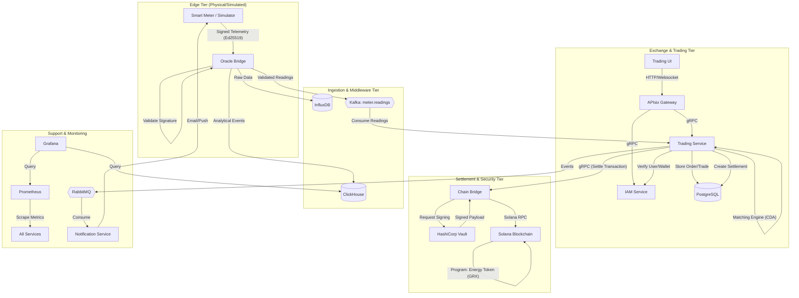

# GridTokenX Data Flow Documentation

This document describes the architectural data flow of the GridTokenX core system, mapping the journey of energy telemetry from physical smart meters to on-chain financial settlement.

## 1. System Overview

GridTokenX is a four-tier cyber-physical system designed to bridge the physical electricity grid with a decentralized ledger (Solana).

---

## 2. Core Data Paths

### A. Telemetry & Ingestion Path (IoT)
The system's primary input is time-series energy telemetry generated by Smart Meters.

1.  **Generation & Signing:** Physical or simulated smart meters generate energy frames (active power, voltage, etc.). Each frame is signed using the meter's private **Ed25519** key.
2.  **Edge Ingestion:** The `Oracle Bridge` receives these frames via gRPC (high-throughput) or REST.
3.  **Off-Chain Verification:** The Oracle Bridge performs cryptographic verification of the meter's signature before processing. Invalid data is dropped at the boundary to protect down-stream services.
4.  **Dissemination:** Validated readings are:
    *   Committed to **Kafka** (`meter.readings`) for real-time processing.
    *   Stored in **InfluxDB** for time-series visualization.
    *   Aggregated in **ClickHouse** for long-term grid analytics.

### B. Trading & Matching Path
This path handles user-driven energy transactions and automatic matching.

1.  **Order Entry:** Users place Buy/Sell orders via the `Trading UI`. These are routed through **APIsix** to the `Trading Service`.
2.  **Identity Verification:** The `Trading Service` verifies the user's identity and wallet status via the `IAM Service`.
3.  **Matching Engine:** The service runs a **Continuous Double Auction (CDA)** engine. When a seller's surplus matches a buyer's deficit, a trade is executed.
4.  **Settlement Generation:** A trade results in a `Settlement` record stored in **PostgreSQL** with a `Pending` status.

### C. On-Chain Settlement Path (The "Atomic" Step)
The finality of all transactions occurs on the Solana blockchain.

1.  **Settlement Trigger:** The `SettlementWorker` identifies `Pending` settlements in the database.
2.  **Transaction Building:** The `Trading Service` constructs the necessary Solana instructions (e.g., `mint_to_wallet` or `atomic_swap`).
3.  **Secure Signing:** Instructions are sent to the `Chain Bridge`. The bridge requests a cryptographic signature from **HashiCorp Vault**, which holds the system's authority keys in a secure HSM-like environment.
4.  **Submission:** The signed transaction is submitted to the **Solana Cluster** via RPC.
5.  **Confirmation:** The `Chain Bridge` monitors for finality. Once confirmed, the settlement status in PostgreSQL is updated to `Completed`.

---

## 3. Technology Stack Summary

| Component | Technology | Role |
| :--- | :--- | :--- |
| **Edge Gateway** | Envoy / Oracle Bridge (Rust) | mTLS Termination & IoT Ingestion |
| **Message Bus** | Apache Kafka | Event Sourcing & Reading Streams |
| **API Gateway** | Apache APISIX | User Auth & Routing |
| **Core Services** | Rust (Axum, Tokio) | Trading Logic, IAM, Notifications |
| **Primary DB** | PostgreSQL 17 | Relational State & Metadata |
| **Time-Series DB** | InfluxDB / ClickHouse | Telemetry & Analytics |
| **Blockchain** | Solana (Anchor Framework) | Settlement & Registry |
| **Security** | HashiCorp Vault | Key Management & Signing |
| **Monitoring** | Prometheus / Grafana | System Health & Observability |
