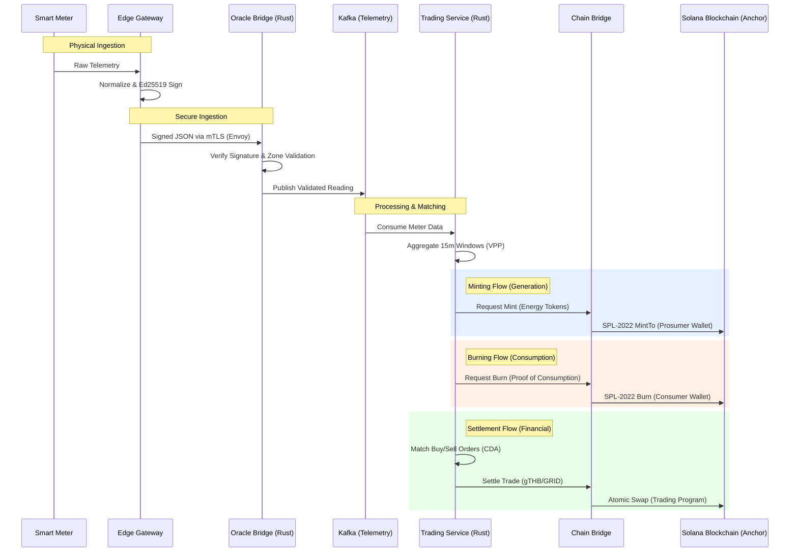

# End-to-End Data Flow: Telemetry to Settlement

This document details the lifecycle of energy data from physical ingestion to on-chain minting, burning, and financial settlement.

## Data Flow Diagram

## Step-by-Step Breakdown

### 1. Ingestion & Validation (Edge to Oracle)

- **Edge Gateway**: Receives raw data from meters (DLMS) or chargers (OCPP). It normalizes this into a standard JSON schema and signs the payload using an **Ed25519** hardware key.
- **Oracle Bridge**: Acts as the cryptographic trust layer. It terminates the **mTLS** connection from the Edge, verifies the signature against the registered device public key, and checks if the reading falls within expected bounds for the specific zone.

### 2. Aggregation & Verification (Kafka to Trading)

- **Kafka**: Stores the validated telemetry stream. The **Trading Service** consumes this stream to track real-time generation and consumption for every participant.
- **Virtual Power Plant (VPP) Aggregation**: The Trading Service aggregates individual meter readings into 15-minute settlement windows. This is the "Truth" used for on-chain triggers.

### 3. Minting Energy Tokens (Prosumer)

- When a prosumer generates energy (verified by the Oracle Bridge), the **Trading Service** triggers a minting event.
- The **Chain Bridge** signs a transaction to mint **Energy Tokens (SPL-2022)** directly into the prosumer's Solana wallet. These tokens represent a verified Renewable Energy Certificate (REC) or a kilowatt-hour of energy produced.

### 4. Burning Energy Tokens (Consumer)

- When a consumer uses energy, the corresponding Energy Tokens must be **burned** to prove consumption and prevent double-counting.
- The system verifies the consumption telemetry, and the **Chain Bridge** executes a `burn` instruction on-chain, removing the tokens from the consumer's wallet.

### 5. Financial Settlement

- **Matching Engine**: The Trading Service matches "Buy" and "Sell" orders in its in-memory Continuous Double Auction (CDA) book.
- **Atomic Settlement**: Once a match occurs and the energy delivery is verified (via telemetry), the **Chain Bridge** executes an atomic settlement on Solana. This typically involves swapping **gTHB** (Thai Baht Stablecoin) or **GRID** tokens for the Energy Tokens held in escrow by the **Trading Program**.
