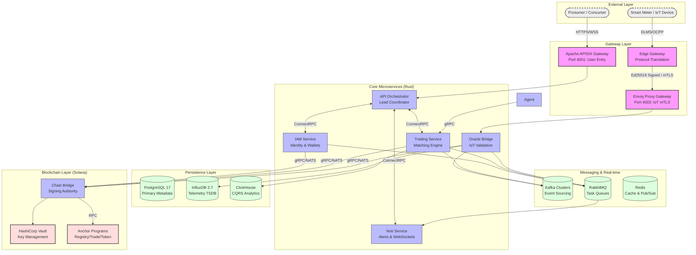

# GridTokenX Microservices Architecture

This document provides a visual and technical overview of the GridTokenX platform microservices, gateways, and data persistence layers.

## Architecture Diagram

## Service Inventory

### 1. Gateways

- **Apache APISIX**: User-facing entry point for Web/Mobile. Manages JWT authentication and rate limiting.
- **Envoy Proxy**: Specialized gateway for IoT telemetry. Enforces mutual TLS (mTLS) for secure meter communication.
- **Edge Gateway**: Local component at the meter/site level. Translates physical protocols (DLMS, OCPP) into cryptographically signed JSON payloads.

### 2. Core Services (Rust)

- **API Orchestrator**: Central hub for the frontend. Coordinates requests between the UI and backend microservices using ConnectRPC.
- **IAM Service**: Identity and Access Management. Handles user registration, KYC, and manages the linkage between users and their Solana wallets.
- **Trading Service**: The platform's matching engine. Implements a Continuous Double Auction (CDA) for P2P energy trading and manages on-chain settlement triggers.
- **Oracle Bridge**: Validates Ed25519 signatures from Edge devices and ingests high-frequency telemetry into the data plane.
- **Noti Service**: Manages multi-channel notifications (WebSockets, Email) via RabbitMQ.
- **Agent Trade**: Actor-based algorithmic trading agent for automated grid participation.

### 3. Messaging Plane

- **Kafka**: The backbone for event sourcing. Records every order, trade, and telemetry event with strict ordering and high durability.
- **RabbitMQ**: Used for reliable background tasks, such as email delivery and settlement retries.
- **Redis**: Provides ultra-low latency caching and powers the real-time WebSocket fan-out for market updates.

### 4. Persistence Layer

- **PostgreSQL 17**: Relational storage for user profiles, order metadata, and system configuration.
- **InfluxDB 2.7**: Purpose-built time-series database for storing billions of energy meter readings.
- **ClickHouse**: Analytical warehouse for generating real-time trading statistics and CQRS read-side views.

### 5. Blockchain Layer (Solana)

- **Chain Bridge**: A decentralized signing authority that interfaces with Solana RPCs and HashiCorp Vault.
- **HashiCorp Vault**: Securely stores and manages signing keys without exposing them to application logic.
- **Anchor Programs**: The on-chain logic for the Registry, Trading Escrow, Energy Tokens (SPL-2022), and Oracle state.
