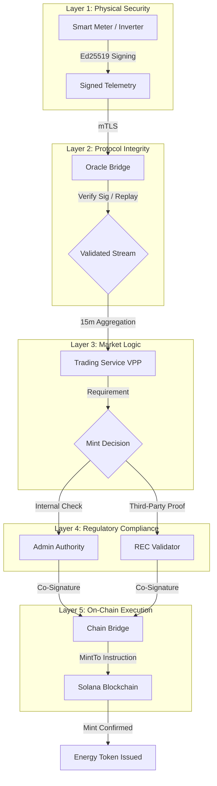

# Minting Strategy & Trust Hierarchy

This document explains the multi-layered verification strategy used by GridTokenX to ensure that every **Energy Token (GRX)** minted on Solana corresponds to a genuine, verified watt-hour of renewable energy.

## Minting Trust Hierarchy

GridTokenX employs a "Defense in Depth" approach to energy provenance, combining hardware-level security with decentralized validation.

## Verification Mechanisms

### 1. Cryptographic Provenance (Oracle-First)
The primary "Proof of Generation" comes from the **Oracle Bridge**. 
*   **Mechanism**: Every simulated or physical meter has a unique Ed25519 keypair.
*   **Validation**: The Oracle Bridge rejects any reading that is not signed by a registered meter key or that exceeds the physical capacity of the site's solar/wind installation.

### 2. REC Validator Co-Signing
For markets requiring higher regulatory oversight (like national Renewable Energy Certificate markets), the system supports **REC Validators**.
*   **Mechanism**: The `energy-token` program can be configured to require a second signature for the `mint_tokens_direct` instruction.
*   **Role**: These validators (e.g., a grid operator or environmental auditor) review the aggregated data before providing the necessary signature to the **Chain Bridge**.

### 3. Sealevel-Friendly Scaling
To maintain high performance during grid-scale events, the minting logic is decoupled from state updates.
*   **Strategy**: Minting transactions are "Read-Only" regarding the configuration accounts.
*   **Benefit**: This allows the Solana runtime to execute hundreds of minting requests in parallel across different cores, as they don't compete for a single write-lock.

## Minting Logic Decision Tree

1.  **Is the Telemetry Valid?** (Oracle Bridge Check)
    *   No → Discard reading, trigger security alert.
    *   Yes → Continue.
2.  **Has the 15-minute window closed?** (Trading Service Check)
    *   No → Buffer reading in Kafka.
    *   Yes → Calculate total kWh generated.
3.  **Are REC Validators required?** (On-Chain Check)
    *   No → Request single-signature mint from Chain Bridge.
    *   Yes → Route request to Validator API for co-signing.
4.  **Execute on Solana**.
    *   Result: `SPL-2022 MintTo` instruction successful.
