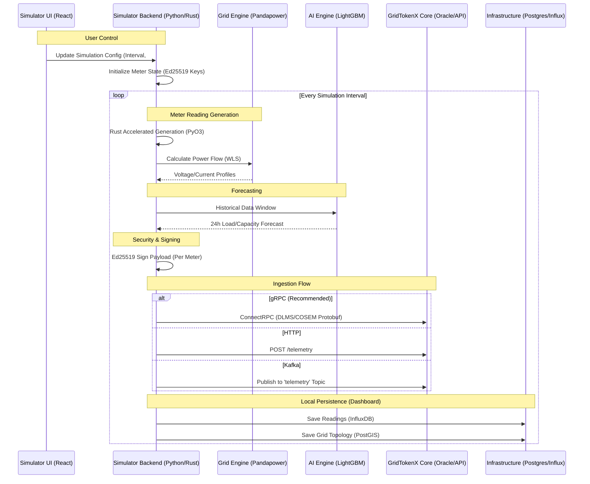

# Smart Meter Simulator: Data & Logic Flow

This document details the internal architecture and external data flow of the GridTokenX Smart Meter Simulator, which serves as a high-fidelity replacement for physical hardware during development and testing.

## Simulator Data Flow Diagram

## Internal Component Roles

### 1. Reading Generation (Rust/PyO3)
To achieve high fidelity at scale (5,000+ meters), the reading generation logic is implemented in **Rust**. This mimics accuracy classes (Class 0.2 to 2.0) and generates realistic noise profiles.
- **Performance**: 1,000 meters in 0.28ms (vs 3,000ms in pure Python).
- **Output**: V, I, P, Q, Power Factor, and Frequency.

### 2. Grid Engine (Pandapower)
The simulator isn't just a random number generator; it performs **Weighted Least Squares (WLS) State Estimation** and **Optimal Power Flow (OPF)**.
- **Topology**: Models Thai PEA/MEA distribution networks.
- **Logic**: If a simulated branch is overloaded, the meter readings reflect realistic voltage drops.

### 3. AI Engine (LightGBM)
Supports the PEA mandates for grid orchestration:
- **24-Hour Horizon**: Predicts load and remaining transformer capacity.
- **VPP Trigger**: If the AI predicts an overload, it triggers simulated BESS (Battery Energy Storage Systems) to discharge.

### 4. Transport Layer
The simulator mimics the **Edge Gateway's** role in the production flow:
- **Protocol**: Wraps readings in **DLMS/COSEM** formatted Protobufs.
- **Security**: Signs every packet with a unique **Ed25519** key per simulated meter.
- **Connection**: Typically targets the **Oracle Bridge** (via Envoy) or the **API Orchestrator**.

## How to use for E2E Testing
1.  **Identity Setup**: Register the simulated meter public keys in the **IAM Service**.
2.  **Start Simulator**: Point the `API_GATEWAY_URL` or `GRPC_GATEWAY_HOST` to your local `gridtokenx-api` or `gridtokenx-oracle-bridge`.
3.  **Monitor**: Watch the **Trading UI** dashboard; it will treat the simulated telemetry as real energy generation/consumption, triggering on-chain mints and burns.
