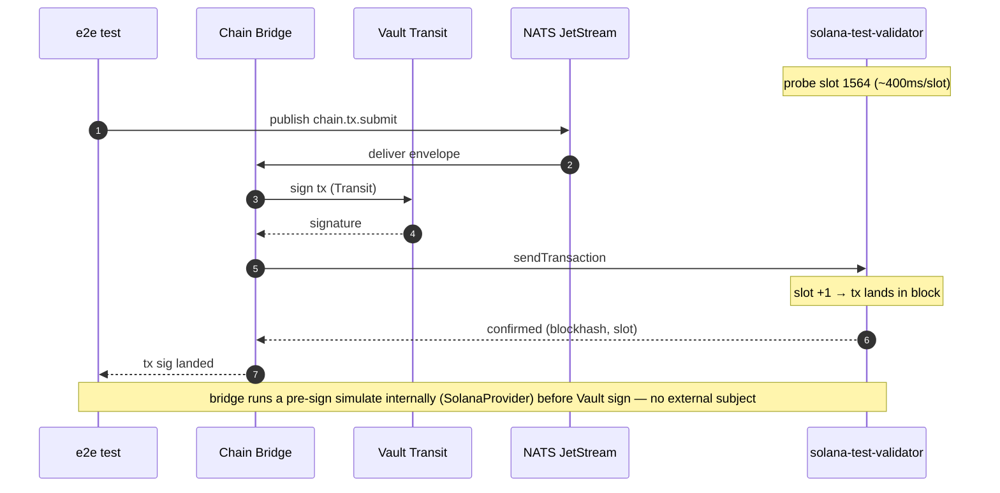

# E2E Cross-Service Communication Map

> Source: `tests/e2e/` suites + `justfile` recipes, verified against code `path:line`.
> Last verified: 2026-07-05 (Flow 3 rewritten: surplus mint via `chain.tx.mint`; `meter.reading` forward removed).
> Ports per `tests/e2e/env.sh` (authoritative for the running dev topology).

## Port topology (`tests/e2e/env.sh`)

| Service | REST | gRPC | Notes |
| --- | --- | --- | --- |
| APISIX gateway (user-facing) | 4001 | — | `APISIX_URL` |
| API Services / orchestrator | 4000 | 4000 | `API_URL`; `API_SERVICES_GRPC_URL` |
| IAM | 4010 | 5010 | |
| Trading | 4020 | 5020 | docker host map 4020→8093, 5020→8092 |
| Aggregator Bridge | 4030 | 5030 / **50051** | `start.sh` launches `IOT_GATEWAY_PORT=4030`; binary internal default `4010` collides with IAM (`gridtokenx-aggregator-bridge/src/main.rs:73-76`). **gRPC: `env.sh` says 5030 but the running container maps host `50051`→container `50051` (`docker-compose.yml` aggregator-bridge pins `GRPC_PORT: 50051`). The DLMS secure-frame tests default `AGGREGATOR_BRIDGE_GRPC=localhost:5030` and skip when unreachable — pass `AGGREGATOR_BRIDGE_GRPC=localhost:50051` to exercise the gRPC path.** |
| Chain Bridge | — | 5040 | reads only; writes via NATS |
| Notification | — | 5060 | ConnectRPC, container 8090 |
| Postgres | 7001 | | |
| Redis | 7010 | | |
| Kafka | 29001 | | `KAFKA_BROKER` |

## Transport summary

| Transport | Paths |
| --- | --- |
| HTTP via APISIX | register, login, orders, telemetry ingest, OpenADR |
| gRPC / mTLS | Chain Bridge reads + writes, IAM identity, Noti, Aggregator→API-Services batch |
| NATS JetStream | `chain.tx.mint` (surplus mint), `chain.tx.submit` |
| Kafka | `meter.readings`, `gridtokenx.aggregator.grid_status` |
| Redis Streams | zone-partitioned dissemination (XADD) |

---

## Flow 1 — Registration & Onboarding (`tests/e2e/10_iam`)

- Client → APISIX(:4001) → IAM(:4010): `POST /api/v1/auth/register`, `GET /api/v1/auth/verify?token=`, `POST /api/v1/me/wallets`, `POST /api/v1/me/registration` (HTTP/REST).
- IAM → Chain Bridge: async on-chain user PDA register (NATS).

## Flow 2 — Telemetry Ingest & Dissemination (`tests/e2e/20_oracle`)

- Meter / simulator → Aggregator Bridge(:4030): `POST /v1/private-network/ingest[/batch]`, `POST /v1/ingest/telemetry[/batch]` (HTTP). Ed25519-signed DLMS frame. Header `X-API-KEY` (`AGGREGATOR_API_KEY=engineering-department-api-key-2025`; validated via IAM).
- Aggregator → Redis: fail-closed sig verify `gridtokenx:devices:{id}:pubkey` (`crates/aggregator-persistence/src/infra/crypto.rs`); AES key fetch `gridtokenx:devices:{id}:enckey` for secure v4 frame.
- Aggregator → Redis Streams: zone-partitioned dissemination, XADD with retry (`crates/aggregator-logic/src/router.rs`).
- Aggregator → Kafka `meter.readings`: `MeterReadingEvent` (when `KAFKA_BOOTSTRAP_SERVERS` set).
- Aggregator → InfluxDB (own instance): async fire-and-forget realtime history (`energy`/`ev_session`/`battery`).

## Flow 3 — Mint Provenance & Telemetry Batch (`tests/e2e/30_settlement`)

> The former "Path B" SettlementEngine AND the `meter.reading` NATS forward to meter-service were both removed. The aggregator now mints surplus **itself**, directly over `chain.tx.mint`; meter-service is a read-only dashboard API (no NATS, no mint decision).

Two real aggregator outbound hops:

1. **Surplus mint (NATS JetStream)**: the settlement flush loop snapshots closed 15-min billing bins and, when `net_kwh > 0`, publishes a signed `MintEnergyMessage` on `chain.tx.mint` (`crates/aggregator-persistence/src/infra/mint.rs:29`) with idempotency_key `mint:{serial}:{window_start_ms}` (`crates/aggregator-persistence/src/infra/mint.rs:143`). Recipient wallet is resolved by the aggregator's MeterRegistry (local cache → Redis `gridtokenx:meters:{serial}:wallet` → Postgres `meters ⋈ users` backfill) — never taken from the payload. Envelope is signed `ecdsa-p256-sha256-v1` with the aggregator's mTLS client key; a durable outbox retries until Chain Bridge replies CONFIRMED (`crates/aggregator-logic/src/mint_settlement.rs`, `crates/aggregator-logic/src/mint_outbox.rs`). Chain Bridge: RBAC → replay dedup on idempotency_key → Vault Transit sign → Solana RPC submit; the on-chain `(meter_id, window_start_ms)` gen_mint PDA is the exactly-once backstop.
2. **Telemetry batch (gRPC, optional)**: `ZoneEventIngester` → `PlatformClient::submit_meter_reading_batch` → API Services (`API_SERVICES_GRPC_URL`, default `:4000`; `src/main.rs:67-72,144`; `crates/aggregator-persistence/src/infra/platform/client.rs:30`). Degrades to None if platform down (`crates/aggregator-api/src/ingester/zone_ingester.rs:75-79`).

Unset `NATS_URL` (or `MINT_VIA_CHAIN_BRIDGE`) on the aggregator ⇒ surplus mint disabled.

## Flow 4 — Energy Trading CDA (`tests/e2e/40_trading`)

- User → APISIX → Trading Service: `POST /api/v1/orders`, `GET /api/v1/orders/{id}` (HTTP). APISIX injects `x-gridtokenx-role: api-gateway` + gateway secret + user-id.
- Trading internal: `MatchingEngine::match_cycle` (CDA, synchronous, `gridtokenx-trading-service/crates/trading-engine/src/engine.rs`).
- Trading → Chain Bridge: `SubmitTransaction` (ConnectRPC gRPC/mTLS :5040) for trade settlement, best-effort background worker.

## Flow 5 — Frequency-Driven Dispatch / OpenADR (`scripts/openleadr-e2e.sh`, `just openadr-e2e`)

- Aggregator `FrequencyMonitor` ← telemetry `frequency_hz` (`crates/aggregator-logic/src/grid_status.rs`).
- Aggregator `GridStatusPublisher` → Kafka `gridtokenx.aggregator.grid_status` (`GridStatusEvent` JSON, default 30s).
- Aggregator `DispatchEngine` consumes → FLEX_UP / FLEX_DOWN vs freq thresholds (`crates/aggregator-logic/src/dispatch/engine.rs:133`).
- Aggregator (BL) → VTN: OpenADR 3 event, HTTP + OAuth2 (`OPENLEADR_VTN_URL`; `crates/aggregator-logic/src/standards/openleadr.rs`).
- Aggregator VEN listener: polls utility VTN `OPENLEADR_VEN_VTN_URL` for `DISPATCH_SETPOINT`, executes via adapter (`ieee` stub default / `grpc`), reports back (`crates/aggregator-logic/src/standards/openleadr_ven.rs`).

## Flow 6 — Notifications (`tests/e2e/60_noti`)

- Service → Notification Service: `noti.NotificationService/SendNotification` (ConnectRPC :5060). Channel EMAIL, template_id, variables, idempotency_key.
- Noti → email provider (internal).

## Flow 7 — Blockchain Reads

- Any service → Chain Bridge (gRPC/mTLS :5040, read-only): `GetBalance`, `GetTokenAccountBalance`, `GetSlot`, `GetAccountData`, `GetSignatureStatus`. Auth: mTLS peer cert → SPIFFE → ServiceRole (or header in `CHAIN_BRIDGE_INSECURE=true` dev mode).
- Explorer frontend → on-chain state (Next.js).

## Flow 8 — IAM Identity gRPC (`tests/e2e/10_iam/test_iam_grpc.py`)

- Service → IAM: `identity.IdentityService/VerifyToken`, `GetUserInfo` (ConnectRPC :5010). Auth header `x-gridtokenx-role` + gateway secret.

---

## E2E suites

| Suite | Services | Transport |
| --- | --- | --- |
| 00_harness | health gate | — |
| 10_iam | IAM, Chain Bridge | HTTP, gRPC, NATS |
| 20_oracle | Aggregator, Redis, Kafka | HTTP, Redis, Kafka |
| 30_settlement | Aggregator, meter-service, API Services, Chain Bridge | NATS, gRPC, Kafka |
| 40_trading | Trading, Chain Bridge | HTTP, gRPC |
| 50_chain_bridge | Chain Bridge RBAC | gRPC, NATS |
| 60_noti | Notification | ConnectRPC |
| 70_anchor | Solana programs | Solana RPC (via Chain Bridge) |
| 80_gateways | APISIX + all backends | HTTP |
| 90_golden_path | all | all transports |

Recipes: `just e2e` (all 00–90), `just e2e-suite name=30_settlement`, `just openadr-e2e`, `just test-registration`, `just test-edge`. **`just test-all` is broken** — its recipe calls `./scripts/run_integration_tests.sh`, which does not exist (`justfile:55-56`); use `just e2e` for the full on-chain suite instead.

---

## On-chain block & timing (verified run 2026-06-16)

> Source: live `just e2e` run `1781559777-68608` against `solana-test-validator` (`:8899`, core 3.1.10).
> All on-chain writes go through Chain Bridge (NATS submit → Vault Transit sign → Solana RPC); no service touches Solana RPC directly except Chain Bridge.

### Chain write → block/slot (sequence)

### On-chain writes over the run (block timeline)

```mermaid
gantt
    title On-chain writes during e2e (validator start slot 1564, ~2.5 slots/s)
    dateFormat X
    axisFormat %Ss
    section Chain writes (each → 1 block)
    10_iam onboard PDA (idempotent)   :crit, 0, 1
    30_settlement surplus mint         :crit, 7, 1
    50_chain_bridge NATS tx lands      :crit, 14, 1
    70_anchor register_user PDA        :crit, 20, 1
    70_anchor register_meter PDA       :crit, 21, 1
    70_anchor aggregate 16-shard       :crit, 22, 2
    90_golden_path chain writes        :crit, 30, 3
```

### Test-run wall-time (suites)

```mermaid
gantt
    title just e2e wall-time — 10 suites ~110s + anchor (separate run)
    dateFormat X
    axisFormat %Ss
    section Off-chain
    00_harness         :0, 2
    10_iam (6.2s)      :2, 8
    20_oracle (1.2s)   :8, 9
    30_settlement(6.7) :9, 16
    40_trading (23.7s) :16, 40
    60_noti (0.07s)    :40, 41
    80_gateways        :41, 44
    section On-chain
    50_chain_bridge    :crit, 44, 48
    90_golden_path(43) :crit, 48, 91
    70_anchor (opt-in) :crit, 91, 140
```

### Skip-closing matrix (alt-config runs)

Some fail-closed/auth tests need a bridge launched in a different mode than the running dev stack. Closed via **throwaway containers** (same image/network, alt host ports) — no restart of the live stack:

| Tests | Config needed | How exercised |
| --- | --- | --- |
| `20_oracle` DLMS secure-frame (3) | dev gRPC reachable | `AGGREGATOR_BRIDGE_GRPC=localhost:50051` |
| `20_oracle` failclosed prod (2) | `ENVIRONMENT=production` | throwaway agg-bridge `:50061` |
| `20_oracle` failclosed plaintext (1) | `ALLOW_PLAINTEXT_DLMS=true` | throwaway agg-bridge `:50061` |
| `50_chain_bridge` mTLS isolation (2) | `CHAIN_BRIDGE_INSECURE=false` + TLS certs | throwaway chain-bridge `:5050` |
| `70_anchor` (3) | `E2E_RUN_ANCHOR=1` + Solana toolchain + dev wallet | `bash tests/e2e/run.sh 70_anchor` |

`50_chain_bridge` `no_role`/`unknown_role` skip under mTLS by design — covered by the no-cert rejection test (mutually exclusive with header-auth mode).
